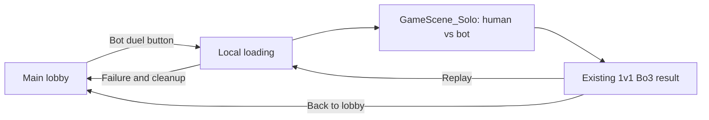

# PLAN 036 - Detailed implementation plan: lobby button to local bot duel

Date: 2026-09-28
Status: T00-T09 are READY_FOR_NEXT as of 2026-09-29; T10 automated integration passed after repairs and revalidation. Final feature acceptance remains pending the required physically offline launch check, final approved shipping tuning and release/manual QA. Solo uses its own dedicated scene derived from 1v1, separate from Multi. Current task states, exact evidence and remaining gates are maintained in [implementation results](../Validation/PLAN_036_results.md).

Revision R1: incorporates D1-D3 and the server-side Solo result-flow clarification from the [detailed-plan review](../Validation/PLAN_036_detailed_plan_review.md). These are implementation contracts and future test gates, not claims of code fixes or runtime passes.

Revision R2: makes task entry/exit executable in dependency order. Early tasks use bounded component fixtures; later owners close integrated V/L cases. Draft configuration cannot launch as the shipping encounter. The first implementation package is T00A baseline capture, then T00B graph-tool compatibility. All implementation was TODO at the R2 planning review; subsequent execution is recorded separately.

References: [design and decisions](PLAN_036_solo_duel_bt_graph.md), [structural breakdown](PLAN_036_solo_structure.md), [risk review / V01-V28](../Validation/PLAN_036_plan_review.md), [GAME_DESIGN](../GAME_DESIGN.md), [architecture contract](../AI_TARGET_ARCHITECTURE.md).

This document refines the earlier structure using current working-tree evidence. In particular, the current 1v1 selection path queues items; it does not activate the unused free-action method. Preserve that executable behavior. Earlier generic references to immediate/free-item chains do not authorize introducing them in Solo.

## Extended debugging run - 2026-09-29

User authorization: execute further available debugging, repair demonstrated defects, revalidate and show the findings visually. Preserve all approved rules, unapproved shipping balance, custom-stat exclusions and unrelated work.

| Slice | Scope | Gate |
|---|---|---|
| E01 | Audit actual item estimates and future catalog validation; add reproductions before repairs | Focused failing tests reproduced, repaired full Editor suite passes |
| E02 | Longer thinking/public-state refresh, difficulty overrides and repeated session lifetime | Production graph fixtures; unchanged authored assets; no stale work or object accumulation |
| E03 | Fresh natural seed corpus and relevant online stress regressions after changes | Bounded real-player runs, explicit failures, logs and source/build provenance |
| E04 | Reconcile extension seams and remaining decisions; visual findings dashboard | Evidence-linked before/after, current statuses, no claim of exhaustive/manual/offline certification |

Canonical outcomes and stable remaining IDs stay in [results](../Validation/PLAN_036_results.md). New evidence lives in `output/validation/plan036/extended_20260929/`. Do not infer a need to change gameplay just because a heuristic can be improved; distinguish implementation omissions, deliberate approximation and unresolved design choices.

## 1. User-visible scope and acceptance

The main lobby gains one **봇 대전** button. Clicking it launches the configured default encounter directly in `Assets/Scenes/GameScene_Solo.unity`. No mode picker, room creation/join code, matchmaking, difficulty-selection screen or external bot process is required. Different bots/difficulties are assigned through encounter data first; an extra selection screen is outside this task.



Acceptance:

- Fresh offline application launch reaches the main lobby and starts Solo without authentication, Lobby or Relay calls.
- One process, one internal NGO host, two logical seats, one real connection. All gameplay and BT execution run locally. Loopback transport remains; no claim of removing NGO/sockets.
- Human uses existing 1v1 input and mini-games. Bot observes permitted state and uses a visual BT to choose actions under those same rules, with configured item-use delays instead of mini-games.
- Preserve grants, cooling, Ready/initiative, effects, defense presentation, death/draw and Bo3. No Multi ghosts/deathmatch or side-view art work.
- Result offers local replay and lobby return; both clean up the match. Returning to an online mode retains its current gameplay behavior.
- This scope does not make optional custom starting-loadout semantics or final penalty durations approved balance data. A neutral baseline encounter is the first deliverable.

## 2. Verified starting points and integration risks

Source paths in this document are repository-relative; proposed new APIs are design targets, not existing symbols.

| Current source / symbol | Observed behavior | Required change |
|---|---|---|
| `UI/Lobby/LobbyMainView.Bind`, `LobbyPresenter.Initialize` | Arena/Closet/Settings only; no Solo entry | Add one main-panel button event and route directly to Solo |
| `UI/Lobby/AZLobbyUI.WaitForManagers`, `Core/Session/AppBootstrapper.InitializeSequenceAsync` | Lobby readiness coupled to online coordinator; bootstrap signs in | Separate local readiness; initialize online services on online entry |
| `Editor/LobbyUISetup.SetupLobbyUI` | Existing setup rebuilds the UI hierarchy | Add the button without deleting/recreating the user's MainUI |
| `Core/Solo/SoloMatchStarter` | Starts host, loads GameScene, launches bot executable, waits for two connections | Replace production entry with single-process coordinator; stop using this flow |
| `Core/Network/SessionManager.OnTransportFailure`, online coordinator callbacks | Legacy/session handlers can independently clean up and load lobby | Route/guard callbacks by the active session owner and generation |
| `UI/Loading/LoadingScreenManager.OnNetworkSceneLoad` | Recognizes GameScene/GameScene_Multi; online states hide loading | Include Solo and scope loading ownership to the active operation |
| `MatchCompositionRoot.ServerBootstrapMatch/FindRuleForMode/ServerCreateRoster` | Reads online selected mode and derives roster from connected clients | Explicit launch context and Solo participant provider; Solo shares 1v1 rule reference |
| `PlayerRegistry`, `PlayerIdentity`, `PlayerState.OnNetworkSpawn` | Registration keyed by OwnerClientId | Distinct logical identity; bot ordinary NetworkObject, human PlayerObject |
| `MatchRoster.IsTurnEligible/IsAutoReady` | Connectionless entries become disconnected humans | Separate bot availability from transport connection status |
| `PlayerState.SelectItemServerRpc/ServerQueueItem/MiniGameResultServerRpc` | Non-mini and successful mini paths queue one selected action | Extract shared validated queue operation; bot delay ends by queueing, not by executing effect |
| `TurnManager.PrepPhaseRoutine` | Forced Ready can precede phase change during emote wait | Bot completion must also require open input window, not just Prep phase |
| `AZPlayerVisual`, `CombatVFXManager`, `FanBladeSpinner`, death RPC | IsOwner/OwnerClientId and some IsPlayerObject filters | Use explicit human perspective/seat lookup for visuals; keep RPC authority guards |
| `RoundResultPresenter`, `LocalPlayerCommandAdapter` | Online rematch vote / online LeaveAsync | Mode-aware local replay/exit without second-person vote |

Prefix source paths above with `Assets/Scripts/`. Existing dirty changes and developer probes in Core/Solo must be preserved. Their directory does not make them obsolete bot code.

## 3. Planned files and responsibilities

Names may be adjusted to repository conventions during implementation; responsibilities and gates remain fixed. Do not add an interface for every class.

### 3.1 App and scene entry

| File target | Proposed changes / methods |
|---|---|
| `Core/Session/AppBootstrapper.cs` | Expose local readiness independently; local references/cosmetic data initialize before menu use. Audit all existing IsReady/OnReady callers before changing their meaning |
| `Core/Session/MatchSessionRouter.cs` (new) | Single active mode/generation; `TryBegin`, `End`, dispatch lifecycle errors/exit. Manual composition, no global general-purpose service locator |
| `Core/Session/MatchLaunchContext.cs` (new) | Immutable generation, mode, required seats and optional Solo encounter; explicit input to scene composition |
| `Core/Session/NetworkSessionCoordinator.cs` | Online `EnsureInitializedAsync` single-flight path; await it before existing online create/join/start operations. Guard async completions and callbacks by online ownership |
| `Core/Session/NgoNetworkRuntime.cs` | Add a local-host configuration entry beside the Relay entry, or share a focused transport adapter; both use the one active NetworkManager owner |
| `Core/Solo/SoloSessionCoordinator.cs` (new) | `StartAsync(encounter)`, `RestartAsync`, `StopAsync`, operation events, bounded initialization and rollback |
| `Core/Network/SessionManager.cs` | Prevent legacy transport/disconnect callbacks from independently unloading an active Solo session |
| `UI/Lobby/LobbyMainView.cs` | Bind `SoloBtn`, publish `OnSoloClicked`, expose busy/interactable state, remove listeners on disposal |
| `UI/Lobby/LobbyPresenter.cs`, `AZLobbyUI.cs` | Inject local Solo entry; route handler with exception/failure recovery. Main UI does not wait for online Ready; online status cannot overwrite Solo loading status |
| `Editor/LobbyUISetup.cs`, `Assets/Scenes/LobbyScene.unity` | Additive, idempotent Solo button wiring and default encounter reference; preserve existing layout and unrelated UI |
| `UI/Loading/LoadingScreenManager.cs`, `Core/Network/SceneLoadSyncManager.cs` | Recognize Solo scene; one generation owns loading. Transport scene completion counts actual clients; match initialization counts logical seats |

Online initialization is deferred to an online action. Do not start UGS in the background at cold launch and then merely avoid awaiting it. If the SDK operation cannot be canceled once started, invalidate its application callback generation and suppress subscription/state updates after ownership changes; do not claim the underlying SDK task was canceled.

### 3.2 Data and scene composition

New targets under `Assets/Scripts/Core/Solo/Configuration/`:

- `SoloDuelDefinitionSO`: default bot, default difficulty, shared `OneVsOneRule.asset`, gameplay scene reference/configuration.
- `BotDefinitionSO`: stable bot ID, display name, existing front-character cosmetic IDs, visual graph, base stat profile and tactical defaults.
- `BotDifficultyProfileSO`: think-time range, Ready policy, branch/scoring weights, decision noise/retry budget; optional explicit stat and item-delay overrides.
- `BotStatProfileSO`: optional starting temperature, fan baseline and initial item list. Unset fields inherit 1v1; custom reset/merge policy must be explicit before enabling.
- `BotItemUsePolicySO`: validated default delay and item-reference overrides. Do not use display names, mutable inventory positions or assumed global integer IDs as stable authoring keys. Resolve references to the current catalog at composition time.
- `ResolvedSoloSettings`: immutable runtime snapshot of validated values and configuration IDs/versions. Mutable decisions and consumed items never live in these SOs.

Modify `Core/Match/MatchCompositionRoot.cs` to accept a launch context instead of deriving all setup from online state. Keep online fallback behavior until its callers migrate. For Solo, construct `MatchConfig(sharedOneVsOneRule, 2, GameMode.Solo)` through an explicit mode binding. The shared rule asset is neither copied nor edited to TargetMode.Solo. Online modes still resolve their existing rules.

Proposed authoring routes:

```text
Assets/Scenes/GameScene_Solo.unity
Assets/Data/Solo/Encounters/DefaultSoloDuel.asset
Assets/Data/Solo/Bots/DefaultBot.asset
Assets/Data/Solo/Difficulties/NeutralBaseline.asset
Assets/Data/Solo/ItemUse/DefaultItemUsePolicy.asset
Assets/AI/Solo/Graphs/SoloDuel.graph  (extension finalized by package fixture)
Assets/AI/Solo/Blackboards/           (only if package authoring needs separate assets)
```

Use the verified Editor to derive the Solo scene from current 1v1 scene presentation, preserving camera/character positions and existing shared prefab/item references. Add Solo-specific composition only. Register it in `ProjectSettings/EditorBuildSettings.asset`. Do not retain a duplicated active NetworkManager/DDOL stack or old BotBrain/BotBootstrap/second-process starter.

Normal entry: local host starts in lobby, then NGO SceneManager loads Solo. Optional direct-Editor-scene testing must converge on the same local composition using a development bootstrap, with duplicate-root guards; do not add a second production startup loop.

LoadingScreenManager must detach from the old NGO SceneManager on shutdown and subscribe to the current instance on restart. A retained registration flag must not suppress the new subscription.

Apply this contract to the persistent PlayerSpawnManager as well (D2):

- Track the exact subscribed NetworkManager and NetworkSceneManager instances with their session generation. Detach through those stored instances, not whichever singleton happens to exist later; clear flags/references even when the old instance is already disposed.
- On session shutdown, clear only that session's pending client/spawn records and resolved scene markers. A late cleanup/callback from an old generation cannot clear a new generation's entries.
- On the next host start, subscribe to the new scene-manager instance once. A callback from an old instance/generation cannot mark the new scene ready.
- Refresh the current gameplay scene's spawn markers after its load completion, before its spawn gate opens. Both the automatic human spawn path and explicit Solo factory respect this gate. A stale marker cache must not silently cause fallback placement; retain intentional online placement policies otherwise.
- T03 owns this lifecycle change; T04/T07 verify actual positions and visual binding. Repeated sessions must not depend on destroying the DDOL spawn manager to recover subscriptions.

### 3.3 Participant and perspective migration

Modify `Core/Player/Identity/PlayerIdentity.cs`, `PlayerBinding.cs`, `PlayerRegistry.cs`, `IReadOnlyPlayerRegistry.cs`, `Core/Match/MatchRoster.cs`, `MatchManager.cs`, `Core/Network/PlayerSpawnManager.cs`, `PlayerState.cs` and TurnManager discovery.

Concrete contract:

1. Logical identity contains match participant key and seat. Controller kind distinguishes human/bot. Human connection mapping is optional and distinct from NGO object ownership; do not use a sentinel ClientId for bots.
2. Pending binding lookup uses actual NetworkObjectId, not OwnerClientId. Ready lookup indexes seat/participant; the ClientId map indexes real humans only. Preserve `TryGetByClientId` for existing human callers.
3. Unregister by exact binding/identity generation; a late despawn must not remove a newer binding that reused the seat. Clear only the associated optional connection entry.
4. Online participant descriptors are adapted from current SessionParticipantTable. Solo descriptors come from local composition, without invented UGS identities/tokens or fake connected clients. Do not reuse disconnected snapshot state for a live bot.
5. Human spawn remains `SpawnAsPlayerObject`. Bot factory configures its participant role before `NetworkObject.Spawn(destroyWithScene: true)`. Server owns the bot object. Both register through the same logical binding contract.
6. Roster preserves genuine `IsConnected` transport semantics. Add explicit participant availability/turn eligibility covering a live local bot; `IsAutoReady` remains disconnected-human policy. Counts and winner logic use logical seats; disconnect/reconnect uses genuine client mappings.
7. WaitForPlayers requires two valid logical bindings, not two ClientIds. No sorting by identical OwnerClientId to assign bot seats. The default encounter assigns human and bot distinct stable seats; consumers resolve these roles rather than hardcoding `1 - seat`.
8. MatchManager stores match membership by logical identity; only online rematch/reconnect paths need connection mapping.

**Bootstrap ordering is mandatory:** resolve launch/rules -> create the two participant descriptors and roster -> spawn/register human and bot -> assign stable seats/promote bindings -> initialize inventories/turn context once through existing match initialization -> permit Prep after scene/bindings/presentation are ready. Current TurnManager waits for two registry entries before building a roster; do not defer bot creation until that old wait completes. Solo needs a mode-specific composition seam before the wait. PlayerSpawnManager must suppress its ordinary automatic host spawn while Solo composition owns it, or delegate that single spawn explicitly; never run both.

**Ready-binding handoff (D1):** in T03, separate seat assignment/promotion from consumption of the ready bindings. `TurnManager.WaitForPlayersRoutine` must not fill `_players` only from `EnumeratePending()` after Solo composition has already promoted both participants.

1. The Solo composition owner assigns seats and promotes bindings without waiting for TurnManager to discover pending entries. Discovery waits, with the existing initialization deadline, for the roster's full expected seat set to be ready.
2. Capture ready bindings from `Registry.Players`/seat lookup; validate exact expected seats, unique participant/object identities, current session generation and live spawned objects. Count equality alone is insufficient.
3. Populate `_players` by roster seat from that snapshot; bind turn contexts and check required inventory/services before initialization. A missing Solo player is an initialization failure after the bounded wait, not the existing non-Multi null-skip path.
4. Assign seat metadata separately from the existing `PlayerState.Initialize` role if necessary, so identity promotion does not depend on the later turn-context/grant stage. Do not create a readiness cycle between these two stages.
5. Initial grants and StartRound run once under a session-scoped initialization state (`NotStarted -> Applying -> Complete`, or `Failed`). A partial failure closes initialization and rolls back the match; a repeated ready notification must not reapply grants or increment the round. Later rounds retain their separate existing reset/grant path.

The online pending-to-ready path remains supported. Its final match binding must also accept participants already promoted before discovery, while preserving established online seat assignment and reconnect behavior.

Define readiness across OnNetworkSpawn and late seat/identity callbacks: until role and perspective are resolved, defer FPS/opponent initialization and local cosmetic submission rather than guessing from IsOwner. A binding-ready callback performs them once; despawn unsubscribes it. If replicated seat metadata arrives after object spawn, the same deferred path applies. Only then may the scene presentation-ready gate complete.

Installed NGO source confirms the proposed Spawn/SpawnAsPlayerObject APIs; this is not a runtime verification of the migration.

Add a small `LocalMatchPerspective` binding (placement finalized with composition): `HumanSeat`, `IsHumanSeat`, `TryGetOpponentBinding`. Audit `AZPlayerVisual.OnNetworkSpawn`, `PlayerState` cosmetic submit and feedback, `GameDataBridge.ResolveLocalSeat/BuildSeatSnapshot`, `LocalPlayerCommandAdapter.RebindLocal`, `CombatVFXManager`, `FanBladeSpinner.GetPlayerState`, and `TurnManager.TriggerDeathSequenceRpc`.

- Replace visual ownership assumptions only. Keep human RPC ownership/sender validation intact.
- Human RPC adapters must also reject a bot-controlled actor: NGO host ownership alone is insufficient to distinguish its bot object. Only the trusted internal Solo adapter may submit for it.
- Bot cosmetics come from validated BotDefinition IDs, not the host's local cosmetic submit path.
- Ordinary bot NetworkObjects fail IsPlayerObject filters: use registry/seat binding for fan, death, camera/target lookup, including VFX fallback paths.
- PresentationBarrier expected recipients are actual viewing human connection IDs, not the count of participants. The host supplies one completion ACK; the bot never supplies a fake ACK.

## 4. Lifecycle and local transport contract

| State | Permitted action / exit |
|---|---|
| Idle | Solo click captures configured default encounter, acquires active-session ownership |
| Starting | Validate settings/assets; disable duplicate start and conflicting menu operations; allocate generation |
| Loading | Configure local transport/approval, start host, load Solo through NGO; bounded progress UI |
| Binding | Compose rules, register two participants, assign cosmetics/perspective, apply normal initialization |
| Running | TurnManager progresses match; BT observes Prep only |
| Finished | Result once; local replay or exit |
| Stopping | Invalidate generation first; cancel waits/operations, dispose bindings/subscriptions, shut down host, await completion |
| Failed | Use same idempotent stop/rollback; restore main lobby with retryable error, release loading ownership |

Suggested initialization bound: reuse the existing match initialization limit where appropriate, rather than introducing unbounded waits or unrelated competing timers. Show the actual failing stage in diagnostics.

Transport setup uses loopback for destination and listen address; clear Relay transport mode/data before starting Solo. Installed `UnityTransport.SetConnectionData(string, ushort, string)` supports an explicit listen address. Accept only the internal host connection; reject additional clients even from loopback. Do not depend on a second connection approval to spawn the bot. Test host self-approval behavior against the installed NGO version.

The installed transport also has the `forceOverrideCommandLineArgs` overload. Use it for Solo or explicitly validate effective endpoints so inherited `-ip`/`-port` arguments from a network test cannot override the local-only configuration.

Retain a configured local port initially, with explicit occupied-port failure/cleanup; no requirement to remove firewall prompts or silently open network permissions. Snapshot relevant NetworkConfig/transport settings before temporary Solo configuration and restore after shutdown; online entry still configures its own transport. Retry only after shutdown is complete.

Lifecycle sequence:

```text
Lobby click -> local readiness -> acquire session generation
 -> validate encounter -> configure loopback -> StartHost
 -> NGO load GameScene_Solo -> composition -> human + bot registration
 -> initialization/grants -> perspective ready -> TurnManager Prep -> BT run

Replay/exit/error -> invalidate generation -> stop graph and pending waits
 -> detach listeners -> shutdown/unload -> clear scoped bindings
 -> restore network configuration -> release session owner
 -> fresh Solo start OR main lobby
```

Do not ask NetworkSessionCoordinator.LeaveAsync to clean up a Solo match. Add mode-aware routing to the existing game commands and initialization-error UI so all exits use the owning coordinator. GameUIRoot and loading fallback code must not race a second SceneManager.LoadScene call.

## 5. Shared command API and bot item delay

### 5.1 Extraction boundary

Keep public human RPC entry points in PlayerState. Extract shared validated operations beneath them, either as a small `PlayerActionService` composed with PlayerState or cohesive internal server methods. Final placement should minimize moving unrelated code; do not create duplicate validation engines.

Proposed operations: validate candidate, begin bot item use, complete pending use, queue selected item, cancel selection, submit Ready. Human adapter validates RPC sender/ownership; bot adapter is constructed for a registered Solo bot seat and cannot choose an arbitrary seat. Bot role cannot be supplied through a client RPC flag.

Proposed request identity: session generation, round sequence, turn sequence, controlled participant/seat, monotonically increasing request ID, CopyId, target. Repeated identical requests return the same pending/terminal outcome; same request ID with different payload is rejected. Keep records bounded to the active/recent turn and invalidate by generation. Human online behavior and existing Multi grant epochs remain intact; do not repurpose ghost-ledger epochs as the Solo lifecycle owner.

Results: `Rejected(reason)`, `Pending(operationId, dueTime)`, `Queued`, `Cancelled(reason)`, `Stale`, `ReadyAccepted`. Returning from an RPC adapter or finishing a BT node is not evidence of item acceptance.

### 5.2 Current 1v1 behavior to retain

- Current SelectItemServerRpc queues the normal item, and successful MiniGameResultServerRpc queues the mini-game item. `HasSelectedItem` prevents a second concurrent selection; cancel before Ready can remove the selection.
- Success does not consume the item at delay completion: actual effects/consumption follow CombatResolver and current defense/cancellation rules.
- `ExecuteFreeAction` exists but has no current selection caller. Do not activate it, `subAction`, or additional item chaining for Solo merely because SO metadata or historical documents mention it.
- Mini-game failure consumption is the human path; the bot has no simulated failure roll. The bot's interrupted pending delay must not invoke a fabricated failed MiniGameResultServerRpc.

### 5.3 Pending use state table

| State/event | Validation | Outcome / inventory effect |
|---|---|---|
| BeginUse | Active Solo bot, current key, alive, open Prep input, not Ready, no pending/queued use, valid CopyId/target/CanUse | Create pending logical operation; no effect and no consumption |
| Wait | Clock advances; existing cooling and Prep continue | No effect; cannot Ready or start a second use to bypass the delay |
| Due before input closes | Revalidate identity, input window, inventory CopyId, target and CanUse | Queue via existing ServerQueueItem semantics once; no immediate combat effect/debit |
| Duplicate begin/completion | Matching request/operation key | Existing outcome; no additional wait/effect/debit |
| Item removed / target invalid | Revalidation fails | Cancel pending operation; no invented replacement item or refund |
| Prep closes / forced Ready / phase exits | Authoritative window closed or IsReady/phase guard fails | Cancel unqueued operation; do not debit a never-executed bot use or accept late completion |
| Death / restart / exit | Participant/session invalidated | Cancel; late callback returns stale and cannot touch the new session |
| Queued selection canceled before Ready | Existing shared cancel rules | Remove queued selection, no new penalty refund; a later new use attempt waits its own delay |
| Combat resolution | Existing 1v1 validation/order | Existing effect and consumption only; no parallel bot effect executor |

Bot delay is separate from AI thinking time and human MiniGameTimeLimit. A mini-game UI/network grace period must not automatically extend bot use beyond Prep.

Use an authoritative clock adapter for bot deadlines (production NGO server time, controllable test clock). TurnManager exposes whether Prep currently accepts input, including the forced-Ready/emote tail. Completion requires both the open input window and the bot not being Ready. At deadline equality/closure, reject completion; do not enlarge the existing input window. Reconcile the actual existing Prep timer and phase-close ordering in T05 so the bot cannot receive time the human does not have. Do not globally rewrite online timekeeping as part of this feature.

### 5.4 Item coverage and delay configuration

All current catalog items need explicit coverage, including items without a human mini-game. Delay values may share defaults but must be inspectable per item. List/catalog membership must be captured from the actual scene registration at implementation time; filenames alone are not proof an item can drop.

| Group | Current asset names to include in fixture coverage | Verification |
|---|---|---|
| Basic | Fan, Windbreaker, WarmTea, Cat | Uses/permanence, self/opponent target, defense; no human mini UI for bot |
| Attack | HandFan, WaterGun, HugTshirt, IcedAmericano, IceCream | Target validation, delayed queueing, normal combat/animation |
| Defense/recovery | Mask, Smartphone, HotPack, HotAmericano | Correct defense filter or recovery timing; consumption once |
| Buff/debuff | Soda, BuldakNoodles, Samgyetang | Existing lifetime/modifier behavior and reset |
| Sabotage/special | RedCard, ClawMachine, BlueTape, Screwdriver, TarotCard | CopyId/slot changes, usability, fan baseline, revealed information; no new free-action path |

Per-item acceptance data will record item reference/catalog ID, current selection/effect/consumption path, configured delay, target policy, completion/cancel assertions and result evidence. Numeric test delays are explicitly test data, not shipping balance. Additional penalties beyond delay require an explicit specification.

## 6. Visual BT and data contracts

Tooling: validate Unity Behavior against this project's actual Unity/package versions in T00 before pinning a version. No package installed during planning. Node/type names below are project concepts, not claimed Unity Behavior APIs.

| Node/subgraph | Input | Output / constraint |
|---|---|---|
| CaptureObservation | Bot seat + turn key | Immutable own/public state, allowed revealed information, revision; no live PlayerState/NetworkVariable exposed in Blackboard |
| BuildLegalCandidates | Snapshot + catalog | CopyId, target, estimated benefit/risk and delay; no mutation or combat RNG calls |
| Survival / Finish / Counter / Resource / General | Candidates + profile weights | Chosen candidate and human-readable reason; editable branch priority |
| WaitThinking | Sampled AI delay + cancellation | Revalidate afterward; deadline/survival bounds override optional thinking |
| SubmitItemUse | Chosen intent + request key | Typed authoritative result; no direct effect |
| AwaitItemUse | Operation ID | Queued/canceled/stale result, no success inferred from elapsed time alone |
| ChooseReadyTiming | Fresh observation + selected action | Earliest safe/desired Ready time under current rules |
| SubmitReady | Current key, no pending operation | Accepted or bounded retry; fan stops through existing Ready path |
| Fallback | Current legality | Ready without item when legal, or await/cancel under lifecycle rules; never force a result |

Blackboard fields: controlled/opponent seat, session/round/turn, observation revision, temperatures/fan state, remaining Prep time, own usable copies, public effects/history, legitimately revealed data, selected CopyId/target, request/operation ID, result, think/Ready deadlines, retry budget, reason and diagnostic seed. Keep per-run mutable state isolated.

One BotTurnController subscribes once to the committed server Prep-ready signal below, runs once per Prep key and stops on Ready or invalidation. Raw phase-value notifications are insufficient to start a run. The graph owns decisions; the controller owns lifetime; TurnManager owns phases. Repeated notifications cannot launch duplicate graphs.

**Committed Prep opening (D3):** T05 introduces a small server-owned observation contract; T08 consumes it. Proposed names `PrepInputSnapshot`, `OnPrepInputReady` and `TryGetOpenPrepSnapshot` are new project APIs, not existing phase RPC callbacks.

1. In `TurnManager.PrepPhaseRoutine`, keep bot input closed during setup. Finish the current session/round/turn key, turn resets, environment setup, PrepStartServerTime/PrepDuration, temperature baseline capture, timer reset and RemainingTime initialization before committing the opening snapshot.
2. Mark the bot input window open only after those values are valid, then publish one server Prep-ready notification. Preserve existing human/online phase notification behavior; `PublishPhaseChanged` calls the empty `OnPhaseChangedClientRpc` body, which is not a server subscription mechanism.
3. Initial and refreshed observation use current time against the committed start/duration, clamped to the open window, not an uninitialized or previous-turn RemainingTime value. A snapshot query fails once the input window/session is invalid, even if CurrentPhase still says Prep during the emote tail.
4. Subscribe first, then query `TryGetOpenPrepSnapshot` for late binding. The same current-turn key guard handles both event and catch-up; a late graph never restarts a completed/Ready turn or receives the full original duration as fresh time.
5. Invalidate the committed window before forced Ready, turn exit, round reset or shutdown. Item completion and Ready use the same validity source described in section 5.3; the new event must not create another phase driver, alter first cooling-tick timing or extend deadlines.

Use a separate seeded AI RNG. Candidate evaluation cannot advance drop/combat RNG. Deterministic tests fix clock, observations, profile and seed; runtime traces include timing as well as seed. Predicted outcomes remain estimates unless item-specific parity is verified using pure/copy-based calculation.

## 7. Initialization, reset and result handling

T00 captures the effective initial and later-round grant/reset sequence from ItemManager, PlayerInventory, PlayerState.Initialize, TurnManager and RoundLifecycleService. Current source gives four basic items plus four random items initially; later-round reset restores basic items/removes random items and grants four random items. The 30/20/10 threshold grants are 1/2/3, using per-round flags. The initial rule asset field is not sufficient evidence of these runtime grants. Neutral settings must replay the current sequence unchanged, and T00 must recheck this if source changes before implementation.

- New turn: clear decision run/retry state; preserve current temperature/inventory according to existing 1v1. Never apply starting temperature/loadout every turn.
- New round: advance round identity before opening Prep; cancel old operations; use existing round reset/grants. Optional custom start profiles stay disabled until first-round/per-round and replace/add rules are chosen.
- Temporary fan modifier ends: restore the resolved baseline rather than blindly forcing global 1 when a custom fan profile is enabled. Preserve online default behavior.
- Match end: stop bot decisions; reuse existing result text/cinematics. Solo action buttons are replay and return, without vote deadline/opponent acceptance.
- Replay: after complete cleanup, reload/reinitialize the same default encounter with a new session generation. Retain local selected cosmetics/preferences, not gameplay state or consumed inventory.
- Exit: all UI/error routes invoke the session router, so only the Solo coordinator stops the local match.

**Server result-flow routing:** T09 changes `TurnManager.HandleRoundEnd` at the completed-duel branch, before `BuildInitialDisconnectMask`/`EnterRematchVote`. For `GameMode.Solo`, retain the existing result publication/cinematic, stop turn/bot activity, keep MatchComplete and exit that coroutine without starting `WaitForRematchDecision`. Solo must never enter RematchVote/RematchDeclined because a second human did not vote.

Route Solo replay/exit buttons through SoloSessionCoordinator and disable the online vote timer/automatic-decline-return paths in RoundResultPresenter for that mode. Replay creates a fresh generation after shutdown; it does not call `MatchManager.CommitRematch` for an online vote. Preserve online duel vote behavior and the Multi result branch. The result screen may remain idle past the online vote duration; only explicit replay/exit or a genuine lifecycle error leaves it.

## 8. Ordered implementation tasks and gates

See [implementation results](../Validation/PLAN_036_results.md) for current states. A task becomes `READY_FOR_NEXT` only when its **current-stage exit assertions** below have evidence and no unresolved defect invalidates its dependents. V01-V28/L01-L10 are cross-task scenario references: citing one does not require, or certify, its complete end-to-end execution in an early task. Later integration owners are explicit below. Stop for a user decision only if a repair needs a gameplay/scope change; ordinary implementation corrections stay within the authorized task.

Execute T00 through T10 sequentially for the initial implementation. Although T04 and T05 share a dependency, both touch player/turn integration and should not be edited concurrently. Read-only reviews or independent fixture preparation may run separately.

| ID | Implementation scope | Dependencies | Current-stage exit assertions / evidence references |
|---|---|---|---|
| T00 | T00A effective 1v1 baseline; T00B isolated Behavior compatibility/build fixture and exact package pin | None | V01 tooling fixture; V16 current-1v1 baseline capture only. Existing relevant tests/console recorded; minimal graph/custom node saves, reloads and runs in intended player build; no unrelated upgrades |
| T01 | Configuration schemas, immutable resolver, item-delay mapping and draft default encounter; validated test configurations | T00 | Positive/negative fixture data tests: invalid references/delays/stats rejected, inheritance correct, SOs unchanged. No final scene/BT dependency; V16 runtime equivalence still open |
| T02 | Local bootstrap/online lazy init; mode owner/generation; local-host adapter and Solo lifecycle | T01 | Local-menu/start-stop harness proves gateway-call separation, duplicate-start/port-failure cleanup and stale-completion rejection. Online entry smoke test. V08-V10/V25 receive component evidence only; no claim of playable Solo |
| T03 | Logical identity, ready-binding handoff/once-only grants, bot spawn/shared-rule binding and spawn-manager lifecycle | T01,T02 | Isolated match fixture proves D1/D2, two seats/one connection, stale binding rejection and one initialization. Current online mapping/spawn/teardown smoke tests pass. No final scene/command-adapter claim |
| T04 | Perspective, cosmetic, owner/player-object visual lookup and human-only ACK | T03 | Existing 1v1 presentation in an isolated fixture proves human/bot roles, fan/death/defense playback and real-viewer ACK. V07/V22/V23 component assertions; final-scene captures belong to T07/T09 |
| T05 | Shared human/bot action seam, typed results, committed Prep snapshot producer and closure | T03,T04 | Shared legality/queue/consumption parity and D3 producer fixtures pass; focused current 1v1/Multi command regressions. V06/V11/V19 component assertions; no final graph required |
| T06 | Bot delay operation, adapter and cancellation | T01,T05 | Controllable clock plus a scripted command caller proves duplicate/expiry/Ready/death/CopyId cases, one queue and existing combat consumption. V12-V15 operation assertions; graph integration remains T08 |
| T07 | Final Solo scene, additive lobby button and loading routes; explicit development-only scripted driver | T02,T03,T04,T05,T06 | Development launch proves one-click offline entry -> two seats -> one resolved turn -> explicit exit, without second process/connection. Scene/build references and V02/V07-V09/V23 integrated slice evidence; not final BT/replay acceptance |
| T08 | Production visual BT, observation/candidates, tactical subgraphs, committed-snapshot consumer and trace; complete default encounter binding | T00,T06,T07 | V14-V15/V19-V21 graph fixtures pass; real graph replaces driver; strict launch validator passes final scene/graph references; fresh one-click BT launch works with identified provisional test balance |
| T09 | Full Bo3/results, server Solo vote bypass, replay/menu/round cleanup; approved profile behavior | T08 | V17/V24/V25 baseline full-match gates, result idle >=30s and three replay cycles pass; V18 custom-profile cases only if their policies are approved, otherwise explicitly deferred outside neutral acceptance |
| T10 | Shipped-path offline player and online regressions; approved tuning and final evidence audit | T09 | Close all required neutral-baseline integration scenarios, V26-V28 and L01-L10; verify no validation driver or bypass in normal launch. Final shipping tuning is a separate outstanding gate if values remain unapproved |

S0-S7 correspondence: T00=S0; T01=S1; T03/T05=S2; T02/T07=S3; T08=S4; T06 and approved T09 tuning=S5; T04/T09=S6; T10=S7. This table is the task-level continuation of PLAN_036, not a separate feature plan.

Suggested focused test files under `Assets/Tests/Editor/`: `Plan036SoloConfigurationTests`, `Plan036ParticipantTests`, `Plan036BotItemUseTests`, `Plan036BotDecisionTests`. Names are provisional; prefer behavior fixtures over tests that mirror private implementation. Runtime tests may use a dedicated `Core/Solo/Validation/SoloDuelProbe` or existing harness extension, compiled only for validation where appropriate.

T02-T06 use isolated test composition/Play Mode fixtures before the final lobby scene is wired in T07. T02 creates the minimal disposable start/stop fixture; T03 adds participant composition; T04 uses existing 1v1 presentation; T05/T06 add scripted command/clock drivers. No fixture depends on the final T08 graph. Current-stage assertions must actually run; lack of a fixture is a task failure to fix, not permission to mark the task passed. Remaining final-scene/graph/match tests move only to the explicit integration owners below.

### Task entry, configuration readiness and completion accounting

1. Before each task, inspect its exact current files and previous gate record, identify unrelated dirty changes, and confirm all declared dependencies are `READY_FOR_NEXT`. Re-read relevant live assets rather than relying only on historical counts.
2. Implement the smallest task slice and run its stage-specific assertions. Perform focused Unity compilation/console checks after source/asset edits, then required fixture/runtime checks. Existing unrelated failures are recorded separately; a new task-caused regression cannot be waived as pre-existing.
3. Repair within the same task and rerun affected checks. No dependent task begins with a failing upstream invariant. Review-only work may proceed independently.
4. Record state (`TODO`, `IN_PROGRESS`, `READY_FOR_NEXT` or `NEEDS_FIX`), changed files, build/revision, exact assertion IDs, actual result/evidence, and deferred integration IDs with owner/dependency in `PLAN_036_results.md` once implementation starts. Never create a passed record merely from this plan.
5. A V/L scenario remains `PARTIAL` until its required integration assertions pass. Task `READY_FOR_NEXT` is not feature completion; T10 audits all outstanding neutral-baseline assertions and cannot erase their deferred history. A remaining required test blocks final feature acceptance; optional profile decisions remain named scope exclusions.

**Configuration readiness without circular dependencies:**

- T01 validates schemas/resolution with real fixture references from T00 and isolated scene fixtures; it may save the future default encounter as an explicitly nonlaunchable draft. Missing shipping references remain validation errors, not accepted nulls.
- T07 binds the actual Solo scene and exposes a development-only test encounter/driver through the new button for the vertical slice. This must be an explicit validation launch compiled/guarded for Editor or development use. It cannot be an automatic release fallback for a missing BT graph.
- T08 binds the real production graph and complete configuration, removes the temporary driver from the normal launch path and enables the default encounter only after strict validation succeeds. No separate player-facing selection screen is introduced.
- Fixture delay values are identified as provisional in asset/test evidence; no unapproved custom loadout or additional penalty is silently enabled. An implementation-ready configuration with test balance is not a claim that final shipping balance was approved.

### Integration ownership ledger

The rows group existing scenarios; exact assertion-level results are recorded during implementation. A later owner does not waive an earlier task's component assertions.

| Scenario group | Earlier component evidence | Integrated closure owner |
|---|---|---|
| V01 tooling | T00B graph/custom node/build | T00B for isolated tooling; T08/T10 verify production graph/player |
| V02,V07-V10 and L01-L04,L06-L09 | T01 config, T02 lifecycle, T03 binding, T04 views | T07 development scene slice; T08 actual BT launch; T10 shipped-path confirmation |
| V03-V06,V11,V16 | T00A baseline, T01 settings, T03 identity, T05 commands | T07 scripted parity with the neutral profile; T10 shared online regression |
| V12-V15,V19-V21 | T05 producer/commands, T06 delay/clock | T08 real graph including late binding, no-item fallback and cancellation; T09 exit/replay phases |
| V17,V24-V25 and result refinements | T02 cleanup and T03 spawn lifecycle | T09 full Bo3/replay/menu/idle result; T10 final player repeats |
| V18 non-neutral fan/loadout/temperature interactions | T01 validates disabled overrides; fixtures only for specified policies | T09 if approved; otherwise recorded as deferred custom-profile scope, not counted as a neutral test pass |
| V22-V23 | T04 visual/ACK fixture | T07 scripted final scene, T09 full-match presentation, T10 representative player evidence |
| V26-V28 and L05,L10 | Focused online checks after T02/T03/T05 | T10 complete mode-transition/network/seed corpus matrix; every required open assertion reconciled |

### First implementation package: T00 only

| Slice | Work | Deliverable / stop point |
|---|---|---|
| T00A - Baseline | Verify connected Editor project before live checks; capture current dirty scope, Unity/package/assembly references, actual catalog and grant/Ready/consumption paths. Run relevant existing tests and a bounded current 1v1 scenario where available | Timestamped baseline and evidence paths. Does not depend on a Solo profile/scene/BT. If required baseline execution is unavailable, record it unresolved and do not fabricate parity evidence |
| T00B - Tooling | After T00A, validate and pin compatible Unity Behavior, using a minimal isolated graph/custom-node fixture. Check assembly references, save/reload, play, cancellation and intended Windows player build. Record manifest/lock/dependency changes | V01 tooling gate and usable fixture references for T01. Stop before modifying player identity, production lobby or TurnManager behavior |

The first implementation turn should finish T00A, then attempt T00B only if T00A's required baseline checks are usable. If tooling is incompatible, correct or revert only introduced package/fixture changes and report the exact blocker; preserve all pre-existing dirty work. Inspect/update only required assembly references (`AbsoluteZero.Core` and/or a narrow graph adapter assembly); package editor APIs must not leak into player builds. No unrelated package upgrade or broad assembly migration is part of T00.

The initial T00-only request was completed. The subsequent user instruction authorizes T01 -> T02 -> T03, advancing only after each current-stage gate passes and stopping after T03. T04-T10 remain outside this implementation run. Task readiness does not certify the full Solo mode.

### Required regression refinements from the detailed-plan review

All cases here remain unexecuted and refine existing validation IDs, rather than declaring additional passed tests.

| Review item / task | Parent checks | Required scenarios and assertions |
|---|---|---|
| D1 / T03 | V03,V05,V16 | Both seats ready before discovery; mixed pending/ready; reversed spawn order; repeated ready events. Two non-null players/contexts and exactly one initial grant/StartRound. Missing/duplicate/stale seats fail within the initialization bound; no partial match runs |
| D2 / T03,T04,T07 | V25,L05,L10 | Solo -> online duel -> Solo and online 3/4-player entry with the same DDOL manager. One subscription to the current scene-manager instance, no prior-scene references, current marker positions used before spawning; delayed old events cannot open the new gate |
| D3 / T05,T08 | V14,V19,V21 | Zero-think first observation on the second turn; late graph bind; repeated Prep notifications. Current key and accurate remaining time from a committed snapshot; one run; closed or already-Ready turn never starts. Online phase/first cooling tick behavior unchanged |
| Solo result / T09 | V24,V25 | Leave match result idle for at least 30 seconds (longer than the existing 15-second online vote). No Solo vote/decline/automatic return, then replay and exit work once. Existing online vote acceptance/timeout still work |

### Additional entry/scene acceptance cases

| ID | Scenario | Pass condition |
|---|---|---|
| L01 | Fresh offline launch, no cached authentication | Local menu usable; one click opens Solo; no Auth/Lobby/Relay request; one process/connection |
| L02 | Click Solo repeatedly during loading | One generation, host, scene load and bot; control restored after failure |
| L03 | Missing encounter/graph/scene or occupied local port | Clear error and usable main lobby; no dangling loading screen or host |
| L04 | Delayed online initialization event arrives during Solo loading | Solo UI/state stays owned by Solo; no unexpected hide/unload |
| L05 | Solo -> lobby -> online 1v1 -> lobby -> Solo | Correct transport/roles/rules each time; no retained bot settings or subscribers |
| L06 | Solo transport error and legacy SessionManager callback | One cleanup owner, one return to lobby, no double unload/exception |
| L07 | Enter through shipped button versus direct Editor test bootstrap | Same rules/participants; no duplicate NetworkManager or config |
| L08 | Ordinary server-owned bot object dies/uses fan/defends | Registry-based visual binding works without IsPlayerObject; visible evidence captured |
| L09 | Main lobby at default and reduced window sizes | Solo button remains readable/clickable and does not overlap Arena/Closet/Settings |
| L10 | Online 1v1, 3-player and 4-player entry after bootstrap refactor | Authentication, lobby, scene load and host-leave behavior retain their established flow |

Logs/captures: `output/validation/plan036/`; implementation gate results: `Docs/Validation/PLAN_036_results.md` when tests are actually run. Include revision/build, seed, encounter/profile/graph version, input timings, phase trace and expected/actual result. Representative captures: main button, loading, both seats, attack/defense, result and replay. No runtime tests are marked passed by this plan.

## 9. Rollout, preservation and review status

- Keep changes grouped by task; do not reset the dirty worktree. Review shared-path diffs and run relevant regressions before continuing to dependent tasks.
- Do not delete all Core/Solo scripts: current matrix/visual/Relay probes live there. Retire only the old separate-process production entry after reference audit; preserve test utilities with distinct purposes.
- Package/scene/UI changes use their focused tools and preserve GUIDs. If the Behavior fixture fails, revert only its introduced changes and report the incompatible API/version; do not silently swap to opaque code-only AI.
- Shared multiplayer behavior is a gate, not an implied consequence of Solo being offline. Identity, presentation and command code is still shared.
- Known runtime/pre-existing defects outside this scope remain recorded in their existing plans; do not claim this feature clears earlier validation debt.

Plan checks performed: read-only code tracing of lobby/auth/loading, participant/spawn/perspective, item/Ready timing and grant paths; independent focused reviews of those boundaries; installed NGO spawn and transport signatures checked. No implementation, package install, scene edit, Play Mode or player build was performed.

**Planning verdict:** revision R2 retains R1's corrected logic and separates current-stage task exits from later integration acceptance. Begin with T00A -> T00B, then T01-T10 in order after implementation authorization. No early task requires the final Solo scene/BT as its prerequisite, and every required deferred integration scenario has a later owner. Final shipping delay values and optional non-neutral starting-profile semantics remain separate balance/configuration decisions. This is a planning verdict, not runtime certification; see the linked review for final task-readiness evidence.
