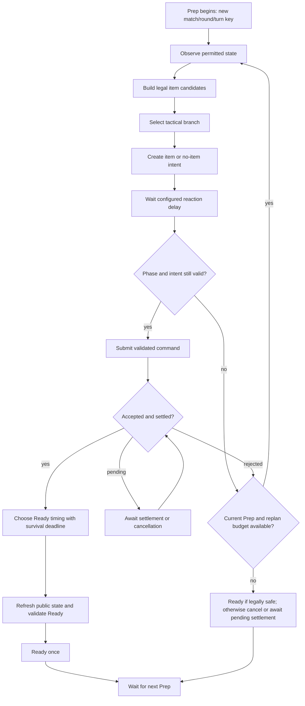

# PLAN 036 - Solo duel scene and configurable BT bot

Date: 2026-09-28
Status: Planning only. No gameplay code, graph, package, prefab, or scene implemented by this plan.

Structural breakdown for review before detailed implementation planning: [Solo structure](PLAN_036_solo_structure.md). Static risk review and 28 planned verification cases: [plan review](../Validation/PLAN_036_plan_review.md).

Detailed continuation: [one-button local bot duel implementation plan](PLAN_036_solo_detailed_implementation.md), T00-T10. Its current-source item-flow and bootstrap contracts refine the generic structure here; all implementation remains TODO.

## 1. Requested outcome and decision status

The user requests a dedicated human-versus-bot scene based closely on existing 1v1 play. Bot decisions must be authored as a visual behavior tree/graph. Bot-specific stats and response policies must be configurable to support difficulty tuning.

Confirmed scope:

- One human and one bot; reuse existing 1v1 combat rules and presentation.
- Visual BT graph authoring, with configurable bot identity, stats and tactics.
- A dedicated scene that can be configured with different bot definitions without duplicating game logic.
- Planning only at this stage.

Confirmed by the user on 2026-09-28: one executable with an internal NGO local host and one server-controlled bot participant. No Relay, UGS login requirement, or second bot process. This retains local transport/socket infrastructure; it is not an NGO-free runtime.

The user's new decision supersedes the earlier separate-client decision. GAME_DESIGN and DESIGN_QUESTIONS B5 now record this planning contract. BOT_HANDOVER remains historical and its direct host-owned-player integration instructions must not be applied without the participant/perspective changes below.

## 2. Current evidence and constraints

| Evidence | Implication |
|---|---|
| `Core/Solo/SoloMatchStarter.cs` starts a host and launches `AbsoluteZeroBot.exe`; no caller in current lobby UI | Existing skeleton is for a different execution model and cannot be treated as a finished entry flow |
| `Core/Solo/BotBrain.cs` returns while `_active` is false before player discovery can set it true | Existing AI does not autonomously activate; replace its wiring rather than assuming a working baseline |
| `BotBrain` contains category scoring and delay logic, not a BT graph | A real editable graph and runner are required |
| `Packages/manifest.json` has no `com.unity.behavior` | Graph tooling requires a compatibility/install task after implementation authorization |
| `MatchCompositionRoot.FindRuleForMode` requires matching TargetMode; GameScene registers OneVsOneRule only | Solo needs an explicit rule binding; merely setting GameMode.Solo fails initialization |
| `PlayerRegistry`, `PlayerSpawnManager`, `MatchRoster`, and `MatchManager.FixMatchRoster` key players by ClientId | One connection cannot simply register two participants under the same ClientId |
| `AZPlayerVisual.OnNetworkSpawn` uses IsOwner for FPS; GameDataBridge resolves local seat by LocalClientId | A host-owned bot would be misidentified without explicit controller/perspective roles |
| `PlayerState.PressReadyServerRpc` cancels pending mini-games and stops the fan | Bot Ready must wait for action acceptance; do not invent an independent fan-toggle ability |
| `RoundLifecycleService` restores 37 degrees and default fan speed | Per-bot baselines must be reapplied through a deliberate reset policy, including upgrade expiry |
| TemperatureSystem clamps recovery/turn state to 37 degrees | Initial temperature must remain in the approved range; higher maximum temperature needs a separate rule change |
| AppBootstrapper waits for online session initialization | Offline Solo needs a local startup path independent of authentication success |

Design references: [GAME_DESIGN](../GAME_DESIGN.md), [DESIGN_QUESTIONS](../DESIGN_QUESTIONS.md), [architecture target](../AI_TARGET_ARCHITECTURE.md), [migration plan](PLAN_018_architecture_migration.md). Older BOT_HANDOVER and PLAN_025 checkmarks are historical rationale, not proof of current functionality.

## 3. Behavior preserved and excluded

- Preserve human-versus-human 1v1 and Multi gameplay, RPC validation, existing scenes, and current item SO assets.
- Baseline Solo uses 1v1 Bo3, death/draw rules, action ordering, actual item grants, defense timing, and existing item animations. Ghost skills, five-kill scoring and Multi deathmatch top-ups do not apply.
- Audit effective 1v1 behavior as well as rule assets: e.g. runtime starting grants exist outside OneVsOneRule fields. Do not infer all balance from SO values alone.
- TurnManager remains the only phase owner. The BT controls the bot's permitted decisions, not phase transitions or combat resolution.
- No side-view sprite/animation work, new external AI service, online difficulty modifiers, campaign, progression economy, mid-match save, or general architecture rewrite.
- Pause is a separate decision: NGO server time and presentation timeouts continue independently of some Unity time settings. Do not promise pause by setting timeScale alone.

## 4. Configuration and runtime ownership

Proposed types/paths below are implementation targets, not existing APIs.

| Asset/runtime object | Responsibility |
|---|---|
| `SoloDuelDefinitionSO` | Shared 1v1 rule reference, selected bot, allowed difficulty profiles, presentation references |
| `BotDefinitionSO` | Stable bot ID/name, existing front character cosmetics, default graph, base stats and tactical identity |
| `BotDifficultyProfileSO` | Reaction delays, Ready policy, safe random choice, observation cadence, risk tolerance and scoring weights |
| `BotStatProfileSO` | Explicit Solo-only stat/loadout overrides; unset values inherit the 1v1 baseline |
| Runtime bot context | Resolved immutable settings plus per-match/round/turn state; never write live values into SO assets |
| `SoloSessionCoordinator` | Local start/stop/restart and cancellation; composes existing match services without driving a second turn loop |
| `BotTurnController` | Starts/stops graph decision runs, observes phase changes, schedules bounded thinking, handles command results |
| `BotObservationProvider` | Read-only permitted information for the graph; no access to hidden human choices or unrevealed random outcomes |
| `BotCommandAdapter` | Trusted server-side bot command entry using the same legality checks as human input |

Configuration precedence: 1v1 defaults -> selected bot base -> explicit difficulty override. Resolve once at match start, validate ranges and references, retain the resolved profile ID/version in diagnostics. Changing an asset during play must not unpredictably change an active match.

Confirmed tuning scope: start temperature within the supported range, baseline fan speed, starting items, and AI temperament/response policy. Exact values are pending; neutral 1v1 settings are the initial fixture. Attack/block/heal multipliers, max-temperature changes, exclusive items and extra actions are outside this approval.

Stat application contracts:

- Apply through authoritative Solo-only initialization after generic resets and before the turn opens; preserve existing online defaults.
- Restore the configured fan baseline when a temporary upgrade expires, not a hard-coded global baseline. Define upgrade composition explicitly before tuning speed.
- Decide whether an explicit starting loadout replaces the ordinary initial grant or supplements it; never grant both accidentally.
- Preserve ordinary 1v1 threshold checks/rewards for a below-37 starting temperature and test their actual timing. Do not silently clear reward flags or introduce a Solo reward exception.
- Validate all proposed starting items through the existing catalog, slot capacity and identity/CopyId rules.
- Runtime settings and tactical randomness belong to the bot instance; no global/static/shared mutable blackboard.

## 5. Participants, commands and perspective

The human and bot receive distinct match participant/seat identities. Network ownership is an optional connection mapping, not the definition of a participant. Online ClientId lookup remains valid for connected humans; a bot has a trusted server-controlled role and must not be represented as a fabricated connected ClientId.

Audit and adapt the bounded paths in PlayerRegistry/PlayerIdentity/PlayerBinding, MatchRoster, PlayerSpawnManager, PlayerState registration, MatchCompositionRoot, TurnManager discovery and MatchManager roster handling. Do not register two PlayerObjects under the human's client key. A bot-specific spawn path must avoid the ordinary per-connected-client duplicate suppression.

Human RPCs retain sender/ownership checks. Extract the necessary shared validated action operations beneath those checks. The bot adapter can address only its registered Solo bot seat, and only while the session and requested turn are current. A client-supplied IsBot flag must never unlock this path in an online match.

Commands carry match/round/turn identity and item CopyId where applicable. Results distinguish accepted, pending item/mini-game processing, rejected and stale. Graph completion is not proof that an action was accepted.

Explicit perspective identifies the human-controlled seat independently of IsOwner. The bot is the opponent for the human camera, inventory, HUD, cosmetics and hit reactions even when the server owns its object. Only the human supplies presentation completion; a virtual bot is not an additional ACK sender.

## 6. BT graph tooling and structure

Proposed tool: Unity Behavior (`com.unity.behavior`), using visual graphs, Blackboard inputs and reusable subgraphs. The official 1.0 documentation currently identifies version 1.0.16; this is a candidate, not a verified package pin for this repository. Validate the registry version, Unity 6000.3.11f1 compatibility, assembly dependencies and player build before selecting an exact version. No package was installed during planning.

Use the graph as the visible decision policy. Small custom nodes expose legal candidates, risk estimates and command results. Avoid putting the entire AI into one opaque DecideEverything node. Keep the runner behind a narrow adapter so graph-specific APIs do not spread into combat or networking classes. Hand-authored graphs must work without online graph generation services.

Conceptual tactical subgraphs, parameterized by the bot/difficulty profile:

1. Survival: estimate own temperature at intended Ready time and exposure to known threats; consider recovery/defense or earlier Ready.
2. Finish: choose a legal likely finishing attack using only permitted observations; probabilistic estimates are not guaranteed kill claims.
3. Counter: consider defense or sabotage against public effects and observed history; never inspect the human's hidden queued item.
4. Resource: trade time/temperature and inventory opportunities using current 1v1 threshold rules.
5. General: score valid attack/recovery/defense/special actions using profile weights and bounded random variation.
6. Fallback: Ready without an item when no legal action remains; never loop forever trying an unusable slot.

The tactical priority order is editable in the graph. A defensive bot may prioritize survival, while an aggressive bot may prefer a risky finish. Initial fixtures validate branch selection; they are not final balance presets.

Blackboard contract: controlled seat, opponent seat, session/round/turn IDs, observation revision, remaining preparation time, own temperature/fan state/inventory/locks, allowed opponent/public information, public scheduled effects, legal candidate IDs, selected CopyId/target, accepted-command status, reaction/Ready deadlines, replan budget and diagnostic reason.

Lifecycle and time:

- One active graph run per bot per Prep turn. Do not create a new run every Update.
- Refresh observations before submission and Ready; temperature continues changing during thought delays. Optional reevaluation is bounded by profile cadence and a replan budget.
- Ready timing accounts for current cooling, recovery opportunities, initiative and prep expiry. Thinking randomness cannot override mandatory lifecycle/survival guards.
- Current rules stop the fan through Ready. AI must use that rule, not introduce a fan toggle that humans lack.
- After Ready, stop all bot selection/reselection attempts for the turn. Reject delayed commands after phase exit, death, round reset, restart or menu return.
- Preserve the current single selected-action path, including legal cancellation before Ready. Source review found ExecuteFreeAction and SetSub have no current selection callers; do not activate immediate/free-item chains from historical metadata. Never repeatedly resubmit the same consumed copy.
- Cancel pending graph waits and coroutines on lifecycle exit. A stalled graph has a diagnostic timeout and a legal fallback if still in Prep; never restart an expired turn.
- Use separate seeded bot-decision randomness from authoritative item-drop/combat randomness. More graph evaluations must not reroll game outcomes.
- Do not use the live mutating CombatResolver/TemperatureSystem to simulate potential actions. Prediction must operate on copies or pure estimators and be labelled approximate until parity is tested.

## 7. Bot mini-games and difficulty

Confirmed by the user on 2026-09-28: the bot does not play mini-games. It uses items with per-item penalties such as a usage delay, while making decisions within the existing 1v1 rules. Do not simulate a mini-game score or add a random success/failure roll. Exact item delay values and any additional penalty types remain tuning decisions; no extra penalty is implicitly approved.

Proposed implementation contract: decide -> validate/reserve the selected item through the authoritative action path -> wait the configured item-use delay -> revalidate session/turn/item/target -> queue the normal selected action once -> continue the existing 1v1 Ready/resolution flow. A delay finishing does not execute effects or consume the item: current 1v1 resolves these in combat, including defense. Do not activate the currently unused immediate/free-action path. Keep AI thinking/reaction delay distinct from item-use delay and record both, avoiding accidental double charges for the same wait.

The human continues to play the existing mini-games. The bot needs a cancellable pending item-use operation, not a fabricated client mini-game success RPC. During the wait, Prep time and ordinary cooling continue. Bot Ready must not bypass a pending required delay. Prep expiry, death, phase exit or session cancellation prevents late application; consumption/cancellation boundaries must be mapped to the current equivalent 1v1 item path in the detailed plan, not invented by the BT. Round/turn identity, consumption-once behavior and late callback rejection remain mandatory.

Default grants, round progression, threshold rewards and win/loss rules follow current 1v1 behavior. Previously approved optional starting-stat/loadout configuration remains available as a planned extension; it does not authorize changing the baseline. Custom override reset/merge semantics must be specified before enabling non-neutral profiles.

Tune difficulty through explicit data rather than hidden cheating. Initial profiles can be named Beginner/Standard/Advanced provisionally. Exact count/names are not fixed. Profiles may change risk, tactical weights, bounded decision noise, reaction delay, Ready timing and approved stat overrides. Increased fan speed is not automatically an advantage: it cools the bot faster and may unlock threshold rewards while increasing death risk.

A debug panel records bot/profile, graph branch, observed public facts, legal candidates, chosen action, command result, Ready reason and seed. Record node paths/IDs so captured play can be reconciled with the visible graph.

## 8. Scene and authoring workflow

Proposed scene: `Assets/Scenes/GameScene_Solo.unity`, authored through the verified Editor path from the current 1v1 presentation baseline. Preserve existing camera/framing and use the current front-character prefab/animations. Reuse common assets; do not make divergent copies of all item definitions or combat code.

Scene composition:

- Existing match, item, combat, environment, HUD and presentation components required by 1v1.
- Solo composition referencing one `SoloDuelDefinitionSO`, human perspective and bot participant factory.
- Bot graph runner and isolated runtime Blackboard, instantiated once for the registered bot seat.
- A dedicated Solo bootstrap path for direct Editor testing and normal menu entry, with duplicate-start guards and initialization failure return.
- Explicit `Mode = Solo` binding to the shared 1v1 rule definition, rather than silently pretending to be online OneVsOne or requiring a copied rule asset to remain synchronized.

Designer workflow: duplicate/create a BotDefinition -> assign a graph and cosmetic profile -> set approved base stats -> create/select difficulty profiles -> assign the encounter definition in GameScene_Solo -> run and inspect active BT branches. The same scene supports bot variants through data; a separate scene per difficulty is unnecessary.

Proposed asset folders: `Assets/Data/Solo/Encounters/`, `Assets/Data/Solo/Bots/`, `Assets/Data/Solo/Difficulties/`, `Assets/AI/Solo/Graphs/`, `Assets/AI/Solo/Blackboards/`. Names are provisional and subject to package asset conventions.

Match completion offers local replay and return to menu. No second-person rematch vote is needed in Solo. Return cancels bot work, clears seat/registry state and restores mode-specific services. A later online match must not retain bot stats, observers or permissions.

## 9. Ordered implementation tasks and gates

Every task remains TODO. Run its gate, fix findings within approved scope and record evidence before advancing. A pass means the stated gate passed, not that all Solo functionality is complete.

| ID | Task | Acceptance gate |
|---|---|---|
| S0 | Record confirmed 1v1 baseline and bot item-delay policy; specify optional override contracts; validate/pin graph tooling through a small compatibility fixture | Document selected contracts and package version; graph loads/runs and builds; no unrelated package upgrades; revert only introduced package/fixture changes if incompatible |
| S1 | Add configuration assets/contracts and effective 1v1 baseline fixture | Invalid profiles rejected; neutral profile matches current 1v1 values and actual grant/reset behavior; shared SO assets unchanged at runtime |
| S2 | Add logical bot participant and trusted action path | Human/bot seats coexist; online ClientId mapping still works; duplicate/stale/wrong-seat requests rejected; bot role cannot be claimed through client input |
| S3 | Wire offline bootstrap and GameScene_Solo using a scripted legal test driver | One process, no UGS/Relay dependency; two logical seats render correctly; one scripted turn reaches resolution; direct scene entry and menu entry both work |
| S4 | Author basic visual BT and reusable custom nodes | Observe -> legal choice -> accepted action -> Ready -> next turn visible in graph; no double actions, hidden-state reads or competing phase driver |
| S5 | Add approved stat profiles, tactical subgraphs and per-item bot delay policy | Different profiles produce explainable decisions; temporary effects restore correct baselines; human mini-games unaffected; delays cannot be bypassed and bot effects/consumption occur exactly once |
| S6 | Complete UI, cosmetics, presentation completion, Bo3/replay/menu cleanup | Full match, draw, replay and menu round trip; bot remains opponent visually; no bot ACK wait; no stale graph actions after restart |
| S7 | Run offline and online regression matrix; tune approved profiles | Evidence-backed Solo acceptance plus existing 1v1/Multi gates below; open defects recorded with reproduction and next action |

File ownership targets: current `Core/Solo/`, `Core/Player/Identity/`, `Core/Match/`, `Core/Session/`, `Core/Network/PlayerSpawnManager`, `Core/Player/PlayerState`, `Core/Turn/`, lobby views/presenter, GameDataBridge/command adapters, AZPlayerVisual and result presenter. Only the mapped seams are in scope; do not broadly reorganize all Core code.

## 10. Verification and evidence

- Pure decision fixtures: survival at low temperature, attack opportunities, defense filters, locked/exhausted items, self/opponent targets, delayed effects, no valid candidates and seeded repeatability. Do not claim the approximate predictor matches every item without item-specific evidence.
- Graph fixtures: runtime Blackboard isolation, restart/stop, repeated Prep notifications, stale waits, rejected command replan limit, no Ready while mini-game pending, early Ready and near-deadline fallbacks.
- Identity/authority fixtures: one connection with two logical seats; bot shown as opponent; human-only local commands; connected humans unchanged; no fake ClientId or online bot privilege escalation.
- Stats: neutral baseline; each approved override; new turn/new round/replay; fan upgrade expiry; below-37 threshold interaction; inventory copy identity and capacity; no online stat leakage.
- Visible Solo Play Mode: attack/defense simultaneous presentation, recovery/mini-game use, all difficulty fixtures, Bo3 win/loss/draw, result displayed once, replay and menu exit during thinking/presentation.
- Offline build launch with no network connection and no prior UGS login; missing graph/config fails with actionable UI. Test Editor direct-scene and shipped menu paths separately.
- Repeat matches with fixed seeds and bounded-turn watchdog; capture any stalls as failures, not forced wins. Record seeds/profile IDs/graph versions, authoritative actions, phase timestamps, outcomes, console and representative screenshots.
- Shared-path regression: online Host+Client 1v1 match/rematch; Multi Host+3 clients including ghost/targeting/inventory progression after identity changes; Solo -> online -> Solo transitions.

Proposed evidence routes: `Docs/Validation/PLAN_036_results.md` for gates/deferred checks; `output/validation/plan036/` for logs and screenshots. Create these during implementation/validation, not as invented passed results now.

## 11. Remaining user decisions

Execution and tuning fields are confirmed above and need not be requested again.

The latest user decision fixes the baseline: follow existing 1v1 progression and grants, retain ordinary threshold checks, and replace bot mini-game participation with per-item use penalties such as delay. Mini-game success probability is no longer an open choice.

1. Per-item delay values and any additional penalty types. Neutral test fixtures may use explicitly labelled test values; these are not final balance settings.
2. Optional custom starting-loadout override semantics (replacement/addition and first-round/per-round application), and optional starting-temperature reset scope. With no override, use ordinary 1v1 behavior. These choices block custom presets, not baseline planning.
3. Bot roster and names/styles, number/names of difficulties, initial profile values. One configurable neutral bot is enough for infrastructure validation; final balance presets can follow.

Proposed information policy is fair public-state observation; hidden player choices remain unavailable. Special omniscient/boss rules, pause and campaign progression require explicit later scope decisions.

## 12. External references checked during planning

- [Unity Behavior overview](https://docs.unity3d.com/Packages/com.unity.behavior@1.0/manual/index.html): visual behavior graph tooling; retrieved documentation identifies 1.0.16.
- [Blackboard variables](https://docs.unity3d.com/Packages/com.unity.behavior@1.0/manual/blackboard-variables.html): graph inputs and shared data authoring; instance isolation remains an acceptance test.
- [Node and subgraph types](https://docs.unity3d.com/Packages/com.unity.behavior@1.0/manual/node-types.html): reusable behavior composition. These references do not verify compatibility with the current project until S0.
