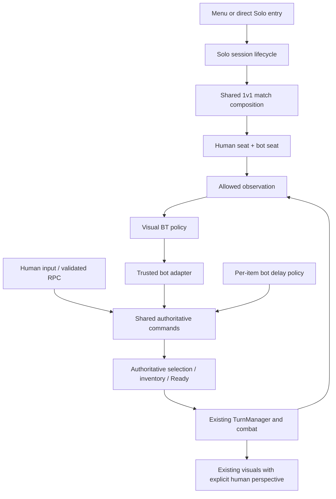

# PLAN 036 - Solo structure for review

Date: 2026-09-28
Status: Proposed structure only; review before file/function-level implementation planning. No code, scene, graph or package changes.
Parent: [PLAN_036](PLAN_036_solo_duel_bt_graph.md). Risks and validation IDs: [plan review](../Validation/PLAN_036_plan_review.md).

Next stage now written: [detailed implementation plan](PLAN_036_solo_detailed_implementation.md). Its verified single-selection item path and explicit roster-before-spawn bootstrap refine this structural outline. No implementation has started.

## 1. Fixed boundaries

- One executable, internal NGO host, one human seat and one server-controlled bot seat. Solo entry does not require UGS, Relay or a second executable.
- Preserve effective 1v1 grants, temperature rules, action ordering, combat, Bo3 and presentation. TurnManager remains the only phase driver.
- The bot decides legal actions through a visual BT. It does not play mini-games or roll a replacement success probability; per-item use delay is the initial penalty mechanism. Exact durations and further penalties are not fixed.
- Shared authoritative operations handle human and bot intent. Neither BT nor presentation mutates gameplay state directly.
- Optional starting stats/loadouts remain configuration extensions. Use an unchanged neutral 1v1 baseline until custom reset/merge semantics and values are specified.

## 2. Responsibility map

These are logical boundaries and provisional names, not a requirement to create one class or interface per row.

| Boundary | Owns | Inputs / outputs | Existing integration seam | Must not own |
|---|---|---|---|---|
| A. Solo session | Start, failure rollback, replay, exit, session generation | Encounter selection -> running/stopped session | AppBootstrapper, NetworkSessionCoordinator, SoloMatchStarter | Turn progression or online authentication |
| B. Match composition | Resolve read-only config, shared 1v1 rule binding, wire services | Encounter + defaults -> immutable runtime settings | MatchCompositionRoot | Duplicated item/rule definitions |
| C. Participants | Bot factory, distinct logical seats, registration and availability | Human connection + bot definition -> registered bindings | PlayerRegistry/Identity/Binding, MatchRoster, PlayerSpawnManager | Camera policy or AI decisions |
| D. Authoritative commands | Legality, pending operation, consumption, selection, Ready results | Validated human RPC or trusted bot intent -> typed result | PlayerState, ActionQueue, inventory and mini-game paths | BT tactics or a second combat engine |
| E. Bot observation | Allowed state snapshots and legal candidate descriptions | Registered bot seat + public/own state -> immutable observation | Match state, inventory, turn context | Hidden human choices or mutable gameplay references exposed to graph |
| F. Bot policy | Tactical branch, chosen action, thinking/Ready timing | Observation + profile -> intent/reason | BotTurnController + visual graph adapter | Damage, inventory writes, phase changes |
| G. Bot item penalty | Resolve per-item delay configuration and operation deadline | Item identity + profile -> delay requirement | Authoritative pending operation in D | Independent effect application or success rolls |
| H. Local presentation | Human viewpoint, opponent visual, HUD, feedback and actual viewer ACK | Explicit human seat + authoritative events -> visuals | AZPlayerVisual, CombatVFXManager, GameDataBridge | Ownership-based authorization changes |
| I. Diagnostics | Trace decision, command, delay and phase correlation | Events/IDs -> logs, graph trace, test evidence | Existing validation probes and output routes | Forcing wins or hiding stalls |

Dependencies: A composes B/C; F reads E and sends intent to D through a bot adapter; D uses G as configuration/policy; existing TurnManager/combat resolve accepted state; H observes results. I observes all boundaries without changing them. Avoid a new global service locator or event bus.



## 3. Data and lifetimes

| Data | Lifetime / owner | Contract |
|---|---|---|
| Encounter, bot, difficulty, stats, item-delay configuration | Asset / authoring | Read-only during play; reuse shared item IDs; delay mapping does not alter shared ItemDataSO assets |
| Resolved settings | Match / composition | Defaults -> bot -> explicit difficulty override; snapshot validated values; absent override inherits baseline |
| ParticipantId, seat, controller role | Match / roster | Human and bot distinct; role assigned by server composition, never client input |
| Connection mapping | Connection / network binding | Human has a real ClientId; bot has no human connection mapping even if its NetworkObject is server-owned |
| Human perspective seat | Local match / presentation binding | Determines FPS/opponent visuals, not gameplay authority |
| Observation, decision, retry budget | Prep run / bot controller | One run per session/round/turn key; snapshots refreshed before submission |
| Pending item operation | Turn / authoritative commands | Request ID + participant + CopyId + target + session/round/turn + deadline; one terminal outcome |
| Trace | Validation session | Record seed, profile/graph version, observation revision, timestamps and request outcomes |

Use the existing identity types where feasible; detail their migration before changing serialization or public APIs. Server-owned bot objects must not become a second PlayerObject registered under the human ClientId. Connectionless bot availability must be distinct from disconnected-human auto-Ready.

## 4. Startup and shutdown sequence

1. Resolve encounter and validate required assets; allocate a new session generation and reject duplicate start.
2. Initialize required local shared services independently of online sign-in. Select one lifecycle owner; old online completions cannot attach callbacks or overwrite this generation.
3. Start local NGO host and load the Solo scene through the chosen single bootstrap path. Direct Editor entry converges on the same path instead of starting another host.
4. Bind Solo to shared 1v1 rules; create/register human and bot logical seats through their distinct factories.
5. Wait for required logical bindings and real scene-load readiness separately. Two logical players do not require two connections.
6. Apply ordinary initial state/grants and enabled approved overrides once; bind human viewpoint and bot cosmetics.
7. Allow TurnManager to begin; start the bot run only on an authoritative Prep notification.

Any failure rolls back only resources created for that generation. Exit/replay first invalidates the generation and cancels bot work, then settles/cancels pending operations under existing item rules, releases subscriptions/bindings, unloads match resources and shuts down the local host. Replay starts a fresh generation; it does not reuse old tickets or require a second human rematch vote.

## 5. Bot decision and item-use sequence

1. Read permitted snapshot; collect currently legal candidates.
2. BT chooses survival/finish/counter/resource/general/fallback branch and an intent.
3. Wait bounded AI thinking time; revalidate before submission.
4. Submit through the trusted bot adapter. The authoritative path rejects invalid phase/seat/item/target or registers a pending operation.
5. Apply configured item-use delay. Preparation time and normal cooling continue. The delay is tracked authoritatively so BT restarts cannot skip it.
6. At completion, revalidate and queue the normal selected item exactly once. Current 1v1 effects and consumption happen during combat, not at this completion point.
7. Refresh observation and determine Ready timing. Preserve legal cancel/reselect behavior but do not enable additional free/sub actions: those methods have no current selection callers.
8. Submit Ready only when legal and no required delay remains. Accepted Ready ends this bot decision run; rejection returns to a bounded current-turn evaluation. Authoritative phase exit always cancels it.

### Pending-operation rules to preserve

- Thinking time and item-use delay are separate named intervals; do not accidentally apply an old mini-game delay on top of the replacement delay.
- Selection locks and inventory consumption remain owned by the shared item operation. A logical reservation is not automatically an extra debit.
- Slot indices can change; use CopyId and revalidate current inventory membership.
- Human mini-game tickets retain their existing UI/result flow. Bot operations must not invoke an owner-targeted human mini-game screen.
- Ready cannot bypass an outstanding bot delay. Duplicate commands/completions return their existing outcome or are rejected without another effect/debit.
- Prep expiry, death, scene exit and restart prevent late effects. Detailed planning must map exact debit/cancel behavior and same-tick precedence to current 1v1 source; this structure does not introduce refunds or a new expiry rule.
- Watchdog timeout records a defect. A fallback can issue only a currently legal action; it cannot force a turn, result or pending-operation success.

## 6. BT structure and cancellation

```text
Prep notification
  -> Observe -> Build candidates -> Tactical branch
  -> Think -> Revalidate -> Submit
       rejected: bounded replan, or legal no-item Ready
       pending: await authoritative delay outcome
       queued: refresh -> Ready timing (legal cancel/reselect retains ordinary rules)
  -> Validate Ready -> Submit Ready
       accepted: Done
       rejected: bounded re-evaluation while current Prep remains
Any state + phase/session invalidation -> Cancelled
```

The turn controller owns run lifetime and cancellation. Graph nodes own policy decisions, not a competing lifecycle loop. Use a narrow adapter around Unity Behavior APIs; verify package compatibility before choosing exact node classes or callbacks. Survival thresholds and tactical weights belong to profiles. The bot must not read the human's hidden queued choice even though it executes on the host.

## 7. Configuration and reset boundaries

| Event | Baseline | Optional override treatment |
|---|---|---|
| Match start / replay | Resolve shared 1v1 defaults; fresh runtime state | Resolve explicit profile once; never modify the asset |
| Initial round setup | Existing 1v1 initialization/grants | Custom starting temperature/loadout semantics must be specified before enabling |
| Subsequent round | Existing 1v1 round reset/grants | First-round-only vs every-round override remains a design choice |
| New turn | Existing turn reset, cooling/Ready rules | Never reapply starting temperature or restock starting loadout here |
| Temporary fan effect ends | Existing effect lifetime | Restore the configured baseline using a defined modifier composition, not an unconditional global value |
| Threshold check | Existing 1v1 rewards/check timing | No special reward suppression; custom starting temperatures still need boundary tests |
| Exit to online | Online defaults | Dispose Solo settings/roles/operations; no modifier leakage |

Per-item delay data needs a validated default and explicit overrides keyed by stable item identity. Missing/negative/non-finite values must not silently create an instant-use advantage. Exact default, durations, allowed zero values and further penalty types are balance settings for later review.

## 8. Structural work packages and review gates

This is dependency order, not an instruction to implement now. The next plan will split these into exact edits and tests.

| Package | Outcome to specify | Depends on | Review coverage |
|---|---|---|---|
| P0. Baseline and tooling | Effective 1v1 contract, graph compatibility fixture, decision list | None | R7; V01-V02,V16 |
| P1. Configuration and lifecycle | Resolved settings, mode ownership, startup rollback and generation cancellation | P0 | R3,R5; V08-V10,V17-V18 |
| P2. Participant and perspective | Two seats/one connection; full ownership-check classification and roster migration | P0-P1 | R1-R2; V03-V07,V22-V23 |
| P3. Command and delay | Human/bot adapters, shared validation, operation state/expiry/debit table | P1-P2 | R4; V06,V11-V13,V19 |
| P4. Solo vertical slice | Scripted legal bot turn in dedicated scene without BT tactics | P1-P3 | V02,V07-V09,V23 |
| P5. Visual BT policy | Observation, subgraphs, bounded retries, Ready strategy, traces | P3-P4 | R6,R8; V14-V15,V20-V21 |
| P6. Match lifecycle and tuning | Approved profiles, full Bo3/replay/menu flow, cosmetic and animation parity | P4-P5 | V12,V17-V18,V22-V25 |
| P7. Acceptance | Offline build, repeated scenarios and 1v1/Multi regressions | P6 | V26-V28 |

Shared identity/command/perspective changes require focused online regression immediately at their package gate, then the full P7 matrix. Do not defer all multiplayer checks until the final package.

## 9. Structural review and next gate

Desk review against the confirmed decisions and R1-R8:

| Check | Structural conclusion | Remaining evidence |
|---|---|---|
| Rule ownership | Single existing TurnManager/combat flow; bot supplies intent only | File-level mapping and regression execution |
| Identity/perspective | Distinct logical seat, connection and viewer responsibilities | Migration signatures, spawn callbacks and renderer audit |
| Mini-game replacement | Authoritative per-item delay; no bot mini-game or random outcome | Per-item timing/debit/expiry table and chosen values |
| Cancellation | Session generation and turn keys bind waits and commands | Concrete cancellation ordering and race fixtures |
| Extensibility | Presets/BT vary behavior without copying scenes or combat rules | Package compatibility and Blackboard isolation |
| Scope | Existing online modes preserved; neutral 1v1 baseline first | Host/Client/Multi regression evidence |

**Conclusion: suitable for user review and subsequent detailed planning.** This is logical consistency review, not a compile/runtime pass. No major new gameplay decision is required to review the neutral baseline structure. Custom initial-profile semantics and final delay values remain separate choices.

After review, the detailed implementation plan should supply: exact files/symbols; participant migration; lifecycle and command state tables; each item's delay/consumption/effect mapping; BT node/Blackboard definitions; narrowly scoped tasks mapped to V01-V28; failure recovery and rollback per task. Do not begin implementation from this structural outline alone.
