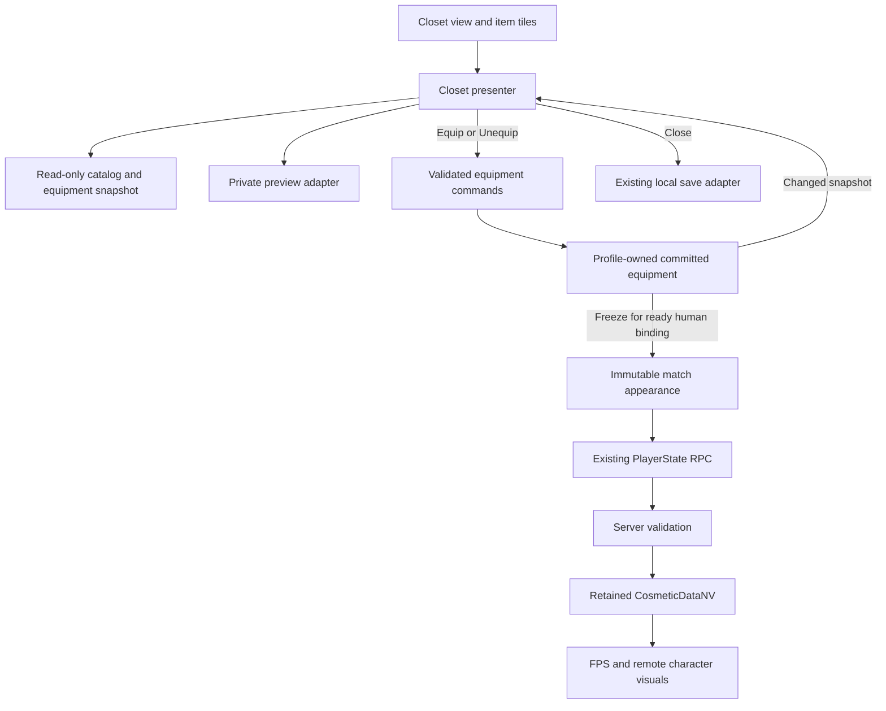

# PLAN 037 — Phase 7 execution detail and finished Closet

> Date: 2026-09-29  
> Status: R00-R13 and C01-C03 passed within the recorded validation scope. PLAN040 UI01 in progress.  
> Parent: [PLAN 037](PLAN_037_gameplay_modular_refactor.md). The parent owns scope, ordering and behavior invariants; this document specifies implementation slices and the Closet handoff.  
> Execution evidence stays in [PLAN_037_results](../Validation/PLAN_037_results.md). This planning pass is not a gameplay test run.
> Reliability revision: the three source-review findings are addressed as implementation contracts below; their code fixes and runtime gates remain pending. Review readiness never advances an execution task.
> Implementation mapping: [file/symbol work packages](PLAN_037_implementation_work_packages.md) specifies the R02-R13/C01-C03 changes, candidate collaborators, existing tests, asset migration and rollback checkpoints. This document remains the behavior/failure contract.
> Follow-up scope — 2026-09-30: [PLAN 040](PLAN_040_followup_features.md) specifies Settings/language, staged bot extension, remaining QA and final verification after the new features. R13 remains the pre-Closet gate.

## 1. Scope and current evidence

Implement the spreadsheet's PHASE 7 as the existing R00-R13 sequence, then build the finished Closet C01-C03. Retain task IDs so the sheet, plan and execution ledger refer to the same work.

The first row reflects current progress; the other rows retain the original planning-time source audit. For changes already completed during R02-R09, use the linked execution ledger and current code rather than treating these historical observations as missing implementations:

| Area | Current owner / observation | Implementation consequence |
|---|---|---|
| Refactor | R00-R09 passed; see the execution ledger for fresh evidence | Resume from R10; retain each completed gate and source baseline |
| Item presentation | `GameSprites.GetItemSprite(string)` uses display names and resource paths; VFX contains item choreography | Add identity-based presentation data, then extract strategies without changing clips/timing |
| Maps | `MapSceneBinding`, `MapCharacterLayout`, `MapCharacterAnchor` now provide map/seat/visual placement | R02 consumes those owners; it must not introduce a second editable set of character coordinates |
| Closet view | `ClosetView` builds text rows, destroys/recreates rows on refresh, uses five fixed tabs | Preserve this screen while R11 separates commands; C02 replaces layout with reusable item cells |
| Closet flow | `LobbyPresenter` directly equips, unequips, saves on close and publishes lobby metadata | Extract a dedicated presenter and a validated application boundary; keep LobbyPresenter in charge of navigation |
| Equipment | `CosmeticProfileService.EquipState` is the current app-owned state; `CosmeticEquipState` saves JSON to `cosmetic_equip_v1` | Keep one committed state, DTO v1 and current IDs; a preview selection is not another committed state |
| Catalog | `CosmeticRegistrySO` checks IDs/duplicates/allowed part types; `GetByPart` exposes a mutable list | UI consumes a read-only projection; do not mutate the shared SO/list for sorting or filtering |
| Artwork | `CosmeticVisualController`, Overlay/Swap and `CosmeticAtlasRenderer` already apply poses/FPS mappings | Reuse them; do not invent new arms, redraw sprites or replace the rig |
| Network | `SubmitCosmeticRpc` validates owner/participant/type/size and accepts once; retained `CosmeticDataNV` feeds FPS/remote renderers | Clothes are selected before the match and carried into it; do not enable mid-match appearance edits |
| Solo | Human submission is separate from `ApplyInitialBotCosmetics` using resolved bot data | The human's clothes must never overwrite the bot's outfit |

Source roots: `Assets/Scripts/Core/{Common,Maps,Cosmetic,Player,Match,Combat,Inventory,Turn,Session,Network}/` and `Assets/Scripts/UI/{Lobby,Game,MiniGame}/`.

Preserve 1v1, 3/4-player Multi and separate local-host Solo, all current winner/ghost/item rules, scene transforms, Animator paths, network component ordering and protocol IDs. Tarot stays inactive. Bot tuning/difficulty, Settings UI01/UI02, runtime map selection and paused side art are separate workstreams, not prerequisites for Closet.

## 2. Architecture choices and ownership

| Pattern | Use here | Why / alternative not selected |
|---|---|---|
| Incremental facade/adapters | Existing PlayerState/TurnManager/network components keep their public boundary while delegates move inside | Avoid wire/scene migration during an ownership refactor |
| Manual composition | Existing MatchCompositionRoot binds match services; AZLobbyUI binds lobby views/presenters | Dependencies are visible without a new service locator or DI package |
| Strategy | Item choreography with genuinely different sequences; retain mode-specific combat policies | A branch belongs in a separate strategy only when it owns meaningful behavior; avoid a class for every trivial item |
| Functional core / authoritative shell | Pure item/temperature calculations return changes; host applies them | Test outcomes without invoking two live writers or converting 1v1 into Multi rules |
| State machine | Targeting and bounded UI operations, not a second turn driver | Makes cancellation/rejection/Ready locks explicit |
| MVP | ClosetView displays a read model; ClosetPresenter handles selection and commands | Layout changes do not alter save/NGO logic |
| Adapter | Current PlayerPrefs store, lobby metadata transport, and visual application | Keep existing keys/protocol; mock only boundaries with failure or lifetime behavior |
| Scoped observer | App equipment changes and match-local notifications | Cleanup belongs to the subscribing scope; do not add a global event bus |

Proposed type names below are responsibilities, not a mandate to create all named files/interfaces. Reuse an existing equivalent owner. Dependencies remain UI -> Core; Core must not depend on a new UI presenter.

### Runtime ownership

- **App:** CosmeticProfileService owns committed equipment and constructs or receives the equipment application service. Keep existing profile lifecycle.
- **Session:** existing router/coordinator owns online/solo start/stop and any asynchronous metadata publication tied to its lease/generation.
- **Match:** MatchCompositionRoot owns bound rule/presentation collaborators; PlayerState and TurnManager retain NGO ingress, state and phase authority.
- **Closet screen:** ClosetPresenter owns selection/tab state and subscriptions; ClosetPreviewRenderer owns only preview objects, camera, texture and any created materials.
- **Assets:** catalog/layout references are read-only configuration. Transient state, equipment selection, cooldowns and queues never live in shared SOs.

## 3. Phase 7 task slices

Execution is sequential: each numbered task must pass before the next begins. Substeps below are small reviewable changes, not parallel writers.

| Task | Slices and proposed seam | Main owner / change | Required exit evidence |
|---|---|---|---|
| R00 / R01 | Already passed: baseline and Tarot availability | Keep existing evidence; refresh affected hashes before R02 | Do not rerun unrelated gates solely to increase test counts |
| R02 | R02.1 inventory asset mappings; R02.2 typed presentation catalog; R02.3 explicit scene bindings; R02.4 scene migration/capture | GameSprites, GameAudioManager, AZPlayerVisual, FPSVisualController, FanSpawner, MultiPerspectiveLayout, MatchCompositionRoot | Every active item/FPS mapping resolves; original coordinates/Animator bindings preserved; duel/Multi/Solo rendered views match |
| R03 | R03.1 camera/effect lifetime; R03.2 sequence context; R03.3 choreography strategies; R03.4 one settlement path | CombatVFXManager delegates to CameraStateScope/effect owner and item presentation strategies | Both attacker perspectives show simultaneous defense once; impact temperature, minimum Multi timing, cancellation and ACK behavior unchanged |
| R04 | R04.1 coherent inventory adapter; R04.2 CopyId-keyed reconciler; R04.3 target registry; R04.4 interaction controller | InventoryPresenter/MultiPerspectiveLayout/ItemWorldView/GameUIManager; retain TargetingArrowPresenter | Duplicate copies, compaction, view-first/metadata-first top-up, rejection, cancel and Ready lock recover correctly on every seat |
| R05 | R05.1 extract request admission; R05.2 mini-game ticket owner; R05.3 shared commit path with separate human/bot authorization | PlayerState keeps RPCs/NVs; plain action service and attempt tracker hold logic | Wrong sender, stale generation/CopyId, expiry, duplicate completion and bot impersonation reject; consume exactly once |
| R06 | R06.1 attack/recovery/defense; R06.2 scheduled buffs/debuffs; R06.3 sabotage/reroll/steal/fan | Extend existing snapshots/results and authoritative applicators; keep duel/Multi policy differences | Frozen input/output fixtures match temperature, uses, defenses, sources, event order and RNG draws; possession stays consume-only |
| R07 | R07.1 temperature/threshold calculation; R07.2 environment policies; R07.3 turn/round/match reset | TemperatureSystem, EnvironmentRuleService, RoundLifecycleService and existing immutable mode snapshot | Rewards, first fan tick, Ready recovery, delayed effects and reset behavior match; possession remains spent across rounds |
| R08 | R08.1 initialization; R08.2 Prep; R08.3 duel/Multi attack; R08.4 result/ghost request handling | TurnManager starts/awaits extracted operations and stays sole phase writer | No extra yield between inventory commit/death/score/winner latch; no duplicate phase/tick/grant/result; disconnects cannot stall |
| R09 | R09.1 map emitters; R09.2 move one event family; R09.3 subscribe + current snapshot; R09.4 remove migrated static forwarding | GameDataBridge, HUD/result/ghost presenters, MiniGameHub, Turn/VFX notifications | Late binding, re-enable, round two, replay and scene exit show exactly one current update and retain terminal results |
| R10 | R10.1 bounded polling; R10.2 typed metadata result and session-owned publication queue; R10.3 retire audited legacy wrappers | NetworkSessionCoordinator, LobbyManager, gateways; keep MatchSessionRouter | Actual Relay 2/3/4-player load/leave/failure and Solo transitions preserve ownership; stale SDK results cannot navigate/mutate a new session; cosmetic SDK failure is observable by its caller |
| R11 | R11.1 equipment commands/read model; R11.2 persistence/codec seam; R11.3 separate ClosetPresenter using current view; R11.4 preview adapter; R11.5 binding-scoped submission readiness/acceptance tracking | CosmeticProfileService/CosmeticEquipState/Registry, LobbyPresenter/ClosetView, PlayerState cosmetic facade, current atlas application | Existing successful equip/unequip/save/reopen behavior is preserved; explicit failure cases use section 4; DTO/server/FPS/remote parity; preview cannot mutate committed or match state |
| R12 | R12.1 isolate development entry; R12.2 remove only proven dead adapters; R12.3 dependency/serialization audit | Core/UI/Editor assemblies and probes | Development/non-development compile; no missing scripts/cycles; provisional Solo guard preserved; pure rule assembly only if actually independent |
| R13 | R13.1 consistent build matrix; R13.2 visual/lifetime comparisons; R13.3 debt handoff | All changed boundaries; PLAN_037_results | No unresolved refactor-caused regression; documented residual release/manual gates remain visible; then C01 may start |

### R02: first executable slice

1. Refresh the post-R01 baseline for the changes introduced by PLAN_038/039. Preserve current map/anchor transforms and evidence of known unrelated limitations.
2. Build an ItemPresentationCatalog from **existing ItemDataSO references**: UI/world sprite, FPS sprite, animation/presentation kind and item-specific audio/effect references where already used. Resolve stable runtime ItemId through the existing catalog; never reindex the 21 entries or serialize a new guessed ID scheme.
3. Keep display labels independent from lookup keys. Do not change gameplay categories or durations while filling the catalog. Validate the 20 enabled entries, deliberate inactive Tarot entry and optional art fallbacks separately.
4. Introduce or extend a serialized match-view binding component in the owning Core assembly. Reference the current gameplay camera, FPS root, local item/icebox anchors and **existing MapCharacterLayout**. Character seat and remote-slot coordinates remain exclusively authored on MapCharacterAnchor.
5. Match composition passes those references to consumers. Late spawned player visuals register/unregister by PlayerBinding and generation; do not rely on all renderers existing during Awake.
6. Keep legacy name/Resources lookup only as a logged, bounded compatibility adapter during scene migration. Migrate duel, Multi and Solo individually; Lobby consumes applicable catalog references without becoming a match composition root.
7. Validate every scene reload, missing/duplicate binding, all local seat perspectives and FPS. Include a valid Solo world/background capture to close the known capture gap when possible; a state-only probe cannot pass the visual gate.
8. Remove a fallback only when every serialized/runtime consumer in its scope is proven migrated. Do not move network components or replace prefab roots.

**R02 deliverable:** catalog asset(s), explicit binding references, focused migration/validation tooling, resolved-reference report, before/after captures, and a task-local source/asset diff. Existing maps and their authoring tools remain operational.

### Hardcoding conversion rules

- Put tunable layout/presentation settings in their actual existing owner, not a universal settings bag.
- Use exact current values as initial data; preserve randomized draw order and per-mode defaults.
- Approved fixed rules (Ghost -3, T+2 reuse, one possession per match) may stay named constants.
- Protocol limits, enum ordinals, CopyId/generation semantics and sentinel values remain contract constants.
- Keep missing-art fallback separate from missing-required-gameplay-data failure. An absent optional icon should not prevent a match; an invalid required seat binding should not silently bind another player.

## 4. R11 contract that makes Closet possible

Proposed responsibilities:

| Contract | Input/output | Rule |
|---|---|---|
| Equipment read model | Read-only list by part, equipped IDs, UI revision | Do not expose a mutable Registry list or allow view code to write EquipState directly |
| TryEquip / TryUnequip | Part + catalog ID -> typed success/failure + current snapshot | Validate membership, expected part and serialized payload before mutation; same selection is idempotent |
| Equipment snapshot/codec | Five IDs + existing v1 wire representation | Preserve 125 UTF-8 byte budget, empty-slot semantics and canonical server validation |
| Profile persistence adapter | Read/write existing PlayerPrefs JSON key | Preserve key/version and malformed/unknown-ID fallback; report a real storage failure instead of displaying saved |
| Preview adapter | Disposable visual instance + immutable preview IDs | No persistence, RPC, session start, or source-asset mutation |
| Lobby metadata adapter | Canonical DTO + equipment revision + current session lease -> typed publication result | Optional session-owned operation; distinguish SDK failure, stale work and no online target; no UGS initialization while using offline Closet/Solo |

R11 does **not** add the final grid, new equip semantics or a draft-save workflow. It routes the old UI through these boundaries first. Preserve save-on-close behavior and current five parts:

**Head / Top / Back / Bottom / Tail.** Head is a set that can map hair, face and hat. Independent hair/face/hat slots require a later design/schema change.

### 4.1 Source findings and bounded repair scope

These are planned reliability repairs, not already corrected runtime defects. Separate each repair from mechanical extraction in the task diff and test its failure trigger as well as the preserved successful path.

| Review ID | Current evidence and triggering condition | Planned owner / required gate |
|---|---|---|
| P37-N1 | [PlayerState](../../Assets/Scripts/Core/Player/PlayerState.cs), TryCompleteBinding/SubmitCosmeticRpc: the client marks submitted before acceptance, initial submission is inside `!wasReady`, and the server rejects without a client reason response. Delayed profile readiness or rejection can leave no confirmed outfit. | R11.5: explicit readiness and observed-acceptance states; C-V13/C-V14. Preserve existing RPC signature, owner guard and server-only NV writer. |
| P37-N2 | [LobbyServiceHelper](../../Assets/Scripts/Core/Network/LobbyServiceHelper.cs), ExecuteAsync: LobbyServiceException fires an error callback but the Task completes normally. [LobbyManager](../../Assets/Scripts/Core/Network/LobbyManager.cs), SetPlayerCosmeticDataAsync returns no operation result. | R10.2: typed result at the cosmetic metadata seam; R11 consumes it; C-V11/C-V16/C-V17. Do not change every unrelated helper caller's exception semantics. |
| P37-N3 | [CosmeticAtlasRenderer](../../Assets/Scripts/Core/Cosmetic/CosmeticAtlasRenderer.cs), Add and [OverlayApplier](../../Assets/Scripts/Core/Cosmetic/OverlayApplier.cs), Apply create additional GameObjects without assigning their camera layer. | R11.4 specifies the preview boundary; C02.4 applies isolation after each dynamic addition/reuse; C-V18. Do not alter the match renderer's sorting/rig to fix preview isolation. |

### 4.2 Identity, immutable data and completion ownership

- Use the existing session lease/generation, PlayerBinding/participant identity and NetworkObjectId to scope match appearance. A seat or OwnerClientId alone is insufficient, especially for local-host Solo. Do not add these local tracking fields to the wire DTO.
- Equipment revision identifies the app's committed state; screen generation identifies a particular open Closet. They are distinct from match generation and result sequence. Capture only the relevant identities for each operation and validate them again before applying completion.
- Freeze a validated five-ID snapshot once the current local-human binding and profile are ready, immediately before its first submission. Never reread a newer outfit for that submitted binding. Start/close navigation guards prevent a stale Closet callback from editing the starting match's snapshot.
- A preview copies IDs from a committed snapshot and changes only the selected part. It never shares a mutable dictionary with the profile, catalog or live player. The bot continues through ApplyInitialBotCosmetics using resolved bot configuration.
- Keep one command writer. Construct and validate a candidate full DTO before committing the selected part; failed validation leaves state/revision/notifications unchanged. Re-equipping the same ID and unequipping an empty slot are successful no-ops. Publish one changed snapshot only for an actual change.

### 4.3 Match appearance submission and honest failure reporting

Retain the existing PlayerState facade. A small bound collaborator may track this local workflow; it is not a second NetworkBehaviour, match initializer or phase driver.

| State / event | Required action and outcome |
|---|---|
| WaitingForDependencies | After participant binding, wait for the app profile/registry if temporarily unavailable; subscribe once or use one bounded owner-controlled check. Already-ready bindings must also enter this path, rather than depending exclusively on the first BindingReady event. |
| ValidateAndFreeze | Validate the complete snapshot with the current registry/codec. Invalid data produces InvalidLocalData with no send and no automatic retry. Do not silently convert an unavailable profile into an empty accepted outfit. |
| AwaitingAcceptance | Subscribe to CosmeticDataNV before dispatch and inspect its retained value; set the local in-flight state before invoking the RPC so host-synchronous completion is safe. Submit at most once automatically for this binding. |
| Matching retained NV | Server-accepted v1 IDs match the frozen snapshot (normalize null/empty slots for comparison). Mark Accepted and let existing FPS/remote binding paths apply it. RPC invocation itself is not acceptance. |
| No confirmation by deadline | Report AcceptanceUnconfirmed, not Rejected or Saved. The existing RPC has no rejection reply, so the client cannot truthfully infer a specific server reason. Record correlated server evidence in tests. Do not add a new ACK/rejection RPC in this refactor. |
| Late matching NV after timeout | Existing retained-state observation may mark AcceptedLate and update the current valid view; do not resend or reopen an old screen. Timeout does not undo server acceptance. |
| Nonempty, different accepted NV | Report a mismatch and render authoritative retained state; never overwrite it from the local profile or bypass the one-accepted guard. |
| Despawn / session replaced | Cancel readiness/deadline work, unsubscribe and discard the snapshot. A new binding starts its own workflow; a new turn/round on the same binding does not reset acceptance. |

Initial diagnostic budgets: **5 seconds** for profile readiness after a valid binding, **10 seconds** for acceptance observation after send, using unscaled time and cancelled on binding/session invalidation. These are cosmetic diagnostic deadlines, not new game-phase waits, disconnect timers or item timing. Record any measurement-driven adjustment in R11's evidence before advancing.

**Retry decision:** retry only local dependency readiness inside its budget. Installed NGO RpcAttribute defaults to reliable delivery; the current SubmitCosmeticRpc does not override it. There is no automatic application-level resend after dispatch, since silent rejection and delayed observation cannot be distinguished by the unchanged protocol. Invalid local DTOs are never retried. Reliable delivery does not itself prove server acceptance.

On a diagnostic failure, preserve existing default/last authoritative presentation and gameplay progression; do not manufacture an empty successful submission, alter the saved outfit or block the turn barrier. Surface concise status to the existing applicable UI/diagnostics without adding an in-match wardrobe. Unexpected server registry/readiness rejection with supported valid data blocks the task until investigated. An intentionally injected rejection passes its negative test only when the expected server rejection and client unconfirmed outcome are both observed.

### 4.4 Local save and optional online publication

Keep storage, lobby publication and match acceptance as three separate outcomes; none proves either of the others.

| Outcome | Meaning / response |
|---|---|
| Local SaveCompleted | Existing PlayerPrefs write/Save call completed without a reported error. Preserve `cosmetic_equip_v1` and DTO v1. This is not a crash-durability guarantee; an application restart is the persistence check. |
| Local SaveFailed | Catch/report an actual adapter/storage error. Retain the in-memory outfit and dirty revision, allow explicit retry, and do not mark that revision saved. A same-process PlayerPrefs readback is not disk-durability evidence. |
| Publication Succeeded | The specific current-lease SDK update completed successfully for the captured equipment revision. |
| Publication Failed | Return a structured error to the caller even when the existing helper consumes an exception; preserve local save/equipment. Error events alone must not masquerade as an operation result. |
| Publication Superseded | A newer pending revision replaced this not-yet-dispatched request. Complete its caller exactly once with the replaced revision; do not call it published or leave an awaiter pending. An already dispatched request is still observed separately. |
| Publication Stale / Cancelled | The captured lease/lobby/player identity is no longer current, or the operation was cancelled. No navigation or current metadata mutation. Cancellation does not prove a remote SDK request was undone. |
| Publication NotApplicable | No legitimate current online lobby exists. Normal offline Closet use succeeds locally and does not initialize UGS. This is not an online success or failure. |

R10 owns a per-session cosmetic publication coordinator, not a queue owned by an individual screen. Permit one in-flight request and at most one pending latest-revision snapshot. A newer pending outfit replaces an older pending one. An unchanged revision/payload does not enqueue another request. Each completion may acknowledge only its captured revision; it cannot mark a newer outfit published.

Use the existing ILobbyGateway/LobbyGateway.UpdatePlayerAsync typed Result<Lobby> seam for the operation. A wrapper that merely awaits the old void-result Task cannot reconstruct the swallowed failure. Preserve unrelated helper callers and route any retained cosmetic facade through the single publisher. Unknown/Unexpected errors are not automatically transient; retry only a verified eligible failure.

- Serialize writes for the same lobby/player even across close/reopen. A screen generation check alone cannot stop an old cloud write from finishing after a newer write.
- On success, send the pending latest snapshot if its session remains current. On explicit transient failure, use the existing audited SDK/backoff policy with a maximum of **one application-level retry**, selecting the latest committed snapshot; do not stack an unlimited retry loop on SDK retries. Invalid/unauthorized/stale work is not retried.
- If a request is still unresolved, do not start another overlapping write to that same lobby/player merely because a UI timeout elapsed. Show pending/unknown status, keep observing the owned operation, and require completion or session disposal before another write. Do not claim cancellation rolled back cloud state.
- Recheck lease/generation/lobby/player before starting or applying each operation. Dispose queued work on session exit; callbacks cannot navigate UI. Preserve current request guards for unrelated Ready/name/poll operations, and test delayed full-lobby responses against newer metadata/polls during R10.
- For operations returning a complete lobby snapshot, capture the locally confirmed metadata revision when the operation starts. If a newer cosmetic publication was confirmed before that snapshot returns, do not replace current metadata with the older operation's snapshot; schedule the existing bounded fresh read instead. Preserve the operation's own success/failure result separately. Do not invent a server ordering guarantee from local callback order. Verify this guard for name/Ready updates and polls as well as the cosmetic publisher.
- Additionally, centralize full-lobby snapshot acceptance across LobbyManager and NetworkSessionCoordinator. Within the same current lease/lobby/player, reject a lower `Lobby.Version` than the last accepted server version, irrespective of whether equipment changed. Equal-version snapshots are idempotent for the versioned public/member fields; do not emit duplicate state notifications. Reset the watermark only for a genuinely new lease/lobby. Installed Lobby SDK documents this version for non-private changes: do not infer ordering of private-only data from it. Preserve request outcomes independently of cache acceptance and apply any required refresh through the existing bounded poll owner.
- Every publication caller must receive one terminal result. Replacing pending B with C completes B as Superseded. Success of A drains the latest pending request. An eligible transient failure may dispatch the latest current snapshot within the single retry budget; skipped pending revisions complete as Superseded. A non-retryable/exhausted failure completes A as Failed and any pending request as Failed with a predecessor-failure reason, clears the queue, and permits an explicit later retry even for the same revision. It never silently strands C or loops on the failure. Lease disposal completes all local waiters as Cancelled; keep observing an already dispatched SDK request for cleanup. An unresolved SDK write retains its lobby/player serialization reservation until it settles, including disposal/rejoin of the same remote identity; local cancellation does not authorize an overlapping write.
- Match appearance comes from the validated local frozen snapshot and authoritative CosmeticDataNV, not from lobby metadata. A failed metadata publication cannot replace match authority or roll back local equipment.

R11 preserves the old successful close flow while introducing explicit results. In C02, close is single-flight per screen: freeze the committed revision for save, disable new equipment commands while saving, discard only uncommitted preview, and return through LobbyPresenter after local success. Online publication is session-owned and must not keep the closed preview alive or later force Main navigation. On reported local failure, retain the current screen/retry status while that screen is valid. Forced scene unload still disposes resources and never resurrects UI or claims that an unsaved revision was persisted.

### 4.5 Preview isolation and resource ownership

| Resource / concern | Ownership rule |
|---|---|
| Root, child renderers, late-created atlas layers and reused Overlay objects | Assign the reserved preview GameObject layer to all owned descendants before the first valid render and after every Apply/replace/reuse. Existing children alone are insufficient. Prefer the preview adapter's explicit apply-and-isolate step; do not force all in-game cosmetics onto a preview layer. |
| Camera mask versus sprite ordering | GameObject.layer/cullingMask isolate cameras. Preserve SpriteRenderer.sortingLayerID, sortingOrder, transforms, flip and pose mappings; these solve a different problem. |
| Main camera / map / weather | No global light, material, map or character transform changes. Reserve a verified free layer; capture/restore any necessary scene-camera mask change under a current-owner token, and do not overwrite a newer scene owner's camera. A layer alone is insufficient if a scene camera still renders all layers. |
| Texture / camera / RawImage | One screen owner creates, binds, suspends and disposes them. On resize allocate a replacement first, rebind both consumers, then release/destroy the old owned texture. Failure keeps a valid old image or a clear unavailable state, never a released reference. |
| Shared versus created assets | Shared sprites, materials, controllers and atlas assets are read-only and never destroyed. Explicitly track only created material instances and preview objects. |
| Disabled/closed/unloaded screen | Stop render scheduling, detach targets, clear cosmetic overlays, release/destroy owned GPU resources and destroy owned objects. Repeated cleanup is harmless; pending callbacks check screen ownership. Re-enable creates/rebinds exactly one valid preview. |

Validate real rendered pixels after pose/remap and camera completion, not only SpriteRenderer.enabled or hierarchy counts. Count objects after Unity's deferred destruction has completed; a same-frame Destroy count is not a leak result. No dedicated preview layer exists in the inspected TagManager yet: reserve and validate it during C02, without renumbering existing layers.

## 5. Finished Closet user flow

**Authoring authority — 2026-09-30:** The user delegated Closet UI/UX design to Codex. An externally supplied layout or another advance design approval is not a prerequisite for C01. Use current hats and deliberate placeholder icons until final art is supplied. Preserve the five-part sprite-swap scope, equipment/save/network contracts, R13 prerequisite and C01-C03 usability/validation gates. The flow below is the working design to refine through those checks; this decision is not evidence that the Closet has been implemented.

The following is the proposed C01/C02 UX, to be demonstrated with a concrete layout during C01. It does not change combat behavior.

1. Open Closet from the existing Lobby overlay.
2. Show the character wearing the committed outfit, current part tab and equipped badges.
3. Click an item tile to **preview** that item on the private character. Merely hovering/selecting does not save or publish.
4. Press **Equip** to validate and commit that part; press **Unequip** to restore the original part. Other parts remain equipped.
5. Switching tabs clears an uncommitted preview and starts from the current committed outfit. Display separate selected/preview and equipped states.
6. Close by the existing close/dim action: discard only an uncommitted preview, save committed equipment once, clean up preview resources and return through LobbyPresenter.
7. Start a new duel/Multi/Solo match. Existing server-validated equipment IDs become the match appearance.

Keep basic front-view idle preview in the first release. Existing drink/defense poses and FPS are validation views, not a new side-view animation feature.

Proposed layout:

```text
+----------------------------------------------------------+
| Closet                                            Close  |
| +---------------------+ +-------------------------------+ |
| |                     | | Head Top Back Bottom Tail    | |
| | Character preview   | +-------------------------------+ |
| |                     | | Icon  Icon  Icon              | |
| |                     | | Icon  Icon  Icon  [scroll]    | |
| +---------------------+ +-------------------------------+ |
| Preview / equipped     | Item name  [Equip] [Unequip]    |
| Save / sync feedback                                  |
+----------------------------------------------------------+
```

Use existing lobby colors, typography and uGUI. A layout profile provides paddings, preview fraction, grid cell size/spacing and minimum widths. Test 1920x1080, 1280x720 and 800x600; use fewer grid columns at smaller widths. Part names stay labels; labels are never equipment IDs.

### Single-state flow



A transient preview snapshot may contain a copied set of IDs. It is disposable presentation data, not a second persistent model. The bot continues to use its own resolved cosmetics.

## 6. C01-C03 implementation slices

### C01 — Reviewable layout and binding specification

- C01.1 Map each required element to a serialized view binding: part tabs, scroll content, item-cell prefab, preview RawImage, selected-name/equipped label, equip/unequip/close controls and status text.
- C01.2 Produce a placeholder layout using current hats/catalog data, including a part with no available items, missing icon, long name and reduced resolution.
- C01.3 Capture layout/input ordering; check that the preview does not block clicks and tab/close controls remain accessible. Keep interaction semantics from section 5 explicit.
- C01.4 Fix layout findings before connecting new mutation logic. Record the chosen layout in the plan and mark C01 passed only with usable captures.

**Deliverables:** reviewable UI prefab/layout configuration and binding map. Preserve the old screen until replacement is validated.

### C02 — UI, preview and equipment connection

- C02.1 Create reusable ClosetItemCell and ClosetPresenter bindings. Use catalog IDs as keys; subscribe once and remove listeners on unbind. Update selected/equipped cells without rebuilding every row. Reuse a bounded cell list first; add virtualization/pooling only when item count/profiling justifies it.
- C02.2 Icons: introduce an optional display-icon reference only if existing Sprite is not a meaningful thumbnail. Existing sprites remain valid fallback; missing art shows a neutral icon/name. Do not use an arbitrary atlas body slice as a full costume thumbnail.
- C02.3 Preview: reuse a verified visual-only character prefab and CosmeticVisualController/AtlasRenderer. Instantiate no NetworkObject, PlayerState, physics, gameplay, audio-listener or session-bootstrap components. Do not instantiate an active network player and remove components afterwards.
- C02.4 Render the preview through one screen-owned camera and RenderTexture into RawImage. Apply section 4.5 to existing and dynamically created/reused descendants after every cosmetic application. Keep camera layers separate from sprite sorting; protect existing main camera, light/weather and map state. Set aspect/orthographic framing from an authoring profile and stable baseline bounds so changing a hat does not make the character jump in scale.
- C02.5 A preview frame is valid after the Animator/SpriteResolver pose and atlas LateUpdate remap. Verify camera scheduling/URP renderer/alpha at the actual installed version; do not rely on an early blank capture. Recreate/rebind a lost texture safely after resize or re-entry.
- C02.6 Connect Equip/Unequip to R11 commands. Validation failure leaves committed state untouched, refreshes the displayed snapshot and reports the actionable reason. Multiple rapid clicks must not duplicate state notifications or online requests.
- C02.7 Close/open lifecycle: stop rendering before detaching targets; clear RawImage.texture and camera.targetTexture; release and destroy the owned RenderTexture; clear atlas layers and destroy owned preview objects/materials. Cleanup is idempotent across close, disable, scene unload and disposal; never destroy shared source sprites/materials.
- C02.8 Keep local persistence and online publication distinct. Save locally first; a lobby metadata failure cannot undo valid local equipment. Scope asynchronous completion to the current presenter generation and session lease, and never switch a newly opened screen to Main from an old close callback.
- C02.9 Preserve the existing Main-menu Closet entry. Do not add in-room/in-match editing implicitly. Retain the existing optional in-lobby publication path for legitimate callers/tests, but reject stale session work. Any queued retry uses the newest committed snapshot and an explicitly current online session; no unbounded retry loop.

**Storage/close contract:** retain save-on-close, not a new per-click disk policy. While closing, coalesce duplicate close requests. On a reported local save failure, keep the equipped state in memory, show a retryable error and do not claim persistence; do not start a match through a stale closing screen. Involuntary process termination is not promised crash-safe by PlayerPrefs.

**Network contract:** keep DTO v1 and the existing one-accepted-submission guard for the spawned participant binding. Implement sections 4.2-4.4, including already-ready binding, synchronous Host completion, late retained NV and truthful unconfirmed status. Re-entering a match/scene uses the newly bound generation; round progression alone does not authorize a new outfit.

### C03 — Acceptance and handoff

Run after C02 on one identified build:

| Check | Stimulus | Pass condition |
|---|---|---|
| C-V01 | Preview different item, then close or change tab | Committed IDs/save/network unchanged by preview alone |
| C-V02 | Equip A -> B -> unequip in each part | Only selected part changes; original current pose restored; badges/read model agree |
| C-V03 | Unknown ID, wrong part, duplicate catalog ID, invalid version/oversized DTO | Typed rejection or existing documented fallback; no partial mutation or server crash |
| C-V04 | Save, close/reopen, application restart, malformed saved JSON | Current outfit restored; malformed data uses existing fallback; no silent false saved state |
| C-V05 | Empty category, no icon/replacement, long name and keyboard/mouse focus | Usable controls, readable names, intentional fallback and no input blocked by preview |
| C-V06 | Open/close rapidly; equip rapidly; resize; leave the scene | One listener path; no stale UI navigation; owned texture/camera/overlay/material counts return to baseline after cleanup |
| C-V07 | Front idle/drink/defense + first-person hands for configured examples | Current outlines, sorting, item-between-hands and pose mapping preserved; missing optional mapping retains original |
| C-V08 | 1v1 Host/client and actual Relay Host+3 clients wearing distinct sets | Server-accepted IDs and all remote/FPS renderers agree; no client-authored pixel/transform upload |
| C-V09 | Late visual bind, metadata arrives before visuals, round two and rematch | Accepted appearance reapplied once to current bindings; old-generation views are not updated |
| C-V10 | Local Solo entry/replay/return and Solo↔online transition | Human outfit preserved; bot uses bot config; Closet/Solo does not require Relay or initialize UGS |
| C-V11 | In-lobby metadata failure, delayed response, close/reopen/new session | Local save retained; old results ignored; online metadata is not treated as a match-state authority |
| C-V12 | Replace a sample item's atlas mapping and reopen without modifying gameplay/UI logic | Correct new reference applied where supplied; missing poses fall back and fit issues are reported separately |
| C-V13 | Profile absent at BindingReady, then ready before the 5s budget; never ready; despawn before ready; Host synchronous acceptance | One frozen valid submission when ready; no send after expiry/despawn; no empty fabricated success; Host acceptance cannot be overwritten by a later in-flight assignment |
| C-V14 | Invalid local DTO; server rejects a locally valid DTO; matching/different NV; approval arrives before/after 10s; new round/new spawn | Invalid local data never sends; server rejection remains unconfirmed on client with correlated server reason; no resend storm; late current-binding NV is applied; accepted appearance cannot be edited and old-binding callbacks are ignored |
| C-V15 | Inject store failure on close; retry; close twice; unload/reopen during completion; successful save then restart | No false saved revision, duplicate save or stale navigation; in-memory equipment retained; forced unload cleans preview; successful restart restores the stored outfit |
| C-V16 | SDK helper consumes LobbyServiceException; no online lobby; cold offline Closet | Adapter returns Failed or NotApplicable accurately; no UGS initialization for NotApplicable; local save remains valid |
| C-V17 | Same-lobby A in flight, then B/C changes; delayed/non-retryable/retry-exhausted A; unresolved timeout; disposal/rejoin; delayed poll/name/Ready response with unchanged equipment revision | At most one write plus latest pending; C is final after successful drain; replaced B completes as Superseded; failure/disposal completes every waiter exactly once and permits explicit retry as applicable; no overlapping unresolved write; lower Lobby.Version never rolls back current state; equal versions do not duplicate notifications |
| C-V18 | Reserved preview layer, atlas overlay + legacy overlay; equip A/B/none repeatedly; inspect preview and scene cameras | Every owned child including reused/late-created layers is isolated; expected hat/body pixels appear in preview and no preview character leaks into the scene camera; original sorting/pose unchanged |
| C-V19 | Repeated open/close (20 cycles), resize during selection, disable/re-enable, texture creation failure, scene unload | No stale/released texture references; one active preview; owned resource counts return to baseline after deferred cleanup; unrelated scene masks/assets unchanged |
| C-V20 | Current identical catalog/build in duel, actual Relay 3P/4P and Solo; deliberate unknown-ID/catalog mismatch fixture | Supported peers agree on five accepted IDs and supplied visuals in every seat; mismatched content is diagnosed/rejected as applicable, not called compatible; human state never overwrites bot state |

Use current supplied artwork and existing motions. Final future sprites require their own fitting review; passing the example hats does not certify art that has not been supplied.

## 7. Validation, rollback and progression

For every R/C task:

1. Snapshot the exact affected dirty files/assets and relevant baseline behavior; record existing failures separately.
2. Implement one slice behind the current public owner. Do not run old/new authoritative writers together for comparison.
3. Run focused static/Editor tests and normal Unity auto-compilation; never force recompile_scripts.
4. Exercise the affected mode/lifetime/network/visual scenarios. Rules require semantic output parity; network boundaries require actual peers; presentation requires valid rendered captures.
5. Record trigger, cause, repair and rerun evidence for each failure. A higher test count alone does not resolve a known defect.
6. Mark the task READY_FOR_NEXT only after mandatory gates pass. Record build/source identity, commands/reports, captures and exact untested scope in the existing execution ledger.
7. Update the sheet status from the verified ledger. Planning alone leaves pending implementation rows pending.

Common stop conditions: altered damage/uses/target rules, a second state/phase owner, broken DTO/GUID/Animator bindings, stale generation updates, new gameplay-induced stalls or unresolved refactor-caused rendering differences. Task-local rollback restores only that task's edits and preserves unrelated dirty work.

Use deterministic fixtures for parity, real local/Relay peers where a boundary changes, and explicit manual checks for perception/feel. Separate-PC/network soak, true offline Solo, final bot balance/release backend and PLAN_039 residual checks stay in their existing ledgers; they are not silently considered passed by a refactor gate.

### 7.1 Failure gates by task

These refine the parent matrix rather than add a second execution ledger. Run the rows when their boundary changes; C03 repeats the combined Closet matrix on one build.

| Task | Failure to inject / preserve | Required observation |
|---|---|---|
| R02 | Missing required/optional reference, duplicate binding, scene/map reload, late player view | Required errors are explicit, optional art falls back; current MapCharacterAnchor remains sole position owner; per-seat and valid Solo world captures match baseline |
| R03 | Cancel sequence A, start B, then receive A completion/timeout/ACK; disconnect during effect | A cannot restore B's camera or release B's objects/locks; each sequence settles once; existing ACK/impact/defense order preserved |
| R04 | Copy compaction, stale selection result, inverted envelope arrival, Ready during pending input | Read one coherent epoch/revision, reconcile by CopyId, reject stale callbacks; authoritative confirmation wins over local speculation |
| R05 | Wrong owner/bot impersonation, duplicate/expired mini-game result, target/copy removal | No unauthorized or double consumption; unchanged turn/phase/deadline admission |
| R06 | Same frozen input and explicit random draws across old characterization fixtures and new pure rules | Exact ordered semantic results and random draw count; one authoritative application; old/new live writers never run together |
| R07 | Turn/round/match resets, threshold crossing with death, delayed source loss | Exact reset scope, grant count, source attribution and ghost availability; no changed stacking/defense policy |
| R08 | Terminal kill at each supported phase, disconnect/empty seat, result while presentation pending | Winner latch and terminal sequence unchanged; no added yield between commit/death/score/winner; no orphan barrier |
| R09 | State changes during initial subscription, duplicate forwarding, late terminal UI, re-enable | Subscribe/read revision handshake or proven uninterrupted equivalent; no missing newest state, duplicate visible event or old-generation callback |
| R10 | Consumed SDK exception, overlapping requests/polls, failed/cancelled load, old completion after a new lease | Typed cosmetic outcome, serialized writes and guarded metadata application; original router remains sole session owner; C-V16/C-V17 pass at this seam |
| R11 | Invalid/no-op equip, store fault, absent profile, immediate/late/rejected acceptance, stale binding | P37-N1/N2 contracts are executable; no false success, partial mutation, duplicate notification or human/bot mix; C-V13-C-V16 pass with current view |
| R12 | Non-development startup, serialized/UnityEvent/animation-event caller of a proposed removed adapter | No missing script/cycle/active probe; removal requires caller evidence; no incidental type/assembly migration |
| R13 | Consistent build across affected modes plus later changes revisiting earlier boundaries | All mandatory gates pass with matching build/data hashes; unresolved refactor regressions block C01, independent known debt remains named |
| C01-C03 | C-V01-C-V20, including rendered isolation and lifecycle failures | Layout reviewed, observed outcomes match contracts, real peer views/IDs agree, resource disposal verified |

### 7.2 Evidence and advancement rule

Record per task in the existing PLAN_037_results ledger: task/substep, source/build/catalog identity, affected baseline hashes, scenario ID and input/order, expected/observed state, test command/report/capture paths, defects and repairs, rerun result, remaining debt IDs, and READY_FOR_NEXT or BLOCKED with reason. Planning status, implementation status and runtime validation status are separate fields/concepts.

- Start R02 only after refreshing the current map-aware affected baseline; do not assume historical counts prove parity. R03-R13 then follow sequentially. R10 metadata contracts precede R11 consumers; R11 gates precede C02 connection; R13 precedes C01.
- Use deterministic fake clock/storage/SDK failure seams for fault branches and actual peers for transport/replication. A mock success does not certify Relay. Actual three-player coverage remains explicit rather than inferred from four players.
- Capture full valid gameplay/preview images at identified pose/sequence checkpoints; black or world-missing captures fail the visual gate even if state assertions pass. No pixel-perfect equality is required across animated frames.
- Preserve same-build/same-catalog as the supported cosmetics contract. The validation harness compares build/catalog/art-reference identity and rejects incompatible evidence. A runtime catalog-download/version-negotiation protocol is not added; identical IDs with different art are an unsupported-content fixture, not something the existing server can detect from IDs alone. Unknown IDs still use the existing server rejection path.
- Functional readiness requires every mandatory gate to pass and zero unresolved task-caused authority, identity, consumption, phase, lifecycle or visible rendering defects. A numerical score never overrides a failed gate. Unavailable mandatory evidence leaves the task blocked; unrelated known debt is not silently closed.

### 7.3 Plan approval versus implementation acceptance

Plan review can approve the contracts and first task without claiming the future code works. Implementation evidence is earned separately per task. Changing balance, equipment slots, accepted wire format, match topology, outfit editing during a match, bot tuning or art/rig remains outside this plan; a necessary departure is raised before dependent implementation. Routine technical fixes that satisfy the contracts need no new gameplay decision.

## 8. Planning review and compatibility

This is a source-based self-review, not independent-agent review or runtime proof.

| Risk found in planning | Resolution |
|---|---|
| Old R02 layout extraction could overwrite the new map anchors | Reuse MapCharacterLayout/MapCharacterAnchor; only non-character view bindings are added |
| Moving components could invalidate NGO behavior IDs or Unity references | Keep RPC/NV facades/component ordering and GUIDs; extract plain collaborators inside them |
| UI dependencies could create Core -> UI assembly cycles | Core owns equipment/rule contracts; UI owns ClosetPresenter/view; existing composition binds them |
| Previewing could accidentally equip/save/send a real character | Disposable preview snapshot + visual-only prefab; only explicit validated equip command commits |
| A completed outfit submission could be mistaken for live customization support | Existing one-accepted appearance per spawned participant binding retained; turn/round progression does not reopen submission |
| Human profile could clobber Solo bot clothing | Preserve resolved bot appearance and logical participant identity paths |
| A slow Closet close could navigate a newer screen or lobby | Screen generation + current session lease checks, single-flight close/publication |
| Repeated opening could leak camera/RenderTexture/overlay resources | Explicit screen ownership, idempotent release/destroy and object-count verification |
| An atlas set could be mistaken for independent head/hair/face slots | Keep existing five-part schema and atlas pose replacement contract |
| Frozen old test totals could be claimed as refactor evidence | Preserve old results as history; every task gets fresh affected-scope evidence |
| P37-N1: one-shot client submission could be confused with server acceptance | Section 4.3 separates readiness, frozen submission, observed acceptance and unknown timeout; C-V13/C-V14 are mandatory |
| P37-N2: consumed SDK exception could look successful to the Closet | Section 4.4 requires typed operation results and a session-owned serial publisher; C-V16/C-V17 include helper failure and same-session ordering |
| P37-N3: generated overlay children could evade preview isolation | Section 4.5 covers every new/reused descendant plus both camera masks; C-V18 checks rendered output |
| Failure toasts/timeouts could accidentally change gameplay or protocol | Cosmetic deadlines are diagnostic only; no new RPC, turn barrier wait, gameplay fallback write or outfit mutation after acceptance |

Installed environment checked: Unity 6000.3.11f1, uGUI 2.0.0, 2D Animation 13.0.5, NGO 2.11.2, Behavior 1.0.16, Input System 1.19.0, URP 17.3.0. Installed uGUI source confirms RawImage.texture, CanvasScaler.referenceResolution/uiScaleMode and GridLayoutGroup.cellSize/spacing/constraintCount. No package change is required.

API references:

- A camera renders into its assigned texture through [Camera.targetTexture](https://docs.unity3d.com/6000.3/Documentation/ScriptReference/Camera-targetTexture.html); [uGUI RawImage](https://docs.unity3d.com/Packages/com.unity.ugui@2.0/manual/script-RawImage.html) displays that texture.
- [RenderTexture.Release](https://docs.unity3d.com/6000.3/Documentation/ScriptReference/RenderTexture.Release.html) releases native resources but does not destroy the object; screen cleanup must handle both owned lifetimes.
- Unity 6.3 [Awaitable](https://docs.unity3d.com/6000.3/Documentation/ScriptReference/Awaitable.html) is available, but existing VFX coroutines and UGS Tasks remain appropriate for this incremental plan. No wholesale async conversion is needed.
- The parent plan records newer NGO API/package candidates. Their compatibility with this project remains untested; upgrading or replacing the approved local-host transport is a separate migration, not a prerequisite.

### Planning review rubric

Planning assessment uses the same five 20-point dimensions as the preceding 88/100 review. It measures written scope/ownership/failure/verification completeness, not a statistical reliability estimate. Source-review gaps now have explicit owners and acceptance scenarios; they remain unimplemented.

| Dimension | Previous | Revised | Basis / remaining limit |
|---|---:|---:|---|
| Design and behavior preservation | 20 | 20 | Existing mode/rule/rig/DTO boundaries retained; failure repairs explicitly separated from mechanical extraction |
| Responsibility and pattern fit | 19 | 19 | Existing facades, manual composition and scoped adapters; exact extraction size still checked per task |
| Synchronization and failure recovery | 15 | 19 | Binding identity, frozen DTO, observed acceptance, typed metadata failure and serial publisher specified; transport/timing remains to be exercised |
| Preview and resource lifetime | 16 | 19 | Dynamic layer isolation, camera ownership, texture failure and cleanup contracts added; final rendered behavior remains to be exercised |
| Verification and rollback | 18 | 19 | Per-task failure gates, C-V01-C-V20, evidence schema and score-independent stop rule; new tests/captures remain pending |
| **Total** | **88** | **96 / 100** | **Source-based plan readiness only; not an implementation/runtime pass** |

This is a self-review against current source, not a second independent reviewer. There are no known unresolved planning blockers to starting R02 under these contracts. Runtime evidence, C01 layout review and future supplied-art fitting are still required at their own gates; no speculative package/framework expansion is needed to inflate the score.

Follow-up review (2026-09-29): the work-package review assessed 94/100 after finding two R10 contract gaps: equipment revision alone cannot reject an older Ready/poll snapshot, and superseded/failed pending callers lacked terminal outcomes. The above monotonic server-version gate and complete queue outcome rules address both at the planning level. R10 must exercise the unchanged-equipment out-of-order response and all-caller-completion cases; no runtime repair or higher executed score is claimed here.

Documentation checks for the reliability revision, before the implementation work-package addition: all local Markdown links in both plans and ACTIVE_CONTEXT resolve; code fences are balanced; R02-R13 slices remain ordered; C-V01-C-V20 exist exactly once; P37-N1/N2/N3 each map to an owner and acceptance cases; no unexpected trailing whitespace. Before/after aggregate SHA-256 for 281 inspected source/test/configuration files was unchanged. That revision edited this appendix, its parent and the continuity note. Current work-package checks are recorded in the linked implementation document. These checks validate the documents and preservation scope, not gameplay.

**Readiness:** PLAN_READY_FOR_R02. First refresh the affected baseline in R02.1, then implement and validate one task at a time. R02-R13/C01-C03 remain pending; the three reliability repairs are planned and have not been executed. No gameplay compilation, Play Mode or Relay tests were run for this documentation revision.
