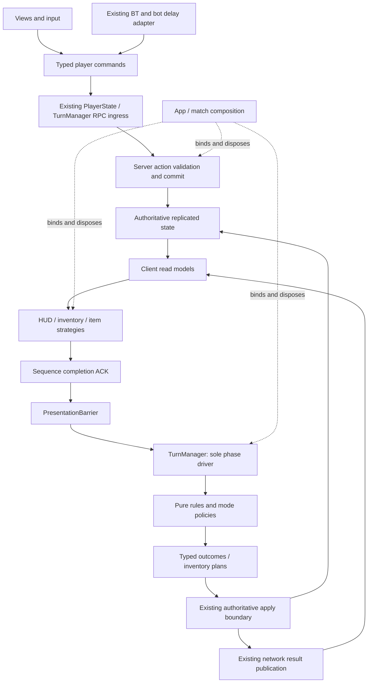
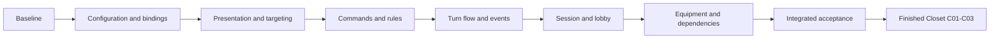

# PLAN 037 — Game-wide modular refactor, then Closet UI

> Date: 2026-09-29  
> Status: R00-R13 and C01-C03 passed within the recorded validation scope. PLAN040 UI01 in progress.  
> Scope: preserve current duel, Multi and local Solo behavior while reducing mixed responsibilities and fragile configuration.  
> Next task: PLAN040 UI02 local settings, with task-local verification and repairs before advancement. Results: [execution ledger](../Validation/PLAN_037_results.md).  
> Follow-up: Closet UI C01-C03 after the refactor acceptance gate. Bot tuning/content remains a separate BT workstream.

> Planning update — 2026-09-29: [Phase 7 execution and Closet details](PLAN_037_execution_and_closet_details.md) specifies R02-R13 substeps, reuse of the new map anchors, R11 equipment contracts, C01-C03 UI/preview/save/network behavior and acceptance cases. Its reliability revision adds binding-scoped observed acceptance, typed/serialized lobby publication, dynamic preview isolation and mandatory failure gates. Plan readiness is 96/100 by the documented self-review rubric; this does not advance implementation status or certify runtime behavior.
> Implementation work packages: [concrete file/symbol plan](PLAN_037_implementation_work_packages.md) maps every task to entrypoints, proposed collaborators, ordered changes, existing test harnesses, asset migration and task-local rollback. Current package status is maintained in the execution ledger.
> Follow-up integration — 2026-09-30: [PLAN 040](PLAN_040_followup_features.md) connects R10-C03 to Settings UI01, language UI02, staged BT authoring/activation and QA01-QA09. It preserves this plan's gates; documentation review does not advance execution beyond R09.

## 1. Latest user decisions

These decisions supersede older proposals in the game design and roadmap.

| ID | Decision | Consequence |
|---|---|---|
| D37-01 | Tarot will not be implemented | Do not implement free actions, reveal-aware AI or additional selection. Plan a separately identified availability correction; preserve serialized catalog identity. |
| D37-02 | Bot starting stats/items and difficulty selection belong to later BT work | Preserve current BT, configuration assets and disabled custom-stat gate. Expose clear initialization/configuration boundaries without activating new tuning. |
| D37-03 | Customization uses replacement sprites; color editing is unnecessary | Preserve atlas, Overlay/Swap, equipment IDs and synchronization. No tint picker or color fields in save/network data. |
| D37-04 | Build the finished Closet after refactoring | Prepare reusable equipment, preview and persistence boundaries first. Implement the new screen only after R13. |
| D37-05 | Prefer components, suitable patterns and less hardcoding | Extract independently owned responsibilities. File splitting alone, additional managers and interfaces for every class are not success criteria. |

Only D37-01's availability correction intentionally changes accessible content. Isolate and test it before taking the behavior baseline used for subsequent extractions. Do not mix it into combat changes.

No balance, targeting, ghost rule, timing, camera composition, sprite/rig, new item, reconnect, host migration, pause/save, networking topology or package changes are part of this refactor. Preserve unresolved stacking/delayed-defense rules exactly as implemented; this plan does not decide them.

## 2. Audit basis and limits

Inspected the current dirty worktree, subsystem inventory, key call paths, scenes/catalog references, assembly definitions, package manifest/lock and recent validation records. `Assets/Scripts` contains 224 C# files including tools/probes. This is a structural audit, not an assertion that every line or runtime combination was retested.

Existing architecture direction: [target contract](../AI_TARGET_ARCHITECTURE.md), [PLAN 018](PLAN_018_architecture_migration.md). Existing evidence: [PLAN 034](../Validation/PLAN_034_results.md), [PLAN 035](../Validation/PLAN_035_results.md), [PLAN 036](../Validation/PLAN_036_results.md). PLAN 018's historical two-player baseline and old ownership descriptions do not describe today's complete implementation. This plan is the current sequencing document for the new cleanup; retain its behavior-preserving principles.

### Findings and concrete destinations

Paths below are relative to `Assets/Scripts/`. Line counts identify inspection scope, not arbitrary size limits.

| ID | Observed code / burden | Proposed boundary and pattern | Why it helps / risk to preserve |
|---|---|---|---|
| A01 | `Core/Turn/TurnManager.cs` (2172 lines): initialization, Prep, duel/Multi attack, ghost ingress/history, round transitions and presentation publication | Existing TurnManager remains phase/network facade; extract phase operations, ghost request handling and round orchestration under its control | A ghost request change need not touch round scheduling. Never create two phase drivers or move RPC components incidentally. |
| A02 | `Core/Player/PlayerState.cs` (1057): replicated fields, identity, target validation, selection, mini-game tickets, bot commands and cosmetics | Server action service + target policy + mini-game attempt tracker; PlayerState retains NGO ingress/state | Human and trusted bot actions share legality/commit rules while retaining distinct authorization. Preserve generation/epoch/CopyId/deadline checks. |
| A03 | Duel `CombatResolver.Resolve`, `ItemContext`, SO `ComputeEffect` and `ItemEffectApplicator` still use live players; Multi already has snapshots, deltas and an applicator | Pure item calculations with explicit inputs; separate duel/Multi orchestration and authoritative apply adapters | Category-by-category parity tests replace scene-dependent rule tests. Do not force duel rules into Multi's sequential winner logic. |
| A04 | `Core/Combat/CombatVFXManager.cs` (1573): queue/ACK, camera, particles and item-specific choreography; name comparisons at `PlayMultiItemSequence` / `PlayItemSequence` | Sequence orchestrator + registered presentation strategies + owned camera/effect context | New item art/choreography need not expand one branching method. Attack/defense impact and exactly-once ACK remain sequence-owned. |
| A05 | `Core/Common/GameSprites.cs` maps display names to resource paths; FPS/cat/freeze/audio paths are distributed | Typed presentation catalog populated from existing assets, with a validated compatibility adapter | Renaming display text cannot change which sprite or animation plays. Existing `ItemId` order and Animator triggers stay stable. |
| A06 | `Core/Inventory/InventoryPresenter.cs` (877) binds, builds views, handles selection and rebuild locks. `MultiPerspectiveLayout` also creates remote views | Read-model adapters, keyed view reconciler, interaction controller and layout profile | Same item view can be reused by local/remote displays. Preserve Multi's atomic envelope; never mix it with raw-list reads during a refresh. |
| A07 | `UI/Game/GameUIManager.cs` searches seat markers and filters renderer names during target detection | Explicit target registry + targeting session state machine; reuse `TargetingArrowPresenter` | Character art names stop affecting hit testing. Preserve click/aim/snap/confirm/cancel rules and character-foot arrow endpoint. |
| A08 | Temperature thresholds, grants, environment timings, layout positions and result waits are split between constants and local defaults | Validated rule/layout/presentation configuration, owned per appropriate scope | Make real tuning values editable without moving protocol constants into generic configuration. Initial values must match current behavior. |
| A09 | Turn/VFX/mini-game static events span scene lifetimes; presentation references are found from multiple consumers | Match-owned typed event source with direct subscriptions and deterministic cleanup | A second match cannot receive an old match's notification. Replicated state and retained results remain sources of truth. |
| A10 | `NetworkSessionCoordinator` (968) and legacy `LobbyManager` (664) both retain substantial service-facing surface | Retain session router/coordinator; extract polling and lobby metadata operations through existing gateways; retire unused wrappers last | One place owns session startup/stop, another bounded component owns polling. Preserve late-result rejection and cleanup compensation. |
| A11 | `LobbyPresenter` handles multiple screens including Closet; existing cosmetics already implement Overlay/Swap and atlas replacement | Dedicated equipment application service and preview adapter; existing profile service remains app owner | Future Closet reuses the same equip/save/network contract. No second equipment state or replacement renderer is needed. |
| A12 | Runtime diagnostics coexist in `Core/Solo`; Core assembly contains rules, NGO, UGS, UI and presentation | Development entry isolation + dependency checks; extract a pure rules assembly only after dependency seams are ready | Prevent test entrypoints becoming normal startup dependencies. Avoid folder/assembly changes before behavior is stable. |

### Keep and extend these existing components

- `MatchSessionRouter`, launch contexts, session leases and generation checks.
- `PlayerRegistry`, `PlayerBinding`, participant descriptors and `LocalMatchPerspective`.
- `PrepInputWindow` and committed input snapshots.
- `GhostSkillLedger`, `GhostSkillService`, authoritative death/winner handling.
- `DeathmatchGrantCoordinator`, prepared inventory mutations and coherent `MultiInventoryReadModel`.
- `ItemEffectRuleSnapshot`, Multi resolver/application separation and `PresentationBarrier`.
- Production Behavior graph, `BotTurnController`, `TrustedBotCommandAdapter`, `BotItemUseOperation`.
- Existing cosmetic registry, atlas renderer, `ICosmeticApplier` implementations and validation.
- Existing particle `ObjectPool<GameObject>` and its cleanup safeguards. Pooling is not a missing foundational feature.
- Existing `AbsoluteZero.Core` and `AbsoluteZero.UI` asmdefs. Do not start from the obsolete assumption that no asmdefs exist.

## 3. Target ownership and flow

**State owners remain explicit:** app owns profiles and session routing; one session lease owns transport/load/stop; match owns bound services/read models; server owns gameplay; each client owns only local presentation. Services receive their required dependencies at construction/binding, not a giant shared service locator.

**Two-person semantics stay explicit.** Duel and Solo share duel policies; Multi retains its own victory, death, ghost and inventory policies. A semantic pair such as the two survivors receiving a deathmatch top-up is valid. Do not mechanically replace every `2`, `P1/P2` wire field or array with a generic N-player abstraction.

## 4. Pattern choices and alternatives

| Boundary | Selected | Alternative considered | Decision reason |
|---|---|---|---|
| Manager decomposition | Facade + composed plain C# services | More MonoBehaviour managers / large base class | Preserves serialized/network identity and makes ownership visible without new Unity lifecycle order. |
| Rule evaluation | Functional core + authoritative application shell | Stateful strategy objects that write NetworkVariables | Calculations can be compared independently; only one writer commits effects. |
| Duel vs Multi | Small mode policies and distinct orchestration | One universal combat algorithm | Shared mathematics is reusable; different ordering, death and victory contracts remain clear. |
| Item animation | Registry of a few strategy families (ordinary, feed, hug, cat, fan upgrade) | Display-name switch / class for every item | Data handles ordinary differences; strategies handle genuinely different choreography. |
| Input | Typed request/result + explicit selection states | Every UI view calls gameplay singletons | Reject reasons, target validity and cancellation share a contract; no generic command bus is required. |
| Configuration | Existing SOs + narrowly scoped catalogs/profiles | One global settings asset / every constant editable | Values have an owner and validation; protocol and invariant constants remain code. |
| Notifications | Direct instance events / narrow match-owned typed source | Global EventBus / SO channels for network truth | Subscription lifetime is bounded and replicated state is not replaced with transient messages. |
| Session cleanup | Existing lease/generation and operation compensation | Cancel token alone / transport replacement | SDK/native work may finish after cancellation; stale completions must still be rejected. |
| Repeated visuals | Existing pool, optional measured additions | Pool every UI/NetworkObject | Reset correctness and measured allocation savings must justify each addition. |
| Closet | MVP + existing equipment/atlas services | UI owns another equipment model | UI layout can change without changing saves or network rules. |

Keep coroutine choreography, Task-based UGS boundaries and current uGUI. No DI framework, ECS, Addressables, UI Toolkit rewrite, general-purpose service locator, automatic all-interface conversion or package upgrade.

## 5. Hardcoding policy and serialization protection

| Kind | Destination / action | Must stay unchanged |
|---|---|---|
| Mode balance, threshold rewards | Extend current rule configuration and immutable runtime snapshot; initialize with exact current values | Duel grants 1/2/3 vs Multi 1/1/1; all current thresholds, capacities and timing |
| Future bot initial stats | Named initialization input seam only | Custom overrides remain disabled until BT work decides reset/loadout semantics |
| Item visuals/audio | Catalog references and presentation kind; existing SO identity maps to wire ItemId | Registry order, slot CopyId, item effects and consumption |
| Local visual positions/arrow geometry | Layout/presentation profile copied from existing values | South-local, west/north/east opponents, center icebox, straight front-target arrow and foot endpoint |
| Scene object references | Serialized bindings or match registration; temporary named lookup at composition only | Existing scene transforms, prefab GUIDs, component ordering |
| Timing for network/cleanup | Named typed settings with units, bounds and current defaults | Server deadlines, retries, tick cadence and barrier semantics |
| Protocol limits / sentinel IDs | Named constants at the contract owner | Enum numeric values, mask sizes, serialized capacities and invalid-seat values |
| Fixed approved ghost rules | Existing named constants can remain | -3 degrees, next turn unavailable / following turn usable, possession once per match |

Configuration extraction must not create client-specific gameplay authority. Gameplay settings are resolved on the host; client presentation receives the same authoritative timing/results it uses today. Do not introduce unsynchronized client tuning assets for server rules.

Preserve `.meta`, catalog order, wire DTO layout, NetworkBehaviour identity, Animator bindings and existing cosmetic save IDs. Use a focused Editor migration for new asset/reference fields, validate all three gameplay scenes and lobby, and keep old values until migration succeeds. `FormerlySerializedAs` helps field renames; it does not by itself migrate classes, component moves or asset GUIDs. Do not hand-rebuild scenes to make references convenient.

## 6. Task sequence and completion gates

Tasks start PENDING; current execution status is maintained in the [ledger](../Validation/PLAN_037_results.md). Proposed new class names describe responsibilities; reuse an existing owner if it already provides that responsibility. Finish each numbered task before starting the next. R06's categories and R08's phases are separate reviewable substeps, not one giant diff.

### Execution groups — agreed ordering before implementation

The user requested larger work groups with debugging and testing alongside each group, and subsequently authorized execution. The groups below organize R00-R13 without merging their individual validation gates or authorizing concurrent mutations. R00 and R01 have passed; R02 is the next task. Later tasks remain pending until their prerequisites pass.

| Order | Group / tasks | Why this comes here | Group exit evidence |
|---|---|---|---|
| G1 | Baseline and test coverage — R00 | Existing defects and refactor regressions must be distinguishable before anything changes. | Reproducible duel/Multi/Solo startup and progression baselines; writer/subscriber map; logs, structured reports and visual checkpoints. |
| G2 | Configuration, content availability and asset/scene bindings — R01 -> R02 | Later components need reliable item identity, references and unchanged configuration. | Tarot exclusion verified separately, then a frozen post-exclusion baseline; stable catalog indices, config defaults and per-seat/FPS asset mappings. |
| G3 | Combat presentation, inventory views and targeting — R03 -> R04 | Establish explicit view and interaction boundaries while gameplay calculation remains the comparison oracle. | Correct simultaneous defense, item impact timing, camera restoration, arrow/cancel/Ready flow, duplicate-copy handling and top-up view consistency. |
| G4 | Authoritative action admission and reusable gameplay rules — R05 -> R06 -> R07 | Input legality comes before effect extraction; then temperature/environment/reset operations can consume the verified rules. | Sender/ticket/deadline rejection; exact damage/defense/uses/schedules/random-choice parity; unchanged per-turn/per-round/per-match reset and ghost contracts. |
| G5 | Turn orchestration and match notifications — R08 -> R09 | TurnManager can become smaller after the operations it coordinates have independent, validated boundaries. | One phase driver/result sequence; no extra yield in commits; correct terminal handling; no stale or duplicate events across rounds and re-entry. |
| G6 | Lobby/session infrastructure — R10 | Stabilize gameplay scope teardown first, then simplify the application layer that creates and releases it. | Real Relay joins/loads/leaves, failures/disconnects and late completions; exclusive session ownership and Solo/online transitions. |
| G7 | Equipment/Closet foundations and dependency cleanup — R11 -> R12 | Use the stable application/match boundaries to prepare the next feature; remove dead adapters only after consumers have migrated. | Existing equip/save/atlas/remote/FPS parity; isolated preview; no assembly cycles/missing scripts; development and non-development compile/entry guards. |
| G8 | Integrated game acceptance — R13 | Verify one consistent build after all boundaries have changed, including interactions between earlier groups. | Complete affected V37 matrix, repeated match lifecycle and rendered comparisons; no unresolved refactor-caused blocker; explicit handoff to Closet. |

#### Within-group execution contract

1. Reinspect the specific baseline and select the affected regression cases before editing.
2. Extract one responsibility, keeping existing public/serialized/network boundaries where specified.
3. Run static checks and Unity automatic compilation, then focused behavioral checks. Inspect new diagnostics without erasing old evidence.
4. Debug any failure, record its trigger/cause and fix only the affected scope; rerun the failed and dependent checks.
5. Close that task before advancing to the next task in the same group. Close the group with short duel, Multi and Solo progression checks against the same revision/build. Presentation work also needs captures, not only a compile pass.
6. Run real Relay checks whenever a changed boundary affects RPC admission/publication, replication, inventory transactions, presentation ACKs or session lifecycle. Use the existing authorized test setup; record topology and evidence. A pure local calculation test is not a substitute for affected peer behavior.
7. Append changed files, expected preserved behavior, actual test results, failure repairs and carry-forward checks to the execution ledger. Update ACTIVE_CONTEXT with the next incomplete task. Never replace a failure with a pass count alone.

G3 extracts consumers behind existing event/command adapters. G5 subsequently changes notification ownership and must rerun the affected G3 visual/input cases. G6 must rerun G5 teardown and G4 stale-command rejection. G7 must rerun local/remote/FPS appearance after equipment changes. This explicitly accounts for later groups changing earlier groups' dependencies.

**Do not advance:** unexplained changes in damage, uses, targets, phase order, winner, replicated results, camera/animation timing, or lifecycle cleanup block the affected task. Preserve the current authoritative path until parity is demonstrated. Baseline failures that prevent a reliable comparison must be resolved or isolated with evidence before extraction; unrelated known release/manual checks remain in the existing ledger and are not automatically erased or converted into new gameplay scope.

Execution began with G1/R00; R00/R01 have passed and the current entry is R02 with the updated map-aware baseline. Completed groups are not invitations for an additional polish rewrite. After G8 passes, proceed to the requested Closet feature; bot stat/difficulty content and color editing remain outside this sequence.

### R00 — Baseline, ownership and regression map

1. Reinspect dirty files; record hashes of affected source/assets and the current package/build settings. Preserve unrelated work; no blanket checkout/reset or staging.
2. Record client command -> server checks -> rule -> mutation -> result -> view -> ACK paths for duel, Multi and Solo. Identify concrete writers and subscribers, including dynamic/serialized callers.
3. Capture current behavior and fresh available test evidence. Establish the ledger at `Docs/Validation/PLAN_037_results.md` when execution starts, including known failures separately from refactor regressions.
4. Add characterization tests only where existing tests do not protect a boundary being changed. Record structured output (not only screenshots or line counts).

**Gate:** affected baselines are reproducible; every later task has an owner and validation scenario. Prior 262/262 Editor and network reports are reference evidence, not a current rerun. Known unrelated failures have explicit impact/disposition and are not silently passed.

### R01 — Item availability and configuration foundation

**Owners:** `ItemManager`, `ItemDropTable`, `ItemDataSO`, game-mode rules and catalog/configuration validation.

1. Identify Tarot by catalog asset/typed identity, not display name. Apply the user exclusion to initial grants, thresholds, round grants, rerolls/steal-related grants, development-to-production entry and ordinary server admission where applicable.
2. Keep the serialized Tarot entry/GUID and item indices as inactive compatibility data. Do not physically delete it or reindex the 21-entry catalog. Existing fixtures can explicitly test inactive entries; normal playable content excludes it.
3. Use one availability policy at the relevant boundaries; preserve unrelated drop weights. Removing Tarot necessarily changes the normalized probabilities of the remaining enabled entries; record that as the D37-01 content delta.
4. Freeze a post-exclusion baseline. Then move duplicated configurable values to their existing rule owner or a small new profile, retaining values and serialized compatibility.
5. Audit unused free-action/Sub APIs before removal. A `Sub` classification also controls ordinary random-item behavior; do not remove/reinterpret it because Tarot is excluded.

**Gate:** all production grant paths exclude Tarot, server rejects stale/manual Tarot intent, other identities/uses remain valid, no catalog index changes. No reveal/extra-action feature is introduced. Config defaults match the baseline and invalid/missing configuration fails clearly.

### R02 — Presentation catalog and scene bindings

**Owners:** `GameSprites`, `GameAudioManager`, `AZPlayerVisual`, `FPSVisualController`, `FanSpawner`, `MultiPerspectiveLayout`, match composition.

1. Build item presentation entries from existing icon/animation/audio/art data; preserve FPS-specific sprites and animation triggers. Bind by item identity, not localized display text.
2. Resolve cat/freeze/fan/audio dependencies once per owning scope; retain working caches. Avoid a generic global resource manager.
3. Provide explicit scene bindings for seat visuals, local/FPS spawn, inventory anchors, camera and icebox. Keep a logged compatibility lookup while each scene is migrated.
4. Validate null/duplicate references, missing required renderers and both local/remote perspectives. Reuse the current MapCharacterLayout/MapCharacterAnchor for character coordinates; bind remaining camera/FPS/local-item references at their existing owners. Do not copy character coordinates into a second layout profile or change the authored layout.

**Gate:** lobby/duel/Multi/Solo assets reload with the same references and positions; all enabled item/FPS mappings resolve; renaming display text in a fixture does not change visuals. Compare per-seat rendered captures. Optional art remains optional; no invented art is required.

### R03 — Combat presentation components

**Owners:** `CombatVFXManager`, `MultiPresentationSchedule`, camera/effect helpers, player visual adapters.

1. Extract particle ownership and camera restoration from the manager without changing their calls.
2. Create a sequence context carrying actor/target bindings, item presentation entry, result sequence, impact callbacks and cancellation/cleanup state.
3. Extract ordinary/feed/hug/cat/fan-upgrade choreography into strategies. Reuse the current implementations and already-correct simultaneous defense reaction.
4. Keep queueing, terminal ordering and ACK completion in one orchestrator. Every complete/cancel/timeout/fault path releases locks, restores the camera and settles exactly once.

**Gate:** both duel perspectives and all Multi seats show attack/defense together; no repeated windbreaker/mask reaction; impact temperature updates, per-item Multi duration, ghost death -> result ordering and late ACK rejection match baseline. Preserve original animation assets.

### R04 — Inventory views and targeting

**Owners:** `InventoryPresenter`, `MultiPerspectiveLayout`, `ItemWorldView`, `GameUIManager`, `TargetingArrowPresenter`, local command adapter.

1. Separate binding/read-model subscription, view creation/reconciliation and interaction state. Use existing Multi envelope/revision and CopyId; introduce no second inventory authority.
2. Define states Idle -> Aiming -> AwaitingServer -> Confirmed -> ReadyLocked, including rejection and timeout transitions. Use a command result to confirm gameplay state, not merely a UI click.
3. Replace repeated scene/renderer-name target scans with registered seat targets and explicit character bounds/anchors. Ghost/alive/actor filters remain authoritative on the server.
4. Reconcile duplicate items by CopyId and epoch, not display name, item type or shifted slot. Keep a full-rebuild fallback during lifecycle changes.
5. Measure rebuild allocations. Extend pooling only if worthwhile, with listener/selection/sprite/material/target reset tests. Inventory diffing must respect combat, icebox and top-up locks.

**Gate:** click/aim/snap/confirm, same-item/Esc/right-click cancellation before commit, same-item server cancellation before Ready, Ready lock and rejection recovery match current behavior. Test duplicate copies, compaction, loss of selected copy, 4->2 top-up with inverted view/metadata arrival and all local seats. Arrow still targets below the character.

### R05 — Player action and mini-game boundary

**Owners:** `PlayerState`, `PlayerActionContracts`, bot command adapter, `MiniGameHub`, `PrepInputSnapshot`.

1. Keep NetworkVariables and RPC signatures on the existing PlayerState. Extract immutable request validation and explicit commit services through bound dependencies.
2. Extract mini-game ticket/attempt/deadline state into a per-player server-owned tracker. Keep rendering and local success calculation in MiniGameHub; preserve the approved client-result model.
3. Let human ingress and trusted Solo bot ingress call the shared action boundary after their separate authorization checks. Bot delay is still enforced by its existing operation owner.
4. Keep cancellation and disposal tied to binding/generation/round/turn, not only GameObject destruction. Narrow helpers must not reconstruct the whole graph through `TurnManager.Instance`.

**Gate:** unauthorized sender, bot impersonation, stale ticket/CopyId, duplicate submit, target death, grant lock and expired Prep all reject without improper consumption. Human mini-game success/failure and bot delay still produce exactly one ordinary action; late callbacks cannot affect the next match.

### R06 — Pure item rules, category by category

**Owners:** `CombatResolver`, `CombatEngine`, `ItemContext`, `ItemEffectRuleSnapshot`, item SO subclasses, item/Multi applicators and inventory mutators.

1. Reuse snapshots/outcomes already implemented in Multi. Separate the SO-to-snapshot adapter from pure data where needed; snapshots must own copied array data rather than retain mutable authoring arrays.
2. Migrate attack/recovery/defense first; then buff/debuff schedules; finally sabotage/fan-control/reroll/steal. Tarot effects stay inactive.
3. Pure calculations receive explicit temperatures, uses, defenses, eligible targets and configuration; they return typed changes. Keep server mutation, inventory transactions, death/score processing and network serialization outside these calculations.
4. Introduce a narrow RNG adapter only at actual random boundaries. Preserve the production random source and draw count/order; fixed-sequence test sources are for reproducibility. Do not silently replace global gameplay RNG with per-item streams.
5. Share reusable calculations and eligibility rules where semantics match. Retain explicit duel/Multi policies for differences, including consumption, defense and terminal checks. AI uses these inputs without gaining access to private choices.

**Gate per category:** compare before/after temperatures, modifiers, consumed CopyIds/uses, schedules, randomized choices, event order and outcomes against frozen fixtures. Cover neutralization, possession consume-only behavior, missing selected copy and no post-win effects. Never compare by executing two live writers.

### R07 — Temperature, environment and reset ownership

**Owners:** `TemperatureSystem`, `BuffDebuffSystem`, `EnvironmentRuleService`, `RoundLifecycleService`, mode-rule snapshot.

1. Separate tick/threshold/scheduled-effect calculation from authoritative application. Keep server tick timing and effect order unchanged.
2. Name mode-specific reward/reset policies; remove duplicated literal defaults only after all callers are mapped.
3. Separate new turn, new round and new match reset contracts. Reuse the existing ghost ledger and top-up transaction owner; possession must survive round resets.
4. Provide one baseline initialization input that later BT starting-stat work can extend. Current neutral settings remain identical; do not activate custom stats.

**Gate:** 30/20/10 rewards, initial fan immunity, Ready recovery, fan upgrade/revert, every environment, delayed damage source attribution, draws, next round, ghost cooldown and match-long possession availability match baseline. No new stacking/defense policy is decided here.

### R08 — TurnManager orchestration extraction

**Owners:** `TurnManager`, match composition, existing death/ghost/grant services, result publication.

1. Bind explicit services in the current composition root; do not create another manager discovery graph.
2. Extract initialization/readiness operation, then Prep operation, then duel/Multi attack operations, then round-result operation. Existing TurnManager starts/awaits these operations and writes the phase state.
3. Extract ghost request correlation/history into its own match-owned handler; leave RPC ingress and publication on the existing network component.
4. Keep synchronous authority groups synchronous: inventory commit, deaths, kill awards and winner latch must not acquire an extra coroutine yield/await during extraction.
5. Keep semantic publication methods and existing wire DTOs. Moving RPCs into a new NetworkBehaviour is deliberately excluded from this pass.

**Gate:** exactly one initialization, phase writer, per-turn tick owner, inventory grant and result sequence. Multi first-5-kill and same-action joint winner stay latched; disconnects/ghosts/empty seats do not stall the barrier. Test terminal kills during Prep, action, delayed effect and ghost use, plus second-round/Solo replay.

### R09 — Match notification and HUD lifetime

**Owners:** Turn/VFX event emitters, `GameDataBridge`, HUD/result/ghost presenters, `MiniGameHub`.

1. Inventory static event producers and consumers, including diagnostic subscribers. Move one event family at a time to a match-owned typed source or direct instance event.
2. Subscribe and read retained state with a revision/deduplication handshake, or prove an equivalent uninterrupted initialization with no yield/reentrant mutation gap. Do not leave a read-then-subscribe window that can miss an update; preserve retained terminal results and exactly one visible update.
3. Remove the old emitter only after consumers move. A compatibility adapter may forward once; it must not also emit the same event independently.
4. Keep GameHudBuilder's one-time construction separate from presenters. Share existing style/layout constants without redesigning HUD.

**Gate:** late UI bind, disable/re-enable, scene exit, second round, Solo replay and online/Solo transition have one visible update per authoritative event and no old-generation callbacks. Results still appear if UI subscribes after terminal state was replicated.

### R10 — Session and Lobby responsibility cleanup

**Owners:** existing session router, online coordinator, `LobbyManager`, gateways, disconnect dispatcher and spawn/load managers.

1. Inventory actual legacy callers, serialized UnityEvents, probes and scene references before retiring wrappers.
2. Extract bounded polling/heartbeat and lobby metadata operations behind existing gateways. Preserve single-flight, generation checks and current retry/backoff behavior.
3. Keep create/join/load/leave compensation and router ownership in the existing coordinator. Retain adapters until every caller is migrated and validated.
4. Solo coordinator remains separate from online infrastructure while both use the same exclusive router. Do not initialize UGS during cold Solo or introduce a generic session superclass with mode-specific side effects.
5. For cosmetic metadata, implement the detail plan's section 4.4 typed outcomes and per-session serial/latest-pending queue. A consumed SDK exception is not success; a local save is not online publication. Keep unrelated helper callers' behavior unchanged while migrating this seam, and reject stale full-lobby responses as required by the current ownership contract.

**Gate:** duplicate starts, cancelled/failed joins, late SDK completion, failure during scene load, host/client exit and repeated mode switches clean up once. Real Relay 2/3/4P and local Solo preserve startup and result return. Scene load completion cannot release session ownership early. The detail plan's C-V16/C-V17 fault cases pass at the metadata seam before R11 consumes it.

### R11 — Cosmetic and Closet application boundary

**Owners:** `LobbyPresenter`, `ClosetView`, `CosmeticProfileService`, equipment state/DTO/registry, preview and atlas/Swap/Overlay adapters.

1. Extract Closet-specific commands/read model from the all-screen presenter, keeping the current screen operational.
2. Expose list-by-part, equipped-item, equip/unequip, preview and save operations with typed outcomes. Use the existing equipment state as the single source of truth.
3. Wrap current PlayerPrefs persistence only where a narrow store boundary enables meaningful tests; preserve key/DTO/version and malformed-data fallback.
4. Preview owns its renderers/materials and uses existing atlas mapping. It cannot mutate shared source sprites, a live match's character or network state.
5. Separately implement the detail plan's R11.5 reliability repair: ready-profile acquisition for the current human binding, one immutable submission, observation of retained server acceptance, and honest unconfirmed/dependency-failure outcomes. Keep the existing RPC/NV layout and server one-accepted guard. Diagnostic deadlines must not drive phases or authorize mid-match equipment changes.

**Gate:** successful equip/unequip/replace/reload, empty/unknown/wrong-part IDs, UTF-8 DTO limit, FPS and remote atlas binding preserve their existing contracts. C-V13-C-V16 failure/readiness cases pass using the current view; controlled failure repairs are recorded separately from extraction. Sprite-only customization needs no color schema, new rig or hand-authored replacement sprites.

### R12 — Dependency and development-tool cleanup

1. Isolate development/probe entrypoints from normal startup; preserve diagnostic usefulness and explicit guards. Legacy BotBrain/debug bootstrap is not automatically the production BT and must not be deleted solely by filename.
2. Remove proven dead wrappers after C# callers, scene/prefab GUIDs, animation events, UnityEvents and tests are checked. Avoid mass namespace/folder changes.
3. Enforce dependency direction with architecture checks first. If migrated pure rules are genuinely Unity/NGO/UI-free, move that slice into a small rules assembly as a separate substep; otherwise report remaining dependencies and resolve them before claiming a pure domain boundary.
4. Preserve Core/UI asmdefs and `.meta` identity. A full six-assembly reshuffle is optional follow-up, not a prerequisite to Closet. Do not move serialized Behavior nodes/SOs across assemblies without a separate migration check.

**Gate:** Editor + development + non-development compile; ordinary build has no active diagnostic launch path; migrated pure-rule tests run without scene/NGO state; no new assembly cycles or missing serialized scripts. The existing provisional Solo release guard remains effective.

### R13 — Integrated acceptance and handoff to Closet

Run the combined affected matrix from section 7 on one consistent build; review remaining diffs, configuration migrations, binding reports and captured views. Record regressions, repaired causes and any explicit residual nonblocking debt in the ledger.

**Gate:** no unresolved refactor-caused gameplay, lifecycle, asset-binding or visual regression. Every mandatory task has evidence, not merely a checkbox. Known release/manual gates from PLAN 036 remain visible and are not erased by refactor acceptance. Then start Closet C01-C03; no need to add speculative features first.

## 7. Validation matrix and stop rules

| Check ID | Stimulus / expected invariant | Main owners |
|---|---|---|
| V37-01 | All enabled item categories: exact rule outcomes, uses, scheduled effects and fixed-random choices; inactive Tarot never enters production play | R01, R06 |
| V37-02 | Duel host/client and local Solo: both attack/defense orderings, mini-game success/failure, same-copy cancellation and normal Ready | R03-R08 |
| V37-03 | Real Relay 3P and 4P; each local seat sees correct targets/inventory/temperature/ghost state; all peers settle the same result | R02-R10 |
| V37-04 | 4->2 top-up with selection, Ready and pending mini-game; injected transaction failure/retry and snapshot arrival permutations | R04-R08 |
| V37-05 | Grudge cooldown, per-target once-per-turn ghost damage, possession across rounds, consumed-but-suppressed item, 5-kill and joint terminal action | R05-R09 |
| V37-06 | Duplicate/stale commands, unauthorized sender, late ACK, selected target/copy loss, disconnected seat and stale generations | R05-R10 |
| V37-07 | Solo replay, online duel rematch, Multi next-round and result-to-lobby, cold Solo and online/Solo transitions | R07-R10 |
| V37-08 | Default/reduced resolution, every seat's view; attacks/defense/food/cat/ghost screenshots and timing traces; camera/arrow/icebox comparison | R02-R04, R09 |
| V37-09 | Repeated equip/unequip/sprite replacement, saved equipment load, hostile/invalid IDs, remote and FPS cosmetic rendering | R11 |
| V37-10 | Serialization/GUID/catalog-order checks, development/release compile, source dependency checks, measured view allocations and clean scope disposal | All affected tasks, R12 |

Use existing PLAN 029/034/035/036 Editor tests, focused fixture builders and `.codex/scripts/run_validation_matrix.py` / `run_solo_acceptance.ps1` where applicable; adapt exact assertions to the deliberate Tarot exclusion. Do not blindly retain old expectations that every registered item is enabled. Add only missing boundary/behavior tests, not tests that repeat implementation details.

For random parity compare identical snapshots and explicit draws, not two real-time matches assumed deterministic from a seed. For visuals use equivalent camera/pose checkpoints plus event times; animated pixels need not be bit-identical. For physical offline, separate-PC adverse networking and human animation feel, carry forward the existing limits if not actually exercised. A local delay proxy is not evidence of real WAN packet behavior.

Per task: inspect -> implement one boundary -> static/compile -> focused behavior test -> fix -> rerun failed/affected checks -> record -> advance. Repeat broad suites only after a shared boundary changes or at R13. No score can override a failed authority, identity, consumption, phase, lifecycle or visual acceptance check.

Stop dependent implementation and ask only if preserving behavior requires a new design decision: changed winner/order, changed damage/stacking, changed consumption or grants, new visibility, custom-stat activation, altered UI layout, new topology/package. Continue independent planned work while that decision is pending.

Rollback is task-local: retain the before-task diff/assets and restore only that task's edits, preserving pre-existing work. Do not run old and new writers in parallel as a rollback switch. When a seam cannot be validated, leave the existing production path authoritative and report the blocked task.

## 8. Finished Closet follow-up

After R13, the next feature is a sprite-based Closet. This ordering is already requested; it does not authorize implementing the feature in this planning turn.

Use the [execution detail](PLAN_037_execution_and_closet_details.md) for the proposed preview-versus-equip interaction, visual-only preview lifetime, existing five-slot save/network contract and C-V01-C-V20 acceptance matrix. Sections 4.1-4.5 and 7.1-7.3 define the mandatory reliability repairs, ownership and failure gates. The old Closet remains operational during R11; C01-C03 add the finished screen after R13.

| Task | Content | Gate |
|---|---|---|
| C01 | Agree a compact layout using current parts: character preview, part tabs, icon grid, equipped indication, equip/unequip and close. Produce a reviewable layout before replacing the screen. | Fits default/reduced resolution; preview does not obstruct selection; no color/unlock/shop/difficulty scope. |
| C02 | Bind the new uGUI view to R11 commands/read model and existing atlas preview. Add placeholder handling for future user-supplied sprites. | Replacing sprite/atlas references requires configuration work, not special cases in the UI controller. |
| C03 | Validate save/reopen, rapid switching, unknown/missing art, animated pose/FPS/remote presentation and real multiplayer equipment sync. | Same equipment state and IDs in preview, local match and remote match; no leaked preview materials or old callbacks. |

BT stats/difficulty can later consume the initialization/configuration boundaries. No dependency requires finishing that content before Closet.

## 9. API/version audit

Inspected `ProjectVersion.txt`, manifest and lock: Unity 6000.3.11f1; NGO 2.11.2; Unity Behavior 1.0.16; Transport declared 2.7.2 with the existing embedded package in the lock. Preserve that embedded transport and existing fixes.

- Installed NGO `Runtime/Messaging/RpcAttributes.cs` supplies universal RPC permissions; `Runtime/Core/NetworkObject.cs` retains ordered NetworkBehaviour identity. Keep current RPC components/order. New RPC work, if later needed, follows [NGO 2.11 RPC documentation](https://docs.unity3d.com/Packages/com.unity.netcode.gameobjects@2.11/manual/advanced-topics/message-system/rpc.html).
- The existing combat effect pool already uses Unity's supported [ObjectPool](https://docs.unity3d.com/6000.3/Documentation/ScriptReference/Pool.ObjectPool_1.html). Reuse it and its cleanup; do not add a pooling dependency.
- Serialized field renames can use [FormerlySerializedAs](https://docs.unity3d.com/6000.3/Documentation/ScriptReference/Serialization.FormerlySerializedAsAttribute.html); broader type/assembly/asset migration requires explicit verification.
- [NGO 2.13 release notes](https://docs.unity3d.com/Packages/com.unity.netcode.gameobjects@2.13/changelog/CHANGELOG.html) include newer diagnostics and API changes; 2.13.1 also documents SinglePlayerTransport. No upgrade or transport substitution is required for this plan. Project compatibility with that newer line was not tested. Keep the user-approved local NGO host and current versions; an upgrade is a separate decision.

## 10. Plan self-review and readiness

This is a source-based self-review, not an independent-agent review or a runtime pass.

Documentation checks executed on 2026-09-29: relative links resolve, R00-R13 appear once in order, code fences are balanced, and tracked documentation passes `git diff --check` (only existing LF/CRLF conversion notices). No gameplay tests were run in this planning turn.

| Concern found during planning | Correction included |
|---|---|
| Removing Tarot by deleting/reordering catalog entries could shift network item IDs | R01 keeps an inactive entry and treats availability as a separate content correction. |
| Generic cleanup could confuse `Sub` item classification with unused extra-action support | R01 requires caller/serialization audit and preserves random-item semantics. |
| A turn extraction could change authority or introduce yields between death and victory | R08 keeps the existing single phase writer, synchronous commits and network facade. |
| Sharing one resolver could alter duel behavior to match Multi | R06 shares calculations while retaining distinct mode policies and golden outputs. |
| Name/resource migration could lose FPS art, overwrite scene positions or invalidate Animator paths | R02 requires reference migration, unchanged coordinates and per-view captures. |
| Inventory reuse could bypass the previously repaired atomic view boundary | R04 consumes the existing envelope and epoch/CopyId, with lock-aware reconciliation. |
| Event migration could double-publish or miss a terminal result | R09 requires one emitter plus retained-state initial synchronization. |
| Generalizing random sources could change item distributions or draw order | R06 preserves production RNG/order and uses fixed draws only for tests. |
| BT/Closet work could silently activate held features | D37-02/03 and R11/C01 explicitly separate those scopes. |
| Prior test counts could be misreported as validation of new architecture | R00 establishes fresh evidence; this turn writes plans only. |

**Planning verdict:** suitable for incremental implementation. Execution has now passed R00-R02; R03 is next. The high-risk boundaries are R05-R10; do not execute them as one change. Completion means a verified responsibility split with unchanged supported gameplay, not maximum class count or removal of every constant. Runtime correctness can only be judged after the corresponding task gates are executed.
