# PLAN 037 — Implementation work packages

> Date: 2026-09-29  
> Status: R00-R13 and C01-C03 passed within the recorded validation scope. PLAN040 UI01 in progress.  
> Scope/order: [parent plan](PLAN_037_gameplay_modular_refactor.md). Behavior, failure and acceptance contracts: [execution and Closet detail](PLAN_037_execution_and_closet_details.md).  
> Execution results belong only in [PLAN_037_results](../Validation/PLAN_037_results.md). The packages below specify the intended changes; the ledger distinguishes completed work from pending contracts.
> Subsequent work: [PLAN 040 follow-up packages](PLAN_040_followup_features.md) adds Settings/language, bot preparation/activation and QA sequencing after these packages. It does not replace R10-C03 contracts or count plan review as implementation.

## 1. How to execute these packages

The parent owns scope, the detail owns contracts, and this document maps those contracts to files, symbols, small changes and test evidence. Read them together; do not duplicate or weaken their acceptance rules. Existing explicit user decisions take precedence.

1. Refresh the working-tree baseline for the package. Save exact affected pre-task content outside Assets, including untracked files and relevant asset/meta pairs. HEAD alone is not the baseline for this dirty checkout.
2. Inventory current callers and serialized references before changing a seam. Record whether each listed symbol still exists; locations below are the 2026-09-29 source audit.
3. Implement one numbered slice, keeping the old public facade. Compile normally and run focused characterization/failure tests. Fix and rerun failures before proceeding within the package.
4. Run the package exit gate against the identified build and assets. Only a passing package becomes READY_FOR_NEXT; subsequent packages stay pending. A package is not complete merely because its code compiles.
5. Record cause, repair, rerun and residual debt in the existing ledger. Stop on a scope-changing design decision or a failed mandatory gate, while preserving unrelated changes.

New type/file names below are **proposed**. Reuse an existing equivalent instead of adding a parallel owner. Do not create every candidate interface, empty class or test file in advance. Use interfaces at real external/testable boundaries, plain collaborators internally, and existing MonoBehaviours only where Unity serialization/lifecycle requires them.

### Source facts that constrain implementation

- `ItemDataSO` already owns Icon, AnimTrigger, OpponentAnimTrigger, AnimDuration and impact timing. R02 must not introduce a second editable authority for these values.
- `ItemDataSO.ComputeEffect`, `ItemEffectOutcome`, `ItemEffectApplicator`, `ItemEffectRuleSnapshot`, `MatchCombatSnapshot` and `MultiCombatApplicator` already exist. R06 extends these seams, preserving distinct duel and Multi ordering.
- `MultiInventoryReadModel`, `MultiInventoryViewPublisher`, `DeathmatchGrantCoordinator`, `PlayerActionContracts`, `TrustedBotCommandAdapter` and the session router already exist. They are reuse targets, not missing systems to replace.
- `LobbyGateway.UpdatePlayerAsync` already returns `Result<Lobby>`. Use that typed gateway for the cosmetic publication adapter; wrapping legacy `Task SetPlayerCosmeticDataAsync` alone cannot recover an exception that its helper swallowed.
- The current PlayerState binding method is **TryCompleteBinding**, which calls registry promotion. Keep that method, SubmitCosmeticRpc and OnCosmeticNVChanged as the inspected integration points.
- Core, UI and Editor test asmdefs already exist. `FanSpawner` is in UI; a Core scene-binding component must refer to its required transforms/data, not introduce a Core -> UI type dependency.

### Runtime ownership and proposed seam map

All paths in the next two tables are relative to `Assets/Scripts/`; NEW denotes a candidate, not an existing implementation.

| Existing entry / owner | Candidate collaborator / destination | Contract and lifetime |
|---|---|---|
| Core/Match/MatchCompositionRoot | NEW Core/Common/ItemPresentationCatalogSO; NEW Core/Match/MatchViewBindings | Read-only asset mapping; scene reference binding. Bind/dispose under the current match; no additional network state. |
| Core/Combat/CombatVFXManager | NEW Core/Combat/Presentation/CombatPresentationContext, CameraStateScope and strategy families | Client presentation sequence, actor/target bindings, cancellation/owned effects. Manager remains coroutine/queue/settlement facade. |
| Core/Inventory/InventoryPresenter | NEW Core/Inventory/InventoryViewReconciler and bound read adapter | Snapshot -> keyed view updates, never gameplay inventory writes. |
| UI/Game/GameUIManager | NEW UI/Game/TargetingInteractionController; extend existing seat registration | Input session transitions using current commands and TargetingArrowPresenter; no new server selection protocol. |
| Core/Player/PlayerState | NEW Core/Player/PlayerActionService and MiniGameAttemptTracker where extraction is useful | Server admission and attempt lifetime; keep existing RPC/NV fields on PlayerState. |
| Core/Combat/CombatResolver / item data | Extend existing effect snapshots/outcomes; small category calculations only where needed | Value input -> ordered outcome; existing server shell commits it once. |
| Core/Turn/TurnManager | NEW Core/Turn/Operations collaborators for bounded initialization/prep/resolution work | TurnManager starts/awaits work and alone writes phases; no independent Update-driven loop. |
| Core/Turn and Core/Combat emitters | NEW narrow match notification source or direct instance events | Notifications only; NVs/retained snapshots remain truth; one subscription owner. |
| Core/Session/NetworkSessionCoordinator and Core/Network/LobbyManager | NEW Core/Session/LobbyCosmeticPublisher; extend existing ILobbyGateway use | Current session lease owns serial/latest-pending publication and typed completion. |
| Core/Cosmetic/CosmeticProfileService | NEW Core/Cosmetic/EquipmentService, EquipmentSnapshot/Codec and narrow store adapter | One app-owned committed state; reuse CosmeticEquipState and existing JSON key. |
| Core/Player/PlayerState cosmetic facade | NEW Core/Cosmetic/CosmeticSubmissionTracker | Current local-human binding owns one frozen snapshot and observed acceptance; no new RPC/NV. |
| UI/Lobby/LobbyPresenter and AZLobbyUI | NEW UI/Lobby/ClosetPresenter, ClosetItemCell, ClosetViewBindings, ClosetPreviewRenderer | Navigation remains in LobbyPresenter; one screen owns selection, listeners and private render resources. |

### Protected boundaries

| Preserve | How the implementation proves preservation |
|---|---|
| NGO component order, RPC signatures, NV declarations, DTO v1 and item IDs | Record prefab/component/GUID/catalog baseline; extract plain collaborators inside existing facades; compare before/after serialized references and wire fields. |
| Current item/ghost/victory/Ready rules and per-mode timing | Characterization fixtures with explicit inputs/draws and ordered semantic results; actual affected-mode regression. No new yield inside authority commits. |
| Existing maps, anchors, rigs and sprite poses | Use current MapCharacterLayout/MapCharacterAnchor; no duplicate coordinate data, Animator path change or new art/arms. Capture equivalent camera/pose checkpoints. |
| Main-menu-only Closet entry and sprite-set customization | Keep Head/Top/Back/Bottom/Tail and save-on-close. No color/shop/unlock UI, in-match outfit edits, independent hair/face slots or side art work. |
| Solo's separate scene/local NGO host and bot identity | Preserve GameScene_Solo and resolved bot cosmetics; no Relay/UGS requirement for Solo or offline Closet. |

## 2. Order and migration strategy

```mermaid
flowchart LR
    A[R02 References] --> B[R03 Presentation]
    B --> C[R04 Inventory and targeting]
    C --> D[R05 Action admission]
    D --> E[R06 Effects]
    E --> F[R07 Tick and resets]
    F --> G[R08 Turn operations]
    G --> H[R09 Notifications]
    H --> I[R10 Session metadata]
    I --> J[R11 Equipment boundary]
    J --> K[R12 Dependencies]
    K --> L[R13 Integration]
    L --> M[C01 Layout]
    M --> N[C02 Closet connection]
    N --> O[C03 Acceptance]
```



Migrate one consumer/category/event family at a time. A temporary adapter may route to the new implementation; it must not run two authoritative writers or send duplicate notifications. Keep legacy names only for unmigrated consumers and remove them after caller/asset evidence proves the scope migrated.

## 3. R02 — Item presentation and scene references

**Existing files/symbols:** [GameSprites](../../Assets/Scripts/Core/Common/GameSprites.cs): GetItemSprite/Get; [GameAudioManager](../../Assets/Scripts/Core/Audio/GameAudioManager.cs): LoadClip/PlayItemSfx; [ItemManager](../../Assets/Scripts/Core/Item/ItemManager.cs): GetItemData/GetAllItems; [FPSVisualController](../../Assets/Scripts/Core/Player/FPSVisualController.cs): CacheSprites/PlayFPSAnimation/InitFromScene; [AZPlayerVisual](../../Assets/Scripts/Core/Player/AZPlayerVisual.cs): TryBindToSlot/BuildFreezeObject; [MatchCompositionRoot](../../Assets/Scripts/Core/Match/MatchCompositionRoot.cs): Awake/ValidateSceneReferences. Also migrate InventoryPresenter, MultiPerspectiveLayout and UI/Game/FanSpawner consumers.

| Slice | Concrete work | Checkpoint before next slice |
|---|---|---|
| R02.1a | Freeze current affected source/assets; collect baseline Lobby, duel, Multi and Solo view captures after PLAN_039. Include every remote slot/local seat and valid world background. | Known baseline/capture failures named; required before/after view comparisons reproducible. |
| R02.1b | Enumerate every current presentation lookup and caller. Record item array index, SO GUID, sprite GUID/local fileID, resource path/fallback, consumer role, existing animation/audio choice, and intentional missing art. | 21 existing catalog identities accounted for, 20 enabled; no assumed mapping from display name alone. |
| R02.2 | Add the typed presentation asset/resolver. Key entries by existing ItemDataSO reference; runtime short ItemId resolves through ItemManager. Store only additional visual/audio references and choreography kind. Read already-authored timings/triggers from ItemDataSO; do not copy them into independent editable fields. | Duplicate/missing mapping validation, optional fallback and display-label rename tests pass. Preserve actual existing FPS precedence rather than blindly substituting ItemDataSO.Icon. |
| R02.3 | Add Core-owned serialized match view bindings for gameplay camera, local item/icebox anchors and existing MapCharacterLayout. Register late FPS/player visuals against the current match/binding. Pass references through current composition and UI initialization. | No Core -> UI dependency; missing/duplicate required bindings fail clearly; late-created roots are not falsely required in Awake. Respect existing headless validation exceptions without weakening product presentation requirements. |
| R02.4 | Use focused Editor migration to populate the catalog and references, then migrate GameScene, GameScene_Multi and GameScene_Solo one at a time. Migrate applicable Lobby consumers separately. Keep GUIDs, network components, transforms and authored map anchors intact. | Each scene reloads and has matching current/fallback reference reports plus rendered captures; remove only migrated fallback paths. |

**Proposed asset locations:** `Assets/Data/Presentation/ItemPresentationCatalog.asset`, optional narrowly scoped shared non-item VFX references, and a focused migration/validator under `Assets/Editor/`. The baseline inventory decides which existing assets can be reused. Do not reimport/repack or move artwork to populate this catalog.

**API seam:** typed lookup consumes ItemDataSO or current registry + ItemId and returns a resolved read-only presentation entry. Typed overloads can coexist with old string methods during migration. Non-item UI/BGM/weather audio remains under its existing owner rather than forcing it into the item catalog.

**Tests/evidence:** new focused `Plan037PresentationCatalogTests` and `Plan037ViewBindingTests` only for missing coverage; reuse Plan037ItemAvailabilityTests and Plan039MapLayoutTests. Save mapping/validation report and per-scene before/after captures under the R02 evidence directory. V37-08 visual failure blocks exit.

**Rollback boundary:** undo this slice's consumer routing and serialized fields/assets to its pre-slice copies; preserve new map work and unrelated dirty files. Do not delete a new asset referenced by an already accepted slice.

## 4. R03 — Combat presentation extraction

**Existing symbols:** `CombatVFXManager.PlayCombatVFXSequence`, `PlayMultiCombatVFXSequence`, `PlayItemSequence`, `PlayMultiItemSequence`, `PlayCatSpriteSequence`, `PlayHugSequence`, `ForceSettleMultiPresentation`, `CompletePresentationSequence`; `MultiPresentationSchedule`; existing player animation and particle cleanup helpers.

1. **R03.1:** extract owned effect cleanup and camera restoration without changing call timing. A camera token identifies the owning match and sequence; a late disposer may release its own resources but cannot restore another sequence's camera state. Keep inventory rebuild lock ownership explicit.
2. **R03.2:** construct an immutable presentation context from result/item entry and actor/target bindings. Keep mutable cancellation/settlement bookkeeping in one manager-owned execution object. Check binding validity at every deferred continuation.
3. **R03.3:** move ordinary, feed, hug, cat and fan-upgrade choreography in small families. Strategies perform presentation and invoke supplied impact callbacks; they never award damage/kills, progress phases or send completion ACKs themselves.
4. **R03.4:** route normal completion, forced settlement, timeout, disable and teardown through one manager-owned settlement path. A normal/forced current sequence follows existing ACK policy exactly once; stale/destroyed-session work cannot send an ACK for a new binding. Coroutines remain coroutines.

**Tests/evidence:** reuse Plan034ParticleLifetimeTests and presentation fixtures; add ownership tests for cancel A -> start B -> late A completion. Capture fan versus windbreaker/mask from both duel perspectives, Multi every seat, feed/hug/cat and ghost-to-result timing. R02 mapping/visual checks affected by this extraction run again.

**Exit/rollback:** same ordered impact/temperature events, Multi duration policy and ACK behavior; no repeated defense or leaked effects. Revert the failing strategy/scope routing to its checkpoint without restoring or changing animation assets.

## 5. R04 — Inventory view reconciliation and targeting

**Existing symbols:** `InventoryPresenter.TryBindLocal`, `RebuildLocalViews`, `OnMultiInventoryChanged`, `OnItemSelectionRejected`, `ResolvePendingSlotIndex`, `ResolveConfirmedSlotByCopyId`, `LockRebuild/UnlockRebuild`; `MultiPerspectiveLayout.ReconcileBindings/Rebuild`; `GameUIManager.OnItemClicked`, `HandleTargetSelection`, `TryResolveSnap`, `CancelTargetSelection`; existing TargetingArrowPresenter and seat markers.

1. **R04.1:** make a bound inventory read adapter. Multi reads its coherent MultiInventoryReadModel envelope; duel retains its existing list semantics. Output a snapshot carrying binding, inventory epoch/revision, CopyId, item ID, uses and displayed selection state. Never combine raw-list values with a different envelope revision.
2. **R04.2:** reconcile views by binding + epoch + CopyId, updating uses/slot/sprite and removing only absent copies. Preserve combat/icebox/top-up rebuild locks. Reused views reset listeners, hover, selected/blocked indicators, target references and transient materials. Measure allocations before adding pooling.
3. **R04.3:** populate a target registry when the existing current visual binds; remove it on unbind/despawn. Reuse the character-foot targeting endpoint and MapCharacterAnchor positions. Resolve seat identity explicitly, keeping local-relative visual slots separate from server seats.
4. **R04.4:** extract Idle/Aiming/AwaitingServer/Confirmed/ReadyLocked transitions into the UI interaction controller. Current local commands still invoke existing RPCs. Correlate confirmation/rejection to the current copy and input generation; no new success RPC merely to drive a UI state machine. A UI timeout does not cancel a server-accepted choice.

**Tests/evidence:** reuse Plan034InventoryViewTests and top-up fixtures; add reconciler/controller boundary tests. Exercise duplicate item types with different copies, copy removal/compaction, view-first/metadata-first top-up, server rejection, Esc/right-click/same-item cancel and Ready lock on each seat. Record allocations for equivalent rebuild stimuli, not a fixed invented performance target.

**Exit/rollback:** no selected-copy drift or extra command/listener; arrow shape/snap/foot endpoint unchanged. Keep full rebuild as the lifecycle fallback until keyed reconciliation passes; revert only the failing adapter/controller routing.

## 6. R05 — Player action and mini-game admission

**Existing files/symbols:** `PlayerState.CheckSharedActionWindow`, `CheckBotCommand`, `ValidateItemCandidate`, `QueueValidatedItem`, `CancelSelectedItem`, `MarkReady`, `SelectItemServerRpc`, `SubmitMiniGameResultServerRpc`, `CancelPendingMiniGame`; PlayerActionContracts, PrepInputSnapshot, TrustedBotCommandAdapter, MiniGameHub.

1. **R05.1:** extract admission/candidate checks into a plain server-bound collaborator returning the existing PlayerActionResult/Candidate contracts. RPC facade validates sender/owner before delegation; bot entry still requires the existing trusted capability and PrepInputKey. Client UI cannot construct trusted bot authorization.
2. **R05.2:** move pending mini-game attempt identity, expiry and consume-once bookkeeping into one bound tracker if it reduces responsibility. Preserve current ticket data and RPC payloads. Invalidate on copy replacement, turn/round/session change, death and despawn, not only GameObject destruction.
3. **R05.3:** share the final candidate revalidation/commit between current human and bot paths. Validate again at commit because an inspected candidate is not a reservation. Keep commit synchronous; preserve bot item delay and human mini-game behavior.

**Tests/evidence:** extend Plan036ActionAuthorityTests/Plan036PrepInputTests/Plan036BotDelayTests and existing action probes. Wrong sender, bot impersonation, duplicated result, stale CopyId/target, expiry at the boundary and cancellation cannot consume or queue twice. No new network signature or prefab component is required.

**Exit/rollback:** supported success and rejection behavior match; rebind/replay leaves no active attempt from the previous match. Keep PlayerState facade and revert collaborator delegation only, never weaken its authority checks as a workaround.

## 7. R06 — Item rule calculations

**Existing files/symbols:** `ItemDataSO.ComputeEffect/ExecuteEffect`, category SO overrides, ItemEffectOutcome/ItemEffectApplicator, ItemEffectRuleSnapshot, `CombatResolver.Resolve/ExecuteMain/ApplyDefense`, `ResolveMultiDefenses/ResolveMultiAction/ResolveAction`, MultiCombatApplicator and SeatInventoryMutator.

1. **R06.1:** characterize attack/recovery/defense outputs before moving calculations. Feed immutable values to small pure functions; retain existing category SO serialized fields as read-only input and leave authoritative application outside the function. Duel/Solo ordering and Multi defense/action ordering remain explicit separate policies.
2. **R06.2:** extract scheduled buff/debuff calculations and source attribution through existing snapshots/results. Keep delay/reset behavior and current unresolved stacking policy exactly as observed. Do not silently reorder iteration to simplify the implementation.
3. **R06.3:** migrate sabotage, reroll, steal and fan-related calculations. Inject explicit random draws into characterization tests; production retains existing RNG stream, call count and order. Route inventory changes through existing transactions/applicators. Possession remains consume-without-effect.

**Data contract:** value inputs include relevant actor/target temperatures, modifiers, selected copy, eligible inventory and item rule values. Outputs preserve ordered temperature/uses/defense/scheduled-effect/source events. ItemId/CopyId/seat/enum meanings do not change. Read-only wrappers must not expose mutable lists used by a live writer.

**Tests/evidence:** reuse Plan029CombatRulesTests plus current Multi/ghost/action tests; add only missing category characterization. Compare identical input and draws, not two live matches presumed deterministic from the same seed. Run one category family through focused duel and Multi probes before the next family.

**Exit/rollback:** exact semantic results and RNG draw count; no runtime SO mutation or extra authoritative writer. Roll back the last category delegation against its captured fixture output, keeping previously passed families.

## 8. R07 — Temperature, environment and reset policies

**Existing symbols:** `TemperatureSystem.Accumulate/ConsumeTick/ApplyFanTick/ApplyRecoveryTick/CheckThresholds`, EnvironmentRuleService's prep/recovery/target rules, RoundLifecycleService's new-turn/new-round resets and grants; current GameModeRuleSnapshot, GhostSkillLedger and DeathmatchGrantCoordinator.

1. **R07.1:** separate tick/threshold decisions from application while preserving existing accumulator timing, first fan tick, Ready recovery and threshold grant count. Keep current mode/configuration owner; no universal settings asset.
2. **R07.2:** separate environment selection/pure effects from staging and application. Capture the exact current pool, draw order, durations, tie handling and eligible-seat rules. VFX remains R03 presentation, not a second environment rule owner.
3. **R07.3:** make a reset table for every moved field: new turn, new round, new match and disconnect. Move reset groups only after their table is tested. Reuse the existing ghost ledger/top-up transaction owner; no per-round reset of match-long possession.

**Tests/evidence:** thresholds 30/20/10, fan upgrade/revert, all current environments, delayed effects with lost source, draws, next round, grudge T+2 reuse and two-survivor fill-empty-slots. Check both duel/Solo and Multi reset differences; do not normalize them by convenience.

**Exit/rollback:** exact tick/grant/reset counts and timing. Revert only the moved policy/application pair, keeping TurnManager as the current authoritative caller.

## 9. R08 — Turn orchestration operations

**Existing symbols:** `TurnManager.WaitForPlayersRoutine`, `InitializeReadyParticipants`, `PrepPhaseRoutine`, `AttackPhaseRoutine`, `ResolutionPhaseRoutine`, `MultiResolutionPhaseRoutine`, `HandleRoundEnd`, `StartNextRound`, `UseGhostSkillRpc`, `LatchMultiVictory`, `CompleteLatchedMultiMatch`, `TryGrantDeathmatchItems`.

1. **R08.1:** extract readiness/initialization work under MatchCompositionRoot's current initialization state and generation. Preserve timeout/failure routing and separate Solo presentation requirements. No extra initializer may run from a new component's Update.
2. **R08.2:** extract prep tick/environment/grant work using R05/R07 services. TurnManager owns loop start/stop and all phase writes; the operation reports completion/outcome rather than changing phase itself.
3. **R08.3:** extract duel and Multi attack orchestration separately. Preserve the synchronous group inventory commit -> death/source -> score -> winner latch without an added yield/await. Keep result sequence assignment and presentation barrier ownership in the existing facade.
4. **R08.4:** extract result/ghost handling into bounded helpers while keeping RPC entry, match terminal latch, rematch ownership and disconnect recovery unchanged. Do not make ghost use a competing phase loop.

**Tests/evidence:** terminal kills in Prep/action/delayed/ghost paths, same-action joint result, disconnect at each affected wait, empty seats, draw/round two, rematch/Solo replay. Reuse existing ghost ledger and recovery suites plus actual affected peer scenarios.

**Exit/rollback:** one phase writer, initialization, tick, grant, winner and result sequence. An operation failure may not leave an orphan barrier. Keep each extracted routine behind its old entry until its focused gate passes; revert that route only.

## 10. R09 — Match notifications and late subscribers

**Existing symbols:** TurnManager Publish* methods/RPC receiver notifications; CombatVFXManager presentation/temperature events; `GameDataBridge.Initialize`, `SubscribeTurnManager`, `ReadCurrentMatchValues`; MiniGameHub binding/HandleStart/HandleFinished; HUD/result/ghost presenters.

1. **R09.1:** enumerate each event family with producer, consumers (including probes), retained source, sequence/revision identity and unsubscription point. Keep visual temperature overrides distinct from authoritative temperature state.
2. **R09.2:** migrate one family to direct instance events or a narrow match-owned source. Keep an old static adapter only for unmigrated consumers, forwarding once. Do not maintain two independent publishers.
3. **R09.3:** subscribe/read with revision deduplication, or prove equivalent uninterrupted initialization. Read retained result/state for late subscribers; transient events do not substitute for retained results. Disabling/re-enabling a view releases/rebinds once.
4. **R09.4:** remove migrated forwarding after C# and diagnostic callers are checked. Cancel any manager-wait routine with its match/scene rather than leaving an unbounded subscription waiter alive.

**Tests/evidence:** late bind before/after terminal state, duplicated notification, state change during binding, disable/re-enable, scene exit, round two and Solo replay. Re-run R03/R04 impacted presentation/input checks after ownership changes.

**Exit/rollback:** latest state visible once, no old-generation callback, no vanished result for a late UI. Revert one event family atomically with its subscribers; never leave both routes subscribed.

## 11. R10 — Session work and cosmetic publication

**Existing files/symbols:** NetworkSessionCoordinator start/join/load/leave, SyncLobbyManager/WaitForRelayCodeAsync; `LobbyManager.HandleHeartbeat`, `HandleLobbyPoll`, `PollLobbyAsync`, `SetPlayerCosmeticDataAsync`, `SetPlayerNameAsync`, `SetPlayerReadyAsync`, `SyncFromCoordinator`; ILobbyGateway/LobbyGateway.UpdatePlayerAsync and Result<T>; MatchSessionRouter/OperationScope.

1. **R10.1:** extract polling/heartbeat scheduling into the current session owner with one active operation per schedule. Keep existing intervals, retry/backoff and scene-load ownership. Disposal stops future work; late remote allocations/joins retain existing compensation paths.
2. **R10.2a:** add a cosmetic publication result carrying status, captured equipment revision, lease and diagnostic error. Use existing typed gateway results. Preserve old external methods with an adapter if callers require them; do not globally change LobbyServiceHelper exception behavior. The current gateway maps many errors to Unexpected: unknown errors are not automatically retryable. Classify a transient error only from verified SDK evidence; otherwise return Failed without retry.
3. **R10.2b:** implement the detail's one-in-flight/one-latest-pending queue and terminal outcome table. Complete replaced pending callers as Superseded, fail/clear pending callers on non-retryable or exhausted failure, and permit explicit same-revision retry after failure. Disposal cancels local waiters, while unresolved remote writes retain the same lobby/player reservation until completion. Apply success only to its captured revision; no new UGS initialization for NotApplicable. Centralize full-lobby snapshot acceptance for both existing caches: verify lease/identity, nondecreasing Lobby.Version and the captured confirmed metadata revision. Equal-version public/member state is idempotent; request success does not imply its old snapshot may replace the cache. Convert unexpected exceptions into explicit results and release only the matching owner in finally; never infer success from a default result value or clear a newer operation's token.
4. **R10.3:** retire only audited legacy wrappers after successful callers, failure compensation, UnityEvents and test probes have migrated. Keep the exclusive router, participant table, scene transition service and separate Solo coordinator.

**Tests/evidence:** fake ILobbyGateway tasks allow exact A/B/C completion and failure order; verify helper-consumed errors still become Failed through the new typed route. Assert every caller completes exactly once for replacement, permanent failure, retry exhaustion and disposal; explicit retry works after failure. Include delayed name/Ready/poll snapshots with unchanged equipment revision, lower/equal server versions, load failure, leave/rejoin and unresolved SDK completion. Reuse Plan036SessionRouterTests/Plan036OnlineSessionTests; then actual Relay 2/3/4P and Solo transitions. C-V16/C-V17 are mandatory at this boundary.

**Exit/rollback:** one owner for session and publication, truthful typed outcome, current metadata retained. Revert publisher routing and callers together; never restore an obsolete session object or repeat a cloud write as a rollback action.

## 12. R11 — Equipment service and current Closet adapter

**Existing files/symbols:** CosmeticProfileService, CosmeticEquipState.Equip/Unequip/ToDto/Load/Save, CosmeticRegistrySO.GetById/GetByPart; `LobbyPresenter.HandleClosetEquip/HandleClosetUnequip/HandleClosetClose`, ClosetView.RenderItems/Bind, AZLobbyUI.Start/OnDestroy; `PlayerState.TryCompleteBinding/SubmitCosmeticRpc/OnCosmeticNVChanged`; CosmeticVisualController and atlas/Overlay/Swap appliers.

| Slice | Concrete implementation | Focused proof |
|---|---|---|
| R11.1 | Add the app-owned equipment command/read boundary around existing EquipState. Candidate full snapshot validates before mutation; existing IDs/parts only. Same equip or empty unequip is a no-op with no new revision/event. Return a copied/read-only view of catalog lists. | Invalid/wrong-part/duplicate/oversized candidates never partially mutate; one event per actual change; other parts unchanged. |
| R11.2 | Extract codec and narrow PlayerPrefs store adapter with explicit results. Preserve key/version, unknown-ID/malformed fallback and save-on-close. Record saved revision only after reported success; storage error does not undo valid in-memory equipment. | C-V03/C-V04/C-V15, with injected store fault plus real application restart for persistence. |
| R11.3 | Construct a separate ClosetPresenter from AZLobbyUI's existing composition, initially driving the current text-row view. LobbyPresenter retains screen navigation and receives close intent. Bind/unbind view listeners explicitly; no grid/preview-selection UX change yet. | Existing successful click-to-equip/current close flow preserved; duplicate bind/close/Dispose cannot repeat state mutation or navigate a new screen. |
| R11.4 | Define the private preview apply/dispose adapter using the current visual controller. Keep source asset references read-only; specify dynamic isolation and ownership from detail section 4.5. Final camera/grid belongs to C02. | Preview snapshots cannot save, send RPCs or mutate a real character; source sprites/materials survive disposal. |
| R11.5 | Add the binding-owned submission tracker and readiness re-entry around current TryCompleteBinding. Subscribe/read NV, freeze valid human DTO, set in-flight before dispatch, observe acceptance and dispose at unbind. Keep server RPC validation/NV declaration and bot initialization paths intact. | C-V13/C-V14/C-V16, immediate Host callback, late profile/NV, unknown server rejection and late old-binding completion. No resubmission after accepted state or round reset. |

**Proposed contract surface:** equipment ReadSnapshot/ListByPart/TryEquip/TryUnequip/SaveCommitted; snapshot includes five IDs and local revision; store accepts a captured DTO and reports its save outcome; submission tracker observes current binding and retained NV. These are local contracts, not extra network fields. Use the detail's diagnostic budgets and retry distinction unchanged.

**Tests/evidence:** extend Plan035CosmeticAtlasTests; add focused equipment/store/presenter/submission tests with fake clock and no network mutation from UI. Host/client and Solo probes must compare accepted IDs and active FPS/remote renderers; retained bot cosmetic tests stay separate.

**Exit/rollback:** successful old screen behavior preserved, N1/N2 failure contracts demonstrable and no Core -> UI dependency. Keep command/store/tracker integration as separate checkpoints; revert a failing adapter to the old facade without rewriting the user's actual saved outfit as a test cleanup action. Use isolated test save keys/profiles or restore only a captured test-owned value.

## 13. R12 — Dependency and development entry cleanup

**Existing paths:** `Assets/Scripts/Core/AbsoluteZero.Core.asmdef`, `UI/AbsoluteZero.UI.asmdef`, `Assets/Tests/Editor/AbsoluteZero.EditorTests.asmdef`; development probes under Core/Solo and isolated fixture assemblies under Assets/Tests; Editor builders and serialized call sites.

1. **R12.1:** audit all diagnostic startup paths and compile guards. Keep deliberate development tools usable; prove ordinary non-development startup does not launch probes. Preserve provisional Solo release blocking and existing validation-only exceptions.
2. **R12.2:** remove only adapters with no remaining source, serialized UnityEvent, animation-event, reflection/test or prefab/scene callers. Record each removed symbol's caller evidence. Do not classify legacy BotBrain or a similarly named file as dead by name alone.
3. **R12.3:** validate assembly direction and missing-script/GUID references. Keep serialized component types in their current assemblies. A new pure-rule assembly is optional only after dependencies are demonstrably independent; folder movement or namespace churn is not a deliverable.

**Tests/evidence:** Editor, development and current non-development build configuration; serialized-reference scan with intentional nulls distinguished; relevant pure calculations run without scene/NGO state. Keep build/stripping limits in the existing release ledger.

**Exit/rollback:** no new cycle, missing script or unwanted probe; restore only removed adapters/guards from this package if a hidden caller is found. Do not purge diagnostics or unrelated assets to reduce file count.

## 14. R13 — Integrated behavior preservation gate

1. **R13.1:** identify one final source/build/catalog baseline and run the parent V37-01-V37-10 matrix for all changed boundaries. Actual Relay 3P is explicit, not inferred from 4P; duel and local-host Solo remain separate paths.
2. **R13.2:** compare valid visual checkpoints, impact/settlement traces and lifecycle resource counts. Re-run earlier gates affected by later extraction: R09 -> R03/R04; R10 -> R05/R09; R11 -> FPS/remote/Solo appearance.
3. **R13.3:** audit final diff/serialized migrations and package evidence; list remaining nonblocking manual/release debt by existing ID. Mark READY_FOR_C01 only if all mandatory refactor gates pass and no task-caused regression remains.

**Deliverable:** integrated report with source/build identity, per-mode scenario results, repair/rerun history, visual links, preserved invariants and named deferred checks. Runtime correctness is not inferred from the previous 96-point plan review.

**Rollback:** identify the owning package and restore its accepted checkpoint/call route, then rerun dependent gates. No repository-wide reset or two live implementations for comparison.

## 15. C01 — Finished Closet layout and serialized binding

**Existing entry:** LobbyScene's ClosetPanel, AZLobbyUI, current ClosetView and `Assets/Scripts/Editor/LobbyUISetup.cs`. Preserve Main/Room/Solo controls and existing navigation.

1. **C01.1:** specify ClosetViewBindings: five tab buttons, scroll content, item-cell template, RawImage, selected/equipped labels, equip/unequip/close controls and separate save/publication feedback. Validate missing/duplicate references at setup.
2. **C01.2:** build a reviewable candidate panel/prefab with existing colors/fonts and current hats. Proposed new assets live under `Assets/Prefabs/UI/Closet/`; do not replace the working scene panel until the candidate passes layout checks.
3. **C01.3:** capture 1920x1080, 1280x720 and 800x600 with empty category, missing icon, long name and selected-versus-equipped states. RawImage must not intercept item/button input. Verify scroll, tab focus and close/dim action.
4. **C01.4:** record the reviewed layout and binding map, fix findings, then pass the layout gate. This is a UI feature step after R13; it does not reopen gameplay rules.

**Exit/rollback:** usable layout/captures and agreed detail-plan interaction. Candidate asset can be disconnected while the old panel continues to work; do not rebuild the whole Lobby UI to replace one panel.

## 16. C02 — Finished Closet implementation

| Slice | Implementation detail | Checkpoint |
|---|---|---|
| C02.1 | Switch ClosetPresenter to the new view. Item cells are keyed by catalog ID; update only changed selected/equipped states. Use a bounded reused list first. Maintain one listener set per bound cell. | Selection/tab/empty-category behavior, no duplicate equip request after repeated open. |
| C02.2 | Add optional display icon only where CosmeticItemSO.Sprite cannot serve as a useful thumbnail. Keep existing IDs/serialized fields, use deliberate neutral fallback for unavailable art. | Missing art/long text/empty category usable without changing gameplay or catalog membership. |
| C02.3 | Prepare a verified visual-only preview prefab using the current front rig/atlas controller. Inspect CosmeticAtlasPreview.prefab for required visual parts and remove gameplay components by authoring the candidate, not by instantiating a live network player and stripping it. | No NetworkObject/PlayerState/session/physics/audio-listener side effects; current supplied poses render. |
| C02.4 | Create the screen-owned camera/RenderTexture and bind RawImage. Reserve a free GameObject layer without renumbering existing layers. Apply-and-isolate all existing/new/reused descendants after every cosmetic update; preserve sprite sorting. | C-V18 real pixels in preview and no duplicate character in scene camera; no global lighting/map edits. |
| C02.5 | Render after existing Animator/SpriteResolver/atlas remap. Use stable framing/profile padding; replace textures safely on resize. Handle allocation/lost-target failure explicitly. | No first-frame blank approval, clipped supplied hats, frame-by-frame scale jump or reference to a released texture. |
| C02.6 | Introduce select-to-preview then explicit Equip/Unequip UX using R11 commands. Changing tabs/closing drops only the uncommitted preview. Equip failure refreshes current committed snapshot and reason. | C-V01/C-V02/C-V03; only the requested part changes; Ready/match UI remains untouched. |
| C02.7 | Implement open/disable/close/unload/dispose cleanup once. Stop rendering, detach camera/RawImage, clear overlays, release/destroy owned resources; shared art/materials untouched. | C-V06/C-V19 after deferred destruction; no stale screen callbacks or duplicate preview. |
| C02.8 | Connect single-flight close to captured-revision local save. On success return via LobbyPresenter, dispose preview and let session-owned metadata publication finish separately. On failure show retry while the same screen is valid. | C-V15; no false saved revision, match start through stale close, or old close navigating a reopened screen. |
| C02.9 | Connect typed online status to current revision/screen only. No lobby means NotApplicable; offline Closet remains local. Keep in-room/in-match editing unavailable. | C-V11/C-V16/C-V17, current-lease retry policy and local outfit survives online failure. |

**Tests/evidence:** new UI/presenter/preview tests only for new behavior; C-V01-C-V19 focused runs and actual current-art captures. Performance check measures repeated opening/cell updates and resource counts against the baseline; a screenshot file existing is insufficient.

**Exit/rollback:** replacement panel uses the same equipment authority and all required slice gates pass. Keep the old panel checkpoint recoverable until C03; switching back must not reset the profile or modify accepted match state.

## 17. C03 — Closet acceptance and handoff

1. Run the detail plan's **C-V01-C-V20** on a single identified build/catalog, including invalid data, true restart persistence, dynamic overlays, resize/20 open-close cycles, delayed callbacks and typed SDK failures.
2. Run actual duel Host/client and Relay Host+2/Host+3 clients with distinct supplied outfits; compare five accepted IDs plus rendered FPS/remote appearance for every seat. Exercise late binding, round two, rematch, Solo replay and Solo <-> online transition.
3. Verify sprite/atlas reference replacement without gameplay/UI code edits using a test-owned configuration; restore only that fixture afterwards. Do not claim future unsupplied art is fitted by current hat tests.
4. Deliver captures, error/repair/rerun evidence and the existing ledger's remaining manual/release debt. A visual or synchronization defect blocks completion even if all pure unit tests pass.

**Handoff:** how to author existing five-part sets/icons/pose mappings, where the Closet assets live, supported same-build/catalog assumptions, known art limits and exact tests still owed. Do not add a second Obsidian copy: these Docs files remain the shared vault source.

## 18. Test harness and evidence execution recipe

### Reuse before adding tools

| Area | Existing starting point | Add only when missing |
|---|---|---|
| Availability and map references | Plan037ItemAvailabilityTests, Plan039MapLayoutTests | Typed mapping/scene binding characterization |
| Rules, ghost and inventory | Plan029CombatRulesTests, Plan034GhostLedgerTests/InventoryViewTests | Extracted category/reconciler boundary and stale callback tests |
| Action, bot delay and sessions | Plan036ActionAuthorityTests/PrepInputTests/BotDelayTests/SessionRouterTests/OnlineSessionTests | New admission/publisher failure seams |
| Presentation and cosmetics | Plan034ParticleLifetimeTests, Plan035CosmeticAtlasTests, Plan036 presentation probes | Camera sequence ownership, submission readiness, real preview isolation |
| Multi/Relay | `.codex/scripts/run_validation_matrix.py`, `run_visual_four_player.py` | New probe assertions only when existing scenarios cannot exercise a boundary |
| Solo | `.codex/scripts/run_solo_acceptance.ps1`, existing action/session/presentation fixtures | New appearance/replay assertions; preserve the separate Solo scene |

Resolve Python/PowerShell and Unity CLI paths at execution time. Verify the connected Editor project, current test API and selected test names; save and use normal compilation. Do not invoke forced recompile_scripts or open a second Editor on the same project to run an example command.

The existing standalone harness uses `%TEMP%/AZVisual4P_Current/Player/AbsoluteZeroVisual4P.exe`. Rebuild and reuse the verified fixed allowed executable path; record its hash and source provenance before testing. Check the current firewall rule rather than changing global security settings. Existing user authorization for this project's real Relay allocations applies; do not create unrelated cloud resources.

Illustrative PowerShell commands below use resolved `$pythonExe`, verified `$testExe` and a **fresh** `$runRoot` for this batch, with distinct child evidence directories. They are not executed by writing this plan:

```powershell
& $pythonExe .codex/scripts/run_validation_matrix.py $testExe (Join-Path $runRoot 'relay-2p') --count 2 --relay --visible --workers 1
& $pythonExe .codex/scripts/run_validation_matrix.py $testExe (Join-Path $runRoot 'relay-3p') --count 3 --relay --visible --workers 1
& $pythonExe .codex/scripts/run_validation_matrix.py $testExe (Join-Path $runRoot 'relay-4p') --count 4 --relay --visible --workers 1
& $pythonExe .codex/scripts/run_visual_four_player.py $testExe (Join-Path $runRoot 'closet-4p') --relay --cosmetic-check
& .codex/scripts/run_solo_acceptance.ps1 -Mode replay -OutputDirectory (Join-Path $runRoot 'solo-replay')
& .codex/scripts/run_solo_acceptance.ps1 -Mode transitions -OutputDirectory (Join-Path $runRoot 'solo-transitions')
```

Choose focused scenarios/filters for intermediate packages after inspecting the runner's current scenario names; use the integrated matrix at R13/C03. Give each invocation a different evidence directory and inspect exit code plus report assertions. Do not weaken required capture/assertion counts to turn a run green. Stop only the test processes owned by that run and preserve the user's Editor scene/work.

### Evidence record per slice/package

Use `output/validation/plan037/<task>_<run-id>/` for immutable run evidence, not source assets. Link from the existing results ledger. Record:

- Source/build/catalog identity and affected pre-task file/asset hashes.
- Slice and scenario IDs, stimulus/order, expected and observed semantic results, relevant seat/CopyId/session/sequence identities.
- Test API/command/filter, machine/network mode, logs, valid captures and explicit negative-test errors.
- Defect cause, smallest repair and rerun evidence; rollback checkpoint and residual debt IDs.
- Status NOT_STARTED -> IN_PROGRESS -> VERIFYING -> READY_FOR_NEXT, or BLOCKED with the missing mandatory evidence. Plans and prior scores never move this state.

Do not log auth tokens, Relay credentials or unrelated personal profile content into the evidence. Network tests compare authoritative data and actual views; injected failure tests are labelled separately from natural gameplay.

## 19. First implementation session and document validation

**First authorized implementation package, when requested: R02.1a/R02.1b.** Confirm project/mode, freeze affected files, capture valid baseline views and produce the item/reference inventory. Resolve blocking baseline problems before writing the catalog. Then R02.2 -> R02.3 -> R02.4, compiling/testing each slice and completing the R02 gate before R03.

No remaining gameplay decision is required for that entry. C01's layout review belongs at C01; original unresolved game-design questions and PLAN_034/036/039 manual/release debt stay deferred in their existing ledgers. A new required scope decision stops only dependent work.

The previous 96/100 is a source-based contract-plan assessment, not increased merely by adding these work packages. This planning pass checks existing symbol/path mapping, R02-R13/C01-C03 coverage, dependency direction, link integrity, wire/asset preservation and explicit tests/rollback. No C#, scene, prefab, package, save data or cloud state is changed; no gameplay/Relay tests are claimed.

Document validation completed: all local links in the three PLAN_037 plan files and ACTIVE_CONTEXT resolve; fences are balanced; 15 work-package headings appear once in R02-R13/C01-C03 order; the contract's 20 Closet acceptance rows remain present; the illustrative PowerShell block parses without errors; no unexpected trailing whitespace was found. The before/after SHA-256 aggregate for 281 inspected source/test/configuration files is identical. Command parsing is not command execution or a gameplay test pass. Only these planning documents and the continuity note were edited.
