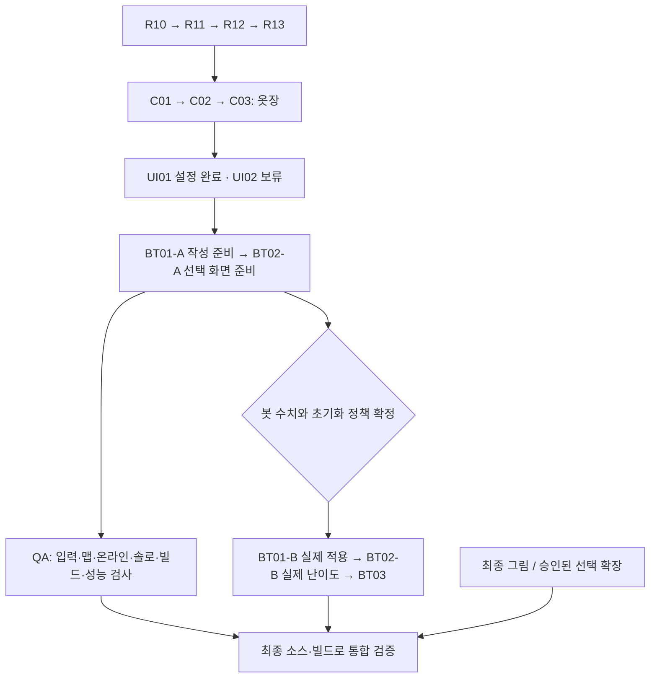

# PLAN 040 — 후속 기능 통합 상세 계획

> 작성: 2026-09-30 / 상태: **태스크별 구현·검증 진행 중**  
> 목적: 내부 정리 → 완성형 옷장 → 설정·언어 → 봇 확장 준비 → 남은 품질 검증을 하나의 실행 순서로 연결한다.  
> 현재 구현: **R00~R13·옷장 C01~C03·설정 UI01·BT01-A/BT02-A 통과, UI02 사용자 요청으로 보류**. 다음 독립 작업은 QA01 실제 오프라인 검증이며 실제 난이도 활성화/최종 QA는 미완료다.  
> 기획자가 읽을 수 있도록 한국어로 작성한다. 검토 근거는 [PLAN 040 계획 검증](../Validation/PLAN_040_plan_review.md), 이번 후속 기능의 구현 증거는 [PLAN 040 실행 원장](../Validation/PLAN_040_results.md), 앞선 정리·옷장 증거는 [PLAN 037 검증 원장](../Validation/PLAN_037_results.md)에 둔다.

## 1. 이번 계획에 포함하는 범위

| 묶음 | 포함할 결과 | 시작 조건 / 현재 상태 |
|---|---|---|
| 내부 구조 R10~R13 | 로비·연결·외형 전송 안정화, 옷장 내부 분리, 불필요 코드 정리, 기존 게임 회귀 검증 | 통과 / 증거와 검증 한계는 PLAN037 원장 |
| 옷장 C01~C03 | 캐릭터 미리보기, 5부위 목록, 착용·해제·저장, 솔로·멀티 반영 | 통과 / 최종 아트·다른 장비 검증은 별도 |
| 설정 UI01 | 전체·배경음·효과음 음량, 전체 화면, 화면 흔들림 끄기 | 통과 / 자체95, PLAN040 실행 원장 참조 |
| 언어 UI02 | 한국어·영어 선택, 공통 화면·아이템 설명·안내 문구 연결 | 사용자 요청으로 보류(2026-09-30) / 현재 출시에 필수 아님 |
| 봇 BT01~BT03 | 시작 설정·판단 성향의 작성 도구, 난이도 선택, 아이템 지연 검증, 출시 데이터 검증 | BT01-A/BT02-A 통과. 수치·초기화 정책 확정 후 B단계·BT03 진행 |
| 디버깅 QA01~QA09 | 입력·화면·맵, 실제 Relay, 솔로, 오프라인, 빌드, 장시간·성능 검증 및 범위 내 수정 | 관련 기능 완료 후 / AI 검사와 실제 장비 검사를 구분 |
| 리소스 후속 작업 | 새 옷·모자·유령·봇 그림을 넣고 맞추는 경로 | 임시 그림으로 경로 검증, 최종 그림 도착 후 외형 검수 |
| 선택 확장 | 게임 안 맵 선택, 행사장에서 다음 사람용 초기화 | 계획에는 포함하되, 필요 여부·정책 결정 전 구현하지 않음 |

**제외:** 타로 구현, 색상 편집, 상점·해금 경제, 새로운 사이드 팔/리깅, 멀티 경기 중 옷 바꾸기, 봇 전용 제2 턴 시스템, 패키지 일괄 교체.

### 반드시 유지할 결정

- 핫팩은 현재 **7초 안에 15회**를 유지한다. 상대에게 미니게임 진행 중 표시를 추가하지 않는다.
- 옷장은 Codex가 UI·UX를 설계한다. **Head / Top / Back / Bottom / Tail**의 그림 교체이며, Head 내부를 별도 머리카락·모자 슬롯으로 재설계하지 않는다.
- 솔로는 별도 1대 봇 씬과 내부 NGO 로컬 호스트를 사용한다. 시작을 위해 UGS 인증·로비·Relay를 기다리지 않는다. 봇은 미니게임 대신 아이템별 지연을 적용한다.
- 2명 생존 보상은 기존 아이템을 유지하고 최대 4개까지 빈자리만 채운다. 귀신의 한은 사용 턴 → 다음 턴 대기 → 그다음 턴 재사용, 빙의는 경기 전체에서 1회다.
- 빙의 턴에는 대상의 아이템을 소모하고 효과를 무력화한다. 유령 피해는 생존자별 턴당 1회 제한, 행동/효과 그룹 직후 5킬 판정, 같은 그룹의 동시 달성은 공동 승리를 유지한다.
- 클릭 조준·확정과 Ready 전 취소, 공격에 맞춘 동시 방어, 임시 네모 유령을 유지한다. 미확정 수치·중첩·공개 시점은 이 작업을 빌미로 바꾸지 않는다.

근거 우선순위: 사용자의 최신 결정 → 현재 코드·자산 → [기획 질문서의 최신 결정](../DESIGN_QUESTIONS.md) → 과거 문서. 오래된 본문에 있는 “미구현”, “Frost Strike / Chill Aura” 등의 기록을 최신 구현 지시로 해석하지 않는다.

## 2. 기존 계획과 역할 분담

- [PLAN 037 상위 계획](PLAN_037_gameplay_modular_refactor.md): R00~R13 순서, 동작 보존 원칙.
- [PLAN 037 옷장 상세](PLAN_037_execution_and_closet_details.md): R10~C03 실패 처리·저장·동기화 계약, C-V01~C-V20 검사.
- [PLAN 037 작업 패키지](PLAN_037_implementation_work_packages.md): 해당 파일·함수·작은 구현 단계·복원 절차.
- [PLAN 036 솔로 상세](PLAN_036_solo_detailed_implementation.md), [BT 작성 안내](../SOLO_BT_AUTHORING.md), [솔로 설정 안내](../SOLO_BOT_SETUP.md): 로컬 솔로와 기존 그래프 작성 경계.
- [PLAN 039 맵](PLAN_039_map_presets.md): 프리셋·배치 앵커·카메라 기준의 주인.
- **이 문서:** 위 계약을 바꾸지 않고 UI01/UI02/BT01~03/QA01~09 및 선택 확장의 순서와 완료 조건을 추가한다.

동일 기능을 다른 이름으로 다시 만들지 않는다. 상태·검증 결과는 기존 원장에 한 번만 기록하고, 다른 문서와 시트에는 링크와 요약만 둔다. Obsidian도 같은 `Docs` 파일을 읽는다.

## 3. 소스 확인 결과와 구조 선택

| 확인한 현재 경계 | 계획에 반영할 사항 |
|---|---|
| `LobbySettingsView`는 BGM/SFX 두 슬라이더만 연결 | 설정 화면을 확장하되 기존 uGUI와 로비 화면 전환을 재사용 |
| `GameAudioManager`에 BGM/SFX/UI/ENV/FanLoop/Clock 6개 소스, 기존 음량 저장 키 존재 | 전체 음량을 한 번만 곱하고 기존 분류별 음량·저장값 보존 |
| `CameraShake`, HUD 알람과 아이템 추첨에 `UnityEngine.Random` 사용 | 흔들림 옵션이 게임 난수에 영향을 주지 않는지 별도 검사·분리 |
| `CosmeticProfileService`, `CosmeticEquipState`, `CosmeticRegistrySO` 존재 | 확정 외형 상태는 하나, 임시 미리보기는 별도 화면 상태 |
| `BotStatProfileSO`는 스키마만 있으며 resolver가 모든 override를 거부 | UI에서 값을 바꾸는 것만으로 적용되지 않음. 준비와 실제 활성화를 분리 |
| `SoloSettingsResolver`에 그래프·카탈로그·지연·개발/출시 검증 존재 | 새 난이도도 반드시 이 검증을 통과, 임시 설정의 출시 차단 유지 |
| 설치 패키지에 Localization 없음 | 우선 소규모 키 기반 언어 표·표시 어댑터 사용. 새 패키지 설치를 전제로 잡지 않음 |

### 부품의 책임

| 적용 방식 | 책임 | 이 구조에 적합한 이유 |
|---|---|---|
| 기존 진입점 + 내부 부품 분리 | NGO 컴포넌트·로비 진입 함수·직렬화 참조 유지 | 기존 씬과 통신 형식을 건드리는 범위를 줄임 |
| MVP | 화면은 표시·입력, Presenter는 선택·명령, 서비스는 저장·검증 | 옷장/설정/난이도 화면 교체가 게임 규칙 변경으로 번지지 않음 |
| Adapter | 음량·화면 설정·저장·언어 표시의 외부 연결 | 실패와 수명을 검사할 수 있는 실제 경계만 분리 |
| 읽기 전용 설정 스냅샷 | 시작 시 봇 설정 확정, 실행 중 SO 수정 금지 | 같은 경기 도중 난이도가 섞이지 않음 |
| 수명에 맞춘 구독 | 화면 닫기/씬 종료/세션 교체 시 구독·대기 종료 | 늦게 도착한 응답과 중복 버튼 동작 방지 |

새 DI 패키지, 전역 이벤트 버스, 두 번째 설정 관리자·게임 루프는 만들지 않는다. 아래의 후보 이름은 책임 설명이며, 동일 역할의 기존 구현이 있으면 그것을 확장한다.

## 4. 실행 순서와 진행 규칙

- 기본 실행은 표의 순서대로 한 작업씩 한다. 독립 작업을 다른 에이전트에 자동 위임하지 않는다.
- 각 작업: 기준 상태 저장 → 작은 변경 → 해당 검사 → 결함 수정 → 실패 검사 재실행 → 영향 범위 회귀 → 결과 기록 → 다음 작업.
- 심각한 규칙·저장·동기화 결함이 있거나 필수 증거가 없으면 해당 작업을 통과시키지 않는다. 점수가 높아도 실패를 상쇄할 수 없다.
- R10~R13 중 발견한 필수 결함을 뒤의 QA 단계로 미루지 않는다. QA는 새 기능 이후의 검증도 담당한다.
- 미확정 기획으로 BT01-B 등이 막혀도 독립된 QA는 가능하다. **BT01-A 통과를 BT01 전체 완료로 표시하지 않는다.** BT02도 동일하다.
- R13은 옷장 제작 전의 기존 게임 기준 검사다. 옷장·설정·언어·봇 적용 이후 **최종 통합 검사**가 따로 필요하다.

### 작업 간 선행 관계

외부 기획 결정은 작업 노드가 아니라 §10의 활성화 조건이다. 아래 표는 필수 작업 간 순환 의존을 검사하는 기준이다.

| 작업 | 선행 작업 |
|---|---|
| R10 | R09 |
| R11 | R10 |
| R12 | R11 |
| R13 | R12 |
| C01 | R13 |
| C02 | C01 |
| C03 | C02 |
| UI01 | C03 |
| UI02 | UI01 |
| BT01-A | UI01 (UI02 보류에 따른 우회) |
| BT02-A | BT01-A |
| BT01-B | BT01-A |
| BT02-B | BT02-A, BT01-B |
| BT03 | BT02-B |
| QA01 | R13 |
| QA02 | BT03 |
| QA03 | C03 |
| QA04 | UI01 (한국어 표시 범위) |
| QA05 | R13 |
| QA06 | R13 |
| QA07 | R13 |
| QA08 | R13 |
| QA09 | UI01 (언어 변경 검사 제외) |
| FINAL | C03, UI01, BT03, QA01, QA02, QA03, QA04, QA05, QA06, QA07, QA08, QA09 |

`FINAL`은 전체 출시 범위를 선택했을 때의 최종 조건이다. 봇 최종 수치/장비 검사가 남으면 “현재 범위 검증 완료·출시 검증 보류”로 기록하며 전체 완료로 바꾸지 않는다. 선택 확장은 실제 채택한 경우에만 FINAL의 범위에 추가한다.

## 5. R10~C03: 기반 정리와 완성형 옷장

상세 함수·실패 처리·복원은 PLAN 037의 계약을 그대로 따른다. 이번 계획에서 빠뜨리지 않을 핵심은 다음과 같다.

| 작업 | 구현 단계 | 반드시 확인할 결과 |
|---|---|---|
| R10 | 세션 수명과 로비 폴링 주인 정리 → 외형 전송 결과 명시 → 진행 중 1건/최신 대기 1건 처리 → 버전·세션 일치 검사 | 늦은 옛 응답이 최신 외형을 덮지 않음. 실패·취소·교체된 요청 모두 종료. 실제 Relay 2/3/4인, Solo 전환 |
| R11 | 외형 명령 검증 → 변경 없는 명령 제외 → 저장 실패 구분 → 옷장 Presenter 분리 → 서버 수신 확인 경계 정리 | 미리보기만으로 저장/전송하지 않음. `cosmetic_equip_v1`·DTO v1·기존 ID 유지. 사람/봇 외형 분리 |
| R12 | 호출·직렬화·UnityEvent·애니메이션·테스트 참조 조사 → 실제 미사용 코드만 제거 → 개발 검사와 제품 실행 분리 | Missing Script/끊긴 GUID/제품에 디버그 진입 경로 없음. 임시 봇 설정 출시 차단 유지 |
| R13 | 같은 최종 소스·자산·빌드에서 게임 모드별 회귀 → 실패 수정 후 영향 검사 재실행 | 기존 V37 검사 충족. 4인 검사를 3인 증거로 대체하지 않음 |
| C01 | 로비 오버레이 와이어프레임 → 독립 미리보기 → 기본 폰트·레이아웃·키보드 포커스 | 메인 로비에서만 진입. 화면 뒤 클릭 차단. 미리보기 오브젝트·카메라가 실경기에 섞이지 않음 |
| C02 | 부위 탭/아이템 카드 → 선택·착용 상태 → 착용·해제 → 저장 오류/재시도 → 닫기 | 선택은 임시, 착용은 확정. 탭 이동/닫기 시 미확정 선택 폐기. 같은 항목 반복 선택으로 중복 저장·전송 없음 |
| C03 | 재실행 저장 확인 → 실제 멀티·솔로 → 모든 시점/포즈 → 20회 열기·닫기 및 씬 종료 | C-V01~C-V20 통과. 1080p/720p/800×600에서 필수 조작 가능, 생성 자원·구독 잔류 없음 |

### 옷장 화면의 구체적인 작업안

- **왼쪽:** 현재 정면 캐릭터, 선택 중인 그림의 미리보기, 현재 착용으로 돌아가기.
- **오른쪽 상단:** 머리 / 상의 / 등 / 하의 / 꼬리 탭. 부위 내부의 스프라이트 교체 규칙은 기존 아틀라스 매핑을 사용한다.
- **오른쪽 목록:** 그림, 이름, 선택 테두리, 착용 배지. 없는 그림은 임시 아이콘, 비어 있는 부위는 “등록된 항목 없음”. 소유·가격·잠금 상태는 새로 만들지 않는다.
- **하단:** 착용 / 해제 / 닫기. 저장 실패는 “이 PC에 저장하지 못함”, 온라인 반영 실패는 별도의 연결 상태로 표시한다. 온라인 실패로 로컬 착용을 되돌리지 않는다.
- **입력:** 마우스와 Tab/Enter/Esc. Esc는 현재 모달만 닫고 뒤 로비 입력을 동시에 실행하지 않는다. 저장 재시도 중 닫기/씬 종료는 화면 수명과 일치시킨다.
- 미리보기는 시각 전용 프리팹·카메라·RenderTexture로 구성하고 동적 자식도 전용 레이어를 적용한다. 실제 NetworkPlayer를 복제해 네트워크 컴포넌트를 지우는 방식을 기본안으로 삼지 않는다.
- 현재 모자를 사용해 먼저 완성한다. 새 팔·사이드 리깅·색상 편집 없이 이후 스프라이트만 교체할 수 있게 한다.

## 6. UI01: 설정 화면

### 구현 위치와 흐름

- 기존 진입점: `Assets/Scripts/UI/Lobby/LobbySettingsView.cs`, `LobbyPresenter.cs`, `AZLobbyUI.cs`.
- 적용 경계: `Assets/Scripts/Core/Audio/GameAudioManager.cs`, `Assets/Scripts/Core/Common/CameraShake.cs`, `Assets/Scripts/UI/Game/Presenters/MatchHudPresenter.cs`.
- 후보 책임: `LocalSettingsService`(앱 수명), 로컬 저장 어댑터, 화면 모드 어댑터. 기존 서비스가 같은 역할을 갖고 있으면 통합한다. 서비스가 UI 클래스에 의존하지 않는다.
- 설정은 해당 PC의 사용자 표시 설정이다. RPC/NV/로비 메타데이터로 전송하지 않는다.

| 단계 | 할 일 | 실패·수명 처리 / 완료 조건 |
|---|---|---|
| UI01.1 | 기존 설정·AudioSource·흔들림 호출을 목록화하고 저장 스키마·기본값 결정 | 기존 `bgm_volume`, `sfx_volume` 읽기·보존. 새 전체 음량 기본 1, 흔들림 기본 켬. 화면 모드는 저장값이 없으면 현재 실행 상태 유지 |
| UI01.2 | 전체 음량 추가, 기존 BGM/SFX 경로를 하나의 적용 경계로 연결 | 기본 음량 × 분류 음량 × 전체 음량을 1회만 적용. `AudioListener.volume`와 중복 곱하지 않음. 6개 소스 외 실제 소스도 조사 |
| UI01.3 | 전체 화면 토글, 적용 결과 확인 | 해상도·주사율은 임의 변경하지 않음. 중복 요청 병합, 다음 프레임 이후 실제 상태 반영. 실패하면 UI도 실제 상태로 돌아감. Editor가 아닌 Standalone에서 검증 |
| UI01.4 | 카메라·HUD의 장식적 흔들림을 설정에 연결 | 경고 글자·소리·타이머·타격 판정은 남긴다. 꺼지는 순간 자기 오프셋만 제거. 카메라 복원 책임자와 충돌하여 이전 좌석 위치로 되돌리지 않음 |
| UI01.5 | 저장/다시 열기/언로드, 슬라이더·토글 UX | 기존 음량의 즉시 반영·저장 동작 보존. 초기 표시 갱신으로 저장 이벤트를 발생시키지 않음. 저장 실패는 실제 적용과 구분, 마지막 정상 저장 스냅샷 보존·재시도. PlayerPrefs를 원자적 트랜잭션으로 간주하지 않으며 캐시 복구 실패도 성공으로 숨기지 않음 |

**흔들림과 난수의 계약:** 시각 효과의 난수는 별도 상태를 사용한다. `UnityEngine.Random.InitState`를 반복 호출해 전역 상태를 덮는 해결은 금지한다. 옵션 켬/끔·다른 화면 FPS에서도 같은 게임 입력과 같은 게임 난수 시작 상태의 드롭/강탈 결과가 같아야 한다. 이 분리는 기존 공유 난수 호출열을 바꿀 수 있으므로 “모든 과거 시드 결과가 그대로”라고 주장하지 않는다. 아이템 분포·유효 후보·게임 측 추첨 로직은 유지하고 시각 효과가 게임 난수를 소비하지 않는다는 새 경계를 검사한다.

**필수 검사:** 음량 0/0.5/1, 전체 음소거 후 복원, 루프 음원·UI 소리·전투 소리, 저장값 누락/범위 밖/저장 실패, 화면 20회 개폐, 씬 전환, 흔들림 도중 끄기·비활성화·카메라 전환, 온라인 호스트/클라이언트의 서로 다른 설정, 전역 게임 난수 불변 검사. 사용자 실제 저장값을 지우지 않고 분리된 테스트 저장소를 사용한다.

## 7. UI02: 한국어·영어

**2026-09-30 사용자 결정: 당장은 불필요하여 보류.** 표시 경계 조사만 보존하며 구현하지 않는다. BT 준비와 독립 QA는 UI01 뒤에 진행한다. 아래 내용은 향후 재개할 경우의 계획이며 현재 필수 완료 범위에서 제외한다.

### 구현 위치와 데이터

- `LobbySettingsView`에 언어 선택을 추가하고 기존 로비/옷장/게임 Presenter의 표시 경계에 연결한다.
- 후보 책임: 읽기 전용 언어 표, `LocalizedTextProvider`, 화면 수명별 표시 갱신. 초기 표는 고정 키와 한국어/영어 문자열을 가진 자산으로 관리한다.
- 현재 규모에서는 새 Localization 패키지를 설치하지 않는다. 복수형·외부 번역 파이프라인 등 실제 요구가 생기면 별도 기술 선택으로 검토한다.
- 작업 기본안은 새 사용자에게 한국어(`ko`), 영어는 `en`으로 제공하고 저장된 선택이 있으면 그것을 우선한다. 기존에 유효한 언어 설정이 발견되면 그대로 이관한다. 지원하지 않는 언어는 한국어로 한 번만 대체한다. 이 기본안은 게임 규칙·네트워크 식별자를 변경하지 않는다.

| 단계 | 할 일 | 완료 조건 |
|---|---|---|
| UI02.1 | 플레이어가 보는 문구 목록화·키 부여 | 로비, 연결/오류, 설정, 옷장, 준비/결과/유령, 미니게임 안내, 아이템 이름·설명 구분. 디버그 로그·플레이어 입력은 번역 대상에서 제외 |
| UI02.2 | 키 기반 조회·기본 언어 fallback·저장 | 누락 번역 시 공백 대신 기본 언어. 키 누락은 개발 진단에 남김. 외부 번역 서버 없이 동작 |
| UI02.3 | 로비·설정·옷장 연결, 이어서 HUD·안내·아이템 표시 연결 | 현재 Presenter·데이터 스냅샷 재사용. 문자열 치환 때문에 게임 명령을 다시 보내거나 씬/미니게임을 재시작하지 않음 |
| UI02.4 | 글꼴·줄바꿈·긴 문장·숫자 확인 | 기존 TMP 글꼴을 우선. 한글/영어/숫자/음수/° 확인. 기존 글꼴 자산을 통째로 재생성하지 않음 |
| UI02.5 | 언어 혼합 피어·재실행·오프라인 검사 | 각자 다른 언어여도 같은 아이템·승자·수치. 최종 문구의 감수 상태와 기능 통과 상태 분리 |

**식별자는 번역하지 않는다:** Item ID, `ItemName` 기반 레거시 조회, 프리팹/리소스 경로, 코스메틱 ID, Animator trigger, 방 코드, 닉네임, 저장 키와 네트워크 형식은 유지한다. 화면용 이름을 별도 키로 변환한다. 이미 서버에서 문자열을 받는 안내는 우선 안전한 표시 경계를 조사하고, 규약 변경이 필요한 부분은 별도 변경·호환 검증으로 분리한다.

**검사:** 누락/중복 키, 형식 인자 수 불일치, 긴 이름, 빈 설명, °·음수, 1080p/720p/800×600, 20회 언어 변경·화면 개폐, 캐시 갱신, 경기 중 선택/Ready/미니게임 상태 유지, 서로 다른 언어의 실제 Relay 화면. 새 패키지나 네트워크 필드를 조용히 추가하지 않는다.

## 8. BT01~BT03: 봇 확장

### 실제 수정 대상

- `Assets/Scripts/Core/Solo/Configuration/`의 `BotStatProfileSO`, `BotDifficultyProfileSO`, `BotItemUsePolicySO`, `BotDefinitionSO`, `SoloDuelDefinitionSO`, `SoloSettingsResolver`, `ResolvedSoloSettings`.
- `Assets/Scripts/Core/Solo/BotBootstrap.cs`, `BotItemUseOperation.cs`, `SoloSessionCoordinator.cs`.
- `Assets/Scripts/Core/Turn/RoundLifecycleService.cs`, 로비의 `AZLobbyUI.cs` 및 기존 Presenter.
- 기존 Behavior 그래프·노드·신뢰된 봇 명령 경계 재사용. 패키지 업그레이드나 두 번째 행동 제출 경로는 도입하지 않는다.

### BT01-A — 수치 미확정 상태에서도 가능한 작성 준비

**2026-09-30 준비 범위 통과:** 작성 도구·Inspector·기존 resolver 재사용 검사, Editor962/962. 자체94/100, 화면 검수 잔여와 실제 활성화 대기는 [실행 원장](../Validation/PLAN_040_results.md) 참조.

1. 시작 온도·선풍기 기준값·초기 아이템·판단 성향·아이템별 지연의 입력 항목과 설명을 정리한다.
2. 현재 `inherit only` 제약을 화면/검증기에 명확히 표시한다. 준비 중인 사용자 지정값을 실제 경기에서 쓸 수 있다고 표시하지 않는다.
3. 카탈로그 ID, 허용 아이템, null/중복, 값 범위, 그래프 누락, think/사용 지연과 Ready 여유의 관계를 기존 resolver에서 검사한다.
4. 개발 테스트용 프로필과 실제 배포 프로필을 구분한다. 기존 실행 가능한 기본 프로필로 미리보기·오류 표시·선택 UI를 시험한다.
5. 작성 안내에 샘플 그래프 연결, 데이터 출처, 실패 이유와 고치는 위치를 기록한다. 여기서 최종 난이도 개수·수치를 확정하지 않는다.

**통과 조건:** 기존 기본 설정은 기존 결과와 동일, 잘못된 데이터는 시작 전에 원인과 함께 거부, SO 런타임 수정 없음. A 완료 후 BT01은 “준비 완료 / 실제 설정 적용 대기”다.

### BT01-B — 승인된 시작 설정의 실제 적용

선행 결정: 각 난이도의 값·허용 범위, **경기 첫 시작/매 라운드 중 적용 시점**, 초기 아이템의 **교체/추가/기본 아이템 유지·중복·초과 슬롯 처리**.

1. 승인된 정책을 resolver가 읽기 전용 스냅샷으로 확정한다. 숫자만 허용하는 것으로 끝내지 않는다.
2. 기존 라운드 초기화 순서 안에 봇 좌석에만 적용한다. 인간·온라인 상대·유령 초기화는 건드리지 않는다.
3. 선택한 초기값으로 인해 온도 구간 보상이나 시작 지급이 두 번 발생하지 않는지 검사한다. 기본 아이템과 임의 아이템의 소유권/CopyId 계약을 유지한다.
4. 2라운드·재경기·중도 종료·다른 난이도 재진입에서도 값이 언제 초기화되는지 동일하게 검증한다.

**통과 조건:** 승인된 각 프로필의 기대 시작 상태가 정확히 한 번 만들어지고, 기본 프로필은 현재 1대1 동작을 보존한다. 미확정이면 구현 활성화를 중단하며 임의 정책을 넣지 않는다.

### BT02-A / BT02-B — 난이도 선택 화면

**2026-09-30 A단계 통과(자체95/100):** 기본 봇 목록·설명·시작/뒤로, 시작 재검증·취소, 재경기 설정 유지 완료. Editor976/976·메뉴288·자연Solo4경기/재경기3·실제Relay전환134·비개발 보호검사 통과. [상세 결과와 한계](../Validation/PLAN_040_results.md), [작성 도구·목록 등록 사용법](../BOT_AUTHORING_TOOL_GUIDE.md). B단계의 실제 난이도는 미확정 유지.

- **A:** 메인 로비의 Solo 버튼 → 프로필 목록 → 선택 정보 → 시작/뒤로. 현재 유효한 기본 프로필로 작동을 검증한다. 테스트 항목은 개발판에서만 명확히 표시한다.
- **B:** BT01-B와 최종 목록 확정 후 실제 난이도 이름·설명·프로필을 연결한다. 사용 불가 설정은 시작 전에 이유를 보여준다.
- 시작 클릭 시 프로필 ID·설정 버전을 캡처하고 resolver를 다시 통과시킨다. 비동기 시작 도중 선택 변경·더블클릭으로 두 경기가 시작되지 않게 한다.
- 뒤로/화면 종료는 미시작 작업을 취소한다. 이미 시작된 세션은 기존 coordinator 종료 경로를 사용한다. 늦은 응답으로 닫힌 화면을 갱신하지 않는다.
- 같은 경기의 재시작은 선택한 설정을 유지하고, 로비에서 새로 고른 설정은 다음 경기에 반영한다. 사람의 외형과 봇 외형은 분리한다.

**검사:** 연속 시작, 뒤로와 시작 경쟁, 실패 후 재시도, 잘못된 프로필, 새 경기/재경기 구분, 온라인→Solo→온라인, UGS 미초기화 상태, 숨겨진 상대 선택을 봇이 새로 읽지 않는지 확인.

### BT03 — 실제 플레이 균형과 출시 데이터

1. 지원 아이템별 사용 가능 조건·대상·지연·취소·한 번만 소모를 기록한다. 봇 미니게임과 임의 성공률 추첨을 추가하지 않는다.
2. 승인된 프로필별 여러 고정 seed와 자연 플레이를 비교한다. 턴 시간 부족·무한 재시도·준비 미완료·존재하지 않는 대상 선택을 확인한다.
3. 숫자가 다르다는 것과 플레이 체감이 다르다는 것을 분리한다. 승률만으로 난이도 적합 판정을 내리지 않는다. 사람이 난이도 이름·체감을 확인한다.
4. 승인된 설정만 출시 허용 상태로 전환한다. provisional/fixture를 통과시키기 위해 개발·출시 보호 코드를 제거하지 않는다.
5. QA02의 비개발·목표 백엔드 플레이 검사로 연결한다.

**통과 조건:** 기능/취소/초기화 검사 통과 + 최종 수치 승인 + 실제 플레이 증거. 프로필 수와 반복 경기 수는 확정된 목록에 맞춰 실행 전 명시한다.

## 9. QA01~QA09: 테스트와 결함 수정 작업

검증 중 발견한 프로젝트 소유 결함은 재현 → 원인 → 최소 수정 → 해당 실패 재검사 → 영향 회귀 순서로 처리한다. 기획 변경·패키지 교체·전역 보안 설정 변경은 자동 해결로 포함하지 않는다.

| 작업 | 구체적인 시나리오 | 증거 / 통과 기준 / AI의 한계 |
|---|---|---|
| QA01 실제 오프라인 | 새 테스트 프로필, 인터넷 사용 불가 상태에서 로비→Solo→한 경기→결과→복귀·재경기 | UGS/Relay 호출 대기 없음, 실제 전투·결과 로그/화면. 가짜 API 실패와 loopback 성공만으로 완료하지 않음. 전역 NIC/방화벽을 임의 변경하지 않으며 실제 격리는 별도 안전한 환경 또는 사용자 확인으로 수행 |
| QA02 출시 빌드 | BT03 승인 데이터로 비개발 빌드, 목표 플랫폼·백엔드·stripping 설정에서 로비→Solo 및 온라인→결과 | 코드 stripping 후 그래프/직렬화/장면 참조 정상. 개발 Mono 검사를 IL2CPP 증거로 대체하지 않음. 목표 배포 조합 미정이면 그 부분 보류 |
| QA03 다른 장비·장시간 | 한 PC 다중 프로세스 반복 + 별도 PC/회선의 Host/Client, 연결·종료·재입장·반복 경기 | AI가 할 수 있는 로컬 장시간 검사는 개발 기준 2시간 또는 30경기 중 늦게 끝나는 시점까지 제안. 별도 장비/실제 회선 검사는 별도 증거 필요. 시간·경기 수·중단 원인 기록, 프로세스만 오래 켜둔 것은 플레이 검사 아님 |
| QA04 입력·화면 | 모든 좌석, 아이템 클릭→조준→캐릭터 아래 고정→확정, 같은 아이템/Esc/우클릭 취소, Ready 후 잠금, 타격/방어/음식/유령, 옷장·설정 모달 | 스크린샷·가능한 실제 입력 기록·호스트와 각 클라 로그. 3인 좁은 HUD의 가림, 화면 밖 UI, 클릭 가로채기 확인. API로 직접 명령 호출한 것은 실제 마우스 검증으로 세지 않음 |
| QA05 빌드·종료 진단 | 시작/종료, 장면 전환, 연출 중 취소, 개발/제품 빌드 경고 분류 | 신규 프로젝트 오류·누수 수정. 기존 패키지 ComputeBuffer 관련 경고는 소유 코드와 구분하고 원인/영향/승인 대기 기록. 캐시 패치·경고 숨김·일괄 업그레이드 금지 |
| QA06 맵·배치 | 유효한 각 프리셋·2/3/4 좌석·모든 활성 아이템 연출, 타깃 화살표·조명·날씨·카메라 전환 | PLAN 039 앵커 기준. 테스트 복제 씬/데이터에서 위치 변화 검사하고 원본 자산 해시 보존. 사용자가 배치한 운영 씬 좌표를 테스트 편의로 덮어쓰지 않음 |
| QA07 실제 Relay | 현재 맵·현재 빌드에서 3인과 4인, 호스트+각 클라, 입장→준비→전투→유령→종료→로비 | allocation/연결 증거와 좌석별 로그·화면 연결. 기존 Relay 사용 승인 범위 이용. 민감 토큰/키는 보고서에 넣지 않음. 4인 통과로 3인 누락을 메우지 않음 |
| QA08 Solo 화면 | 실제 Solo 로비 진입→전투→결과→재경기/복귀에서 프레임 캡처 | 존재하는 파일 수뿐 아니라 이미지 decode·비어 있지 않은 실제 렌더·내용 육안 확인. 오래된/다른 씬 캡처를 통과 증거로 재사용하지 않음 |
| QA09 성능 | 같은 장비/해상도/빌드·시나리오에서 프레임 시간 P95/P99, CPU/GPU, GC, 메모리, 씬 로드, 화면 20회 개폐 | 우선 전후 비교 기준값 확보. 기능 누락·해상도 축소로 수치만 개선하지 않음. 실제 목표 장비/FPS/메모리 예산이 없으면 측정 완료만 표시, 출시 성능 통과는 보류 |

### 기존 잔여 검사와 연결

- QA01/02/03/05: [PLAN 036 결과](../Validation/PLAN_036_results.md)의 V036-01/03/06/07/08.
- QA04/05/03: [PLAN 034 결과](../Validation/PLAN_034_results.md)의 물리 입력·패키지 경고·다른 장비/장시간 잔여 검사.
- QA06/07/08/09: [PLAN 039 결과](../Validation/PLAN_039_results.md)의 N039-01~04. N039-05는 아래의 선택 확장이다.
- 이미 통과한 검사도 이후 변경한 경계에 영향을 받으면 해당 부분만 다시 실행한다. 같은 소스/자산/빌드/시나리오에 해당하는 기존 증거만 재사용한다.

### 최종 통합 검사 FINAL

1. 최종 후보 소스·자산·설정·빌드 식별자를 고정하고 필수 검사 목록과 누락을 먼저 출력한다.
2. 저장된 옷·음량·언어 → 재실행 → Solo/온라인 Duel/Relay 3인/4인에서 각각 확인한다. 참가자별 언어·음량이 달라도 같은 판정·외형이어야 한다.
3. 유령 쿨타임·빙의 소모·공동 승리, 4→2 보충, 대상 사망·퇴장·중복 명령·늦은 응답·준비 취소를 기존 모드별 규칙으로 확인한다.
4. Duel/Solo의 재경기와 Multi의 로비 복귀를 서로 바꾸지 않는다. 메뉴를 여러 번 열고 닫거나 경기를 바꿔도 구독·자원·프로필이 섞이지 않아야 한다.
5. 경고·실패·수동 검사·승인 대기를 목록으로 남긴다. 출시 범위의 필수 미완료가 있으면 전체 PASS를 주지 않는다.

## 10. 미확정 기획과 선택 확장

| 항목 | 지금 가능한 작업 | 확정/제공 후 작업 |
|---|---|---|
| 봇 수치·초기화 | BT01-A, BT02-A, 기존 기본 봇으로 테스트 | 난이도 목록·값·지연·성향, 매 라운드 적용 여부, 초기 아이템 지급 정책 확정 → BT01-B/02-B/03 |
| 귀신의 한 피해량 | 현재 구현 값 보존, 쿨타임/킬/동기화 회귀 | `3(?)`의 최종 수치 확정 시 데이터와 영향 검사 |
| 버프 중첩 / 이전 턴 음식의 마스크 방어 / 선택 공개 시점 / 빈 슬롯 표시 | 현재 동작 기록, 현행 동작 보존 검사 | 관련 질문 확정 후 별도 규칙 변경. 이번 UI 개선에서 몰래 결정하지 않음 |
| AT02 최종 코스메틱 그림 | 기존 모자·임시 아이콘으로 옷장과 적용 경로 완성. 기존 AT01의 매핑을 재사용 | 각 아틀라스 부위/포즈/FPS 매핑, 피벗·PPU·정렬·외곽선·누락 확인, 모든 피어 캡처 |
| ART01/ART02 유령·봇 최종 그림/문구 | 현 외형·설정 연결과 임시 텍스트로 기능 검증 | 그림·최종 이름/번역 제공 시 표시 교체, 규칙은 유지. ART03 사이드 작업은 보류 유지 |
| 게임 중 선택 가능한 맵 | Editor 프리셋/앵커 작성 경로 유지 | 필요하다고 확정되면 MAP04: 방장만 준비 전 선택, 맵 ID 검증·동기화·로드 실패/구버전 거부·준비 상태 정책부터 계획 재검토 |
| 행사장 다음 사람 초기화 | 현재 로컬 저장·프로필 유지, 분리된 테스트 프로필 사용 | 초기화할 범위(닉네임/옷/설정), 버튼 위치·확인·복원 정책 확정. `PlayerPrefs.DeleteAll` 사용 금지 |
| 출시 기준 | 현재 장비 측정·기능 검사·개발 빌드 | 목표 장비/백엔드/언어 감수/성능 예산 확정 후 QA02/09와 최종 출시 검수 |

MAP04는 로컬 배경만 바꾸는 기능으로 처리할 수 없다. 선택 맵은 서버 세션 설정이고 카메라·앵커·씬 로딩과 맞아야 한다. 필요 여부가 정해지기 전 RPC/NV나 로비 형식을 추가하지 않는다.

## 11. 검증 기록·수정·복원 절차

### 각 작업이 남길 기록

`작업 ID / 범위 / 수정 파일 / 이전 상태 / 검사 조건 / 예상·실제 / 실패 원인 / 수정 / 재검사 / 빌드 식별 / 로그·화면 경로 / 잔여 한계 / 다음 작업`.

- R/C 실행 증거는 PLAN 037 원장을 유지한다. UI/BT/QA는 첫 구현 시 후속 검증 원장을 만들고 기존 원장의 해당 항목과 연결한다. 이 계획 검토 보고서에 실행 PASS를 섞지 않는다.
- 개발 스크린샷은 `output/validation/plan040/<task>/<run>/` 등 구분된 실행 폴더에 저장한다. 로그의 시각·좌석·세션과 캡처를 연결한다.
- 현재 dirty worktree의 해당 파일 원문과 관련 `.meta`/설정은 변경 전에 보존한다. HEAD로 전체 되돌리기, 다른 작업의 파일 삭제는 금지한다.
- 저장 검사는 주입 가능한 분리 저장소/테스트 프로필로 한다. 정상 사용자의 옷·설정·인증 프로필을 초기화하지 않는다. 테스트 중 생성한 리소스·프로세스만 정리한다.
- UI01은 새 저장 키 추가 방식, UI02는 화면 표시 경계부터 단계적 교체로 복원 가능하게 한다. Bot 변경은 승인 프로필과 기본 프로필을 구분하고 실행 중 SO 원본을 변경하지 않는다.
- 정상 컴파일·집중 검사 통과 후 새 변경/실패/우려가 없으면 테스트 수를 늘리기 위한 반복은 하지 않는다. 실제 멀티·화면·수명 경계의 증거를 우선한다.

### 통과 판정

- 계획: 범위·동기화/수명·데이터/복원·의존성·검증 가능성을 자체 검토한다. 독립 교차 검증이나 실행 테스트로 부르지 않는다.
- 구현: 규칙/저장 손상·동기화 불일치·진행 불가 같은 차단 결함 **0건**, 해당 작업의 필수 검사 통과, 관련 기존 동작 보존 후 다음 작업으로 진행한다.
- 사람/장비/미확정 수치가 필요한 검사는 별도 보류로 남긴다. 점수는 검토 충실도이며 무결함 확률이 아니다.
- 이번 계획 검토 통과는 **다음 R10부터 순서대로 구현할 준비가 됐다는 뜻**이다. 신규 후속 기능 전체 구현 완료 또는 출시 승인이라는 뜻은 아니다.
