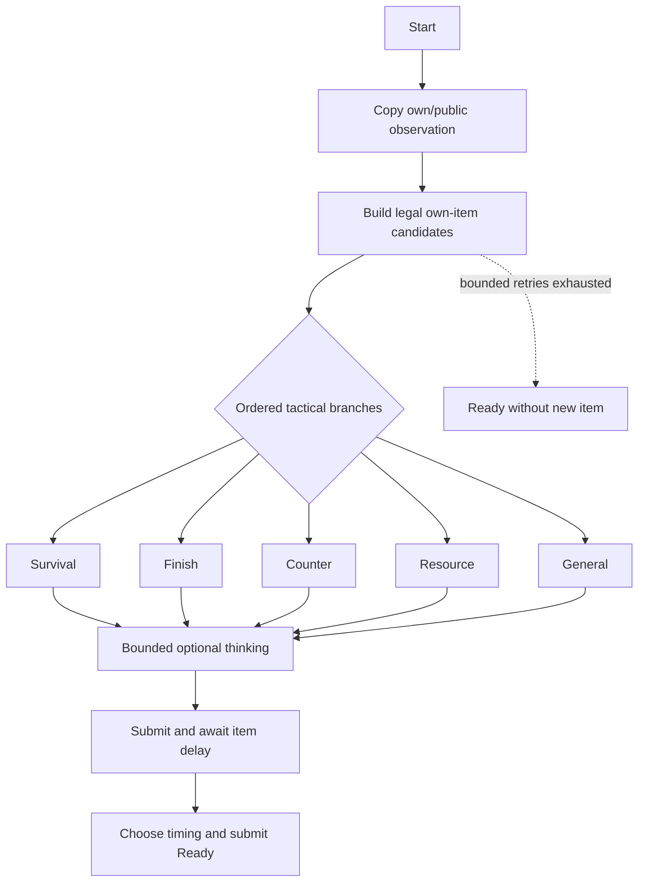

# Solo bot setup

Implementation: [PLAN 036](Plans/PLAN_036_solo_detailed_implementation.md). Current acceptance and deferred checks: [results](Validation/PLAN_036_results.md).

For graph editing, node code examples, tactical scoring, profile authoring and a validation checklist, use the [Solo BT authoring guide](SOLO_BT_AUTHORING.md).

## Play the current development version

1. Open `Assets/Scenes/LobbyScene.unity` and enter Play Mode, or run a Windows **Development Build** with the enabled project scenes.
2. Click **1대 봇 대전**. The dedicated `Assets/Scenes/GameScene_Solo.unity` opens.
3. Play the existing 1v1 rules against the bot. Humans keep mini-games. The bot waits its configured item delay and submits through the authoritative action boundary.
4. At match end choose **다시 하기** or **로비로**. Solo has no online rematch vote or automatic vote timeout.

A simultaneous-death draw replays the same round with no win awarded, matching the existing 1v1 rule.

The local session uses one NGO host connection and two logical participants. The ordinary bot object is server-owned. Cold Solo does not initialize Unity Authentication, Lobby or Relay. Online buttons still invoke the existing online services explicitly. After online play the process can retain authenticated SDK state, but Solo uses its own localhost transport and does not allocate a Relay server.

Start from the lobby. Opening the gameplay scene alone is not a supported public launch route because it lacks the application/session context; explicit Editor fixtures can supply that same context for testing.

## Configuration assets

| Asset | Edit here |
|---|---|
| `Assets/Data/Solo/Encounters/DefaultSoloDuel.asset` | Default bot, difficulty, shared 1v1 rule, dedicated scene and readiness |
| `Assets/Data/Solo/Bots/DefaultBot.asset` | Bot identity, existing cosmetic IDs, graph, tactical weights and item policy |
| `Assets/Data/Solo/Difficulties/NeutralBaseline.asset` | Think delay range, Ready timing/reserve, tactical override, noise and retry limit |
| `Assets/Data/Solo/ItemUse/DefaultItemUsePolicy.asset` | Default delay and per-item overrides for all 21 current duel items |
| `Assets/Data/Solo/Graphs/SoloDuelDecision.asset` | Editable Unity Behavior graph; select the asset and open it in the graph editor |
| `Assets/Data/Solo/Stats/NeutralInherited.asset` | Inherited 1v1 baseline; custom stat/loadout overrides intentionally remain disabled |

Duplicate profiles before creating a new difficulty. Give every distinct configuration a unique lowercase ID and positive version. All referenced items/cosmetics must belong to the current catalog. Configuration is copied/resolved at launch; changing an asset during a match is not a live tuning mechanism.

Current provisional test values: ordinary item delay **0.75 s**, mini-game-item delay **1.5 s**, optional thinking **0.2-0.45 s**, Ready reserve **0.25 s**, retry budget **2**. The bot never runs a mini-game. Item effects, targets, uses, cooling, initiative, round grants and win rules are still the current 1v1 implementation.

## Graph and ownership

- `TurnManager` owns phases and the committed preparation window.
- `BotTurnController` owns one graph run per session/round/turn key, isolated RNG and cancellation.
- `TrustedBotCommandAdapter` owns bot-authorized requests; `BotItemUseOperation` owns the pending delay and idempotency record.
- Existing `PlayerState`/`CombatResolver` validate, queue, apply and consume items.
- `MatchSessionRouter` owns exclusive session lifetime; Solo and online coordinators own their respective cleanup. `PersistentNetworkRoot` rejects the duplicate lobby network root on return.

The bot sees its inventory and public temperatures/fans/Ready state. It does not inspect unrevealed opponent item choices or inventory. Trace entries identify generation, round, turn, seed, candidate/reason, timing and action outcome. Damage estimates are heuristics, not guaranteed combat results.

## Shipping gate and scope exclusions

### Connecting future design work

| Planned extension | Existing connection | Current limit / next decision |
|---|---|---|
| Multiple bot personalities | Duplicate BotDefinition and Difficulty; assign the encounter | Existing lobby launches one configured default. A picker/campaign route is separate UI scope |
| Reaction speed / item penalties | Think range, item-delay policy, Ready policy and bounded retry | Values are provisional. Longer thinking can cross the survival threshold; the graph now reobserves within its retry budget |
| Aggressive vs defensive ordering | Reorder tactical branches in the Behavior graph | Weights scale candidates **inside** a branch (and zero disables it); they do not reorder the first-success branch sequence. Do not present them as probabilities of selecting branches |
| Starting temperature/fan/items | BotStatProfile schema and authoritative setup seam | Overrides currently reject. Decide per-round reset, loadout replace/add and temporary fan-upgrade restoration before implementation; fields alone do not provide the feature |
| New item of a supported type | Existing catalog + ordinary shared validation/effect + item-delay override | Default delay is inherited without an override; review actual intended penalty. Estimates are heuristics, not guaranteed damage or hidden-state prediction |
| Entirely new item effect type | ItemEffectRuleSnapshot mapping, combat/application rules and bot estimate | Missing mappings now fail Solo launch with an indexed error instead of reaching a BT exception; add authority/consumption/visual tests with the mapping |
| Additional bot graph | BotDefinition.Graph, named controller action nodes and isolated runtime Blackboard | Must compile without placeholders; preserve the shared command adapter and TurnManager phase ownership |
| Mid-match pause/save or online bots | No completed integration in this scope | Define clock/persistence/seat rules first. TimeScale alone is not a full NGO pause; current trusted bot commands are Solo-only |

The estimator deliberately does not treat reveal/extra-action modifiers as guaranteed useful follow-up actions: ordinary 1v1 currently exposes one queued selection and the bot cannot inspect hidden human choices. Defining reveal-aware replanning or extra-action consumption would be a separate shared gameplay contract, not a silent AI-only shortcut.

The non-development entry **rejects provisional tuning**. Functional development acceptance is separate from shipping approval. Approve final delay/difficulty values and then mark the actual reviewed difficulty/item-policy assets non-provisional before final release validation; do not merely disable the guard.

Custom starting temperature/fan/loadout and reset/replace/add semantics need a separate decision before activation. Side sprites/rigging, new item art, network host migration and bot mini-games are outside this implementation. Final release backend/stripping, prolonged soak and human judgment of difficulty/animation feel remain separately recorded in the results ledger.

## Validation

Normal play does not require probe arguments. `--solo-scripted-slice` is an explicit development-only fixture and must not be used as acceptance evidence for normal AI play.

Reproducible developer helpers:

- `.codex/scripts/run_solo_acceptance.ps1`: fresh evidence directories, exact owned player PIDs, replay/corpus/real Relay transition runs. It uses the fixed existing test executable path.
- Add `-HumanPolicy mixed` to a corpus run to sample the human's available non-mini-game items through normal selection/Ready commands; the default remains `late-fan`. Rejected special-item requests are recorded, not converted into successful uses. Each run records its seed, actual item choices and natural round/turn counts. `-MatchTimeoutSeconds 600` allows a longer mixed-item match (default 300, supported 30-600); runner and player use the same budget, without accelerating gameplay or changing rules.
- `Plan036ExtensionValidation.Start()` in Editor Play Mode: 12 cloned-profile/session cycles covering urgent re-observation, a removed CopyId followed by Red Card-only replanning, near-deadline Ready, unaffordable item delay with zero retries, and runtime graph/transport cleanup. This fixture injects boundary state and is not a natural match or a tuning approval.
- `Plan036BoundaryValidation.Start()` in Editor Play Mode: cloned tuning, zero-think/late Ready/low-temperature/slow-frame, human win, draw and thinking-exit scenarios. Original assets are preserved.
- `Plan036ExitValidation.Start()` in Editor Play Mode: pending graph item, Attack, Resolution and RoundOver exit, followed by a fresh graph generation. This explicitly injects a death boundary for RoundOver; it is separate from natural-match evidence.
- Existing Editor test assembly `AbsoluteZero.EditorTests` plus `.codex/scripts/run_validation_matrix.py` for shared online regressions.

Natural player runs record a starting seed for sampling and diagnosis, not a promise of bit-identical full-match replay: real frame timing, preparation cooling/recovery and the shared game loop remain active. Keep actual decisions, turn counts and outcomes with the seed. The bot's separate decision RNG still avoids consuming gameplay RNG.

`Docs` is the Obsidian vault source. Use this guide for configuration navigation, the plan for scope/contracts, and the validation results for actual evidence. No separate note copy or synchronization job is needed.
