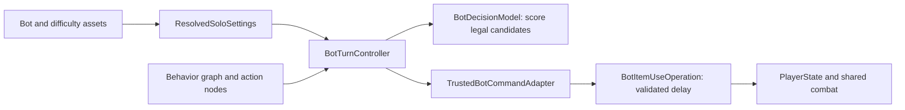

# Solo BT authoring guide

Verified against repository source and the saved production graph on **2026-09-29**. Installed package: **Unity Behavior 1.0.16**. This is a guide to the existing Solo implementation; the code samples below have **not** been installed into the game.

**Start here:** [play and configuration guide](SOLO_BOT_SETUP.md). Scope and existing evidence: [implementation plan](Plans/PLAN_036_solo_detailed_implementation.md), [validation results](Validation/PLAN_036_results.md).

## 1. The four things an author edits

| I want to change... | Edit... | Responsibility |
|---|---|---|
| Which tactic is tried first | `Assets/Data/Solo/Graphs/SoloDuelDecision.asset` or a duplicate | Graph: decision order |
| Which legal item a tactic prefers | `Assets/Scripts/Core/Solo/BotDecisionModel.cs` | Pure observation/scoring code |
| A reusable step visible in the graph | `Assets/Scripts/Core/Solo/SoloBehaviorNodes.cs` or a new adjacent C# file | Thin action node calling the controller |
| Thinking, item delay, Ready policy, noise | Difficulty and item-use assets under `Assets/Data/Solo/` | Configuration resolved when launching a match |

`BotTurnController` connects these pieces. It observes public state, builds legal candidates, runs the graph and submits requests. Keep actual item effects, consumption and combat in the shared game systems.



The bot uses the existing 1v1 rules in `GameScene_Solo`. One process runs an internal NGO host with a human and a logical bot participant. The BT decides the bot's input; `TurnManager` remains the only phase owner. The bot does not play mini-games or simulate mini-game success percentages.

## 2. Open and safely change a graph

1. Stop Play Mode and preserve any unsaved scene work.
2. In Unity's Project window, select `Assets/Data/Solo/Graphs/SoloDuelDecision.asset` and open its Behavior graph editor.
3. For a new personality, duplicate the graph **in Unity**, preserving the baseline. Do not copy/edit its serialized YAML or `.meta` GUID by hand.
4. Duplicate `DefaultBot.asset`, `NeutralBaseline.asset` and `DefaultSoloDuel.asset` as needed. Duplicate the item-use policy only if its delays will differ. Shared unchanged profiles can stay referenced.
5. Give each distinct configuration asset a unique `configId` and positive `version`. Example IDs: `solo.bot.practice`, `solo.difficulty.practice`, `solo.encounter.practice`. These names do not imply approved balance.
6. Assign the duplicated graph to the new bot's **Graph** field. This field requires the compiled **BehaviorGraph** associated with the authoring asset. If dragging the asset leaves the field empty, select its runtime graph sub-asset through the object picker; never assign a fixture graph instead.
7. Assign the new bot and difficulty to the encounter. Keep the shared OneVsOne rule and `Assets/Scenes/GameScene_Solo.unity`. Use readiness **Ready** for ordinary development play, not Draft or ValidationFixture.
8. Register the encounter in the saved lobby's `AZLobbyUI` **Solo Profiles** list with a title and description. Preserve the baseline entry and use unique encounter IDs. The player opens **봇 대전**, selects a profile, then presses **대전 시작**. Validation fixtures are excluded from this ordinary menu. See the [workbench and registration guide](BOT_AUTHORING_TOOL_GUIDE.md); final difficulty tuning remains a separate approval step.
9. Save the graph, let Unity finish normal compilation, inspect console errors, and launch through the lobby's **1대 봇 대전** button. Start a fresh match after tuning changes.

**Execution order matters:** in the installed package, outgoing child connections are compiled in ascending horizontal position (`GraphAssetProcessor.GetSortedConnections`). Keep sibling nodes at distinct X positions, left to right in execution order. Moving them for presentation can change behavior. Verify the compiled order and a trace after rearranging; do not rely on wire creation order or equal-X placement.

**Do not use `Plan036BotGraphBuilder.CreateAndBind()` as a routine save/refresh command.** It rewrites the default bot binding, default/per-item delays, difficulty timing/retry values and encounter readiness, and saves the Solo scene. An existing graph's topology is not rebuilt by that method. Its separate `Validate()` imports and checks the **default** asset with an exact 19-node expectation; it is not a general validator for a customized graph.

## 3. Current graph: exact execution structure

The saved default graph has 19 nodes including its start and flow nodes:

```text
On Start [Repeat = false]
└─ Try In Order
   ├─ Bounded Solo retry
   │  └─ Sequence
   │     ├─ Capture own and public observation
   │     ├─ Build legal own item candidates
   │     ├─ Try In Order
   │     │  ├─ Survival tactic
   │     │  ├─ Finish tactic
   │     │  ├─ Counter tactic
   │     │  ├─ Resource tactic
   │     │  └─ General tactic
   │     ├─ Wait for bounded thinking
   │     ├─ Submit delayed item request
   │     ├─ Await authoritative item result
   │     ├─ Choose Ready timing
   │     ├─ Wait for safe Ready time
   │     └─ Submit authoritative Ready
   └─ Fallback Ready without item
```

- **Sequence:** continue after each successful step; a failed step fails the sequence.
- **Try In Order:** try the next child when a child fails; stop at the first success. It is not random selection and does not continuously rescore every branch while a later step runs.
- **Bounded Solo retry:** retry the sequence from observation, within the same valid preparation window. Budget `2` allows an initial attempt plus at most two retries.
- **Fallback:** submit Ready without a new item only while the bot can still act and has no pending item operation. It does not guarantee success after the input window closes, and it does not explicitly clear an already queued selection.

The controller starts one run per committed `PrepInputKey` (generation, round, turn, sequence). It creates/initializes a runtime `BehaviorGraphAgent`, keeps the agent component disabled, and ticks its graph manually while the run is valid. This is intentional. Do not enable a second automatic tick loop, add another controller, or enable Start repetition.

### Existing nodes and their code boundary

All custom actions are in `Action/Absolute Zero/Solo`; the retry modifier is in `Flow/Absolute Zero`.

| Node class | Controller call | Result |
|---|---|---|
| `SoloObserve` | `CaptureObservation()` | Copy own/public state |
| `SoloCandidates` | `BuildCandidates()` | Validate usable own inventory entries and estimate effects |
| `SoloSurvival` | `Choose(BotTactic.Survival)` | Choose a healing candidate under the current threshold |
| `SoloFinish` | `Choose(BotTactic.Finish)` | Choose estimated lethal damage |
| `SoloCounter` | `Choose(BotTactic.Counter)` | Choose defense against public pressure |
| `SoloResource` | `Choose(BotTactic.Resource)` | Prefer a permanent damaging item in the current safe range |
| `SoloGeneral` | `Choose(BotTactic.General)` | General scoring fallback |
| `SoloThinking` | `Think()` | Running until thinking ends; may fail for urgent re-observation |
| `SoloSubmitUse` | `Submit()` | Start one delayed item request |
| `SoloAwaitUse` | `AwaitUse()` | Running while pending; success when the selection is queued |
| `SoloChooseReady` | `ChooseReadyTime()` | Set the intended Ready time |
| `SoloWaitReady` | `WaitReady()` | Wait until that time or urgent temperature |
| `SoloReady` | `SubmitReady()` | Success only on authoritative Ready acceptance |
| `SoloFallback` | `Fallback()` | Try Ready without a new item request |
| `SoloRetry` | `CanAct()`, `RetryBudget` | Bound retries and respect the input window |

## 4. Understand the current decision rules before tuning

These are implementation values, **not final difficulty/balance approval**. The formulas live in `BotDecisionModel.TryChoose`.

| Tactic | Eligibility | Positive candidate score |
|---|---|---|
| Survival | Own temperature <= 12 | Estimated healing |
| Finish | Estimated damage >= opponent temperature | Estimated damage |
| Counter | Own temperature <= 20 and opponent fan speed > 1 | Estimated defense |
| Resource | Both temperatures > 20 and candidate is permanent | Estimated damage |
| General | Any legal, affordable candidate | Damage + healing × 0.7 + utility + defense × 0.1 |

Every tactic also rejects an item when `item delay + Ready reserve + 0.05 >= observed remaining seconds`. Zero/nonpositive scores cannot win. Ranking is `score × tactic weight + random noise`, with noise sampled from the bot's private RNG. Equal scores keep the first encountered candidate because replacement uses a strict greater-than comparison.

**Weights are not branch probabilities or priorities.** Setting a branch's weight to zero disables it. With noise zero, multiplying every candidate score in a branch by the same positive weight does not change its winner. A high Finish weight cannot bypass an earlier successful Survival branch. Change graph order to change priority; change scoring to distinguish candidates differently.

For example, a copied aggressive graph could put Finish before Survival. That changes the choice when both are eligible and needs explicit tuning review. It is an authoring option, not a change made by this guide. Preserve Observe, legal validation, delayed submission, Ready and bounded fallback around the tactic selector.

### Estimates are deliberately limited

- Observation contains own inventory candidates plus public temperatures, fan speeds and opponent Ready state. Opponent Ready is currently captured but not used in scoring.
- No unrevealed opponent inventory or selected item enters the decision model.
- Estimated damage is not a guarantee of a kill: shared combat can still apply defense, timing and other effects.
- Healing is clamped to the current maximum of 37. Defense estimation is capped at 10; selected utility effects get heuristic scores. These constants are presently code, not Inspector settings.
- Reveal and extra-action items do not have a completed look-ahead/follow-up strategy. Do not invent hidden-state knowledge or a second queued action to make them appear smarter.

The controller has additional safety thresholds: thinking can re-observe after crossing from above 12 to 12 or below; at 5 or below optional thinking ends immediately. NearDeadline Ready waits only while temperature is above 10 and uses at least 0.15 seconds of reserve. If these thresholds become configurable, update both controller and scoring from one resolved policy and test the boundaries together.

## 5. Configure a bot without adding C#

| Asset / field | Meaning and constraints |
|---|---|
| `BotDefinitionSO.graph` | Compiled graph for this bot |
| `BotDefinitionSO.tacticalDefaults` | Five nonnegative weights with a finite positive total |
| `BotDifficultyProfileSO.overrideTacticalWeights` | When true, difficulty weights replace the bot weights; otherwise they are ignored at runtime |
| `minimumThinkSeconds`, `maximumThinkSeconds` | Finite, nonnegative; maximum >= minimum. Thinking is shortened when the available preparation time is insufficient |
| `readyPolicy` | `AfterSelection` or `NearDeadline`; the latter can affect ordinary 1v1 initiative/cooling |
| `readyReserveSeconds` | Nonnegative and shorter than the shared Prep duration |
| `decisionNoise` | Finite 0..1 additive ranking noise; not a mini-game success rate |
| `retryBudget` | Integer 0..32; zero means no retry after the initial attempt |
| `BotItemUsePolicySO.defaultDelaySeconds` | Finite and strictly positive; used when an item has no override |
| `BotItemUsePolicySO.overrides` | Unique current-catalog item references and positive delays |
| `BotDifficultyProfileSO.itemUseOverride` | Replaces the entire base item-use policy, not just matching entries |
| Bot cosmetic IDs | Existing registry IDs for the correct part, or empty for the base character |

The resolver validates both weight sets and both referenced item policies even when an override determines the effective values. Keep unused-but-referenced profiles valid too.

Current default tuning is provisional: 0.2–0.45 seconds thinking, 0.75 seconds ordinary item delay, 1.5 seconds for items whose human path requires a mini-game, 0.25 seconds Ready reserve, zero noise, two retries, AfterSelection Ready, and all tactic weights at 1. Per-item override entries take precedence over the default: changing only the default does not change an item that already has an override.

### Settings that are not ready for Inspector-only customization

`BotStatProfileSO` contains starting temperature, fan baseline and initial-item fields, but `SoloSettingsResolver.CheckStats` currently **rejects custom overrides or a nonempty initial-item list**. `ResolvedSoloSettings` still inherits the shared 1v1 baseline and grants. Checking an override does not activate the feature; it fails launch.

To implement this later, specify whether each value applies per match or per round, how custom initial items replace/add to shared grants, and how fan reset works. Then implement resolver snapshots, authoritative application/reset and tests as one task. The user intends these controls and difficulty selection to be part of future BT work; this guide does not claim they are already functional.

Ordinary Editor/Development entry accepts the current provisional tuning. Non-development entry rejects it. Final reviewed tuning, asset flags and release validation must agree before shipping. Do not bypass the release guard to test a new personality.

## 6. Write a custom action node

First reuse an existing node when it already expresses the required step. For a genuinely new step, keep the node thin: obtain the controller, call its narrow operation, return the correct status. Unity's wizard supports **right-click empty graph space → Create new → Action** and generates the node class and lifecycle methods; see [Unity's custom-node instructions](https://docs.unity3d.com/Packages/com.unity.behavior@1.0/manual/create-custom-node.html).

The example below wraps the **existing Finish decision** to show the project integration pattern. It adds no new intelligence and is unnecessary if `SoloFinish` already fits.

Suggested location if intentionally installed: `Assets/Scripts/Core/Solo/Nodes/SoloChooseFinishExample.cs`. Keep it in the existing `AbsoluteZero.Core` assembly; controller decision methods are `internal`. A file in an unrelated assembly cannot call them simply by importing the namespace.

```csharp
using System;
using Unity.Behavior;
using Unity.Properties;

namespace AbsoluteZero.Core.Solo
{
    [Serializable, GeneratePropertyBag]
    [NodeDescription(
        name: "Choose finish example",
        story: "Choose estimated lethal damage",
        category: "Action/Absolute Zero/Solo",
        id: "af827a82a15b421a94913470c3f911a8")]
    public partial class SoloChooseFinishExample : Unity.Behavior.Action
    {
        protected override Status OnStart()
        {
            var controller = GameObject != null
                ? GameObject.GetComponent<BotTurnController>()
                : null;

            if (controller == null || !controller.CanAct())
                return Status.Failure;

            return controller.Choose(BotTactic.Finish)
                ? Status.Success
                : Status.Failure;
        }
    }
}
```

- Generate a different unique node ID for each new node type; keep an existing type's ID stable. The shown ID belongs to this example only. PowerShell can generate one with `[guid]::NewGuid().ToString('N')`.
- Keep `[Serializable, GeneratePropertyBag]`, `partial` and the node metadata. Resolve compilation errors before adding the node to a graph.
- The graph's owner GameObject is the controller object. It is not necessarily the bot's character GameObject; do not obtain the actor with `GameObject.GetComponent<PlayerState>()`.
- Place this kind of selection node inside the tactic selector **after Observe and Candidates**, before Thinking/Submit.
- `Success` here means a legal candidate was chosen, not that its damage has happened.

### Waiting and asynchronous operations

`OnStart` begins a node; `OnUpdate` polls a running node. A pending operation returns `Running`, not `Success`. `Failure` must let the surrounding retry/fallback act. Use `OnEnd` to clean up resources owned by that node when appropriate. Package lifecycle background: [Unity Behavior node types](https://docs.unity3d.com/Packages/com.unity.behavior@1.0/manual/node-types.html).

The existing pattern in `SoloAwaitUse` is:

```csharp
protected override Status OnStart() =>
    GameObject.GetComponent<BotTurnController>().AwaitUse();

protected override Status OnUpdate() =>
    GameObject.GetComponent<BotTurnController>().AwaitUse();
```

This is an excerpt from an existing class, not another standalone script to paste into the project. Submission happens once in the preceding `SoloSubmitUse`; the waiting node only polls that operation. Do not submit again every frame, add another timer, or play a fake mini-game. `BotItemUseOperation` already owns the authoritative delay. `BotTurnController.StopRun` aborts pending work on cancellation/invalid context. Do not indiscriminately abort that shared operation from every action's `OnEnd`, which also runs at normal action completion.

## 7. Add an actually new tactic or smarter scoring

Use this order for a focused implementation task:

1. **Define the decision in plain language.** State the public inputs, legal candidate set, priority, fallback and expected examples. Example: prefer an already legal utility item under a particular public fan condition. Do not begin by creating new RPCs.
2. **Prefer an existing tactic when sufficient.** A scoring adjustment to General needs no new graph node. Adding another branch is useful only when it has distinct eligibility/priority.
3. **Extend the pure model.** Use `BotObservation` and `BotCandidate`, not scene searches or `PlayerState` inside scoring. Add missing public observations through the controller, copying them into an immutable snapshot. Do not leak hidden human state.
4. **For a new tactic enum member**, append a stable `BotTactic` value and handle it explicitly in both eligibility/scoring and weight selection. The current default switch arm falls back to General, so adding an enum alone is incomplete.
5. **For new profile knobs**, add serialization/defaults, resolver range checks and a copied field in `ResolvedSoloSettings`. Update configuration versions and existing-profile migration/default behavior. If extending `BotTacticalWeights`, update Neutral, resolver total/range checks, overrides and affected assets together.
6. **Expose it through the controller.** Reuse `Choose(newTactic)` where sufficient. A different operation needs its own narrow controller method with `CanAct` and existing session/key checks.
7. **Add the thin node and graph branch.** Assign a unique type ID and intentional left-to-right position. Preserve the single submission/await/Ready sequence.
8. **Add decision tests first**, then verify the saved graph, authoritative delay/cancellation and ordinary matches. Preserve baseline online 1v1/Multi behavior whenever shared code is touched.

For a newly introduced item subtype, also implement its `ItemEffectRuleSnapshot` mapping, shared effect handling and a conservative bot estimate. An unsupported effect fails Solo configuration resolution today. Do not silence that failure by assigning invented damage to all unknown items.

### Example decision test

This illustrative test uses current internal APIs. If adopted, place it in the existing `Assets/Tests/Editor` assembly (`AbsoluteZero.EditorTests` already has friend access). The fixture tests the scorer, not graph wiring or actual combat. Similar coverage already exists in `Plan036BotDecisionTests`; avoid adding a duplicate test without a new behavior to protect.

```csharp
using System;
using AbsoluteZero.Core.Solo;
using AbsoluteZero.Core.Solo.Configuration;
using AbsoluteZero.Core.Turn;
using NUnit.Framework;

namespace AbsoluteZero.Tests
{
    public sealed class SoloAuthoringExampleTests
    {
        [Test]
        public void FinishSelectsTheOnlyEstimatedLethalCandidate()
        {
            var candidates = new[]
            {
                new BotCandidate(11, 0, 0, 0.75, 2, 0, 0, 0, true),
                new BotCandidate(12, 0, 1, 0.75, 4, 0, 0, 0, false)
            };
            var observation = new BotObservation(
                new PrepInputKey(1, 1, 1, 1),
                seat: 1, opponent: 0,
                temperature: 30, opponentTemperature: 3,
                fan: 1, opponentFan: 1,
                opponentReady: false, remaining: 10,
                candidates: candidates);

            bool found = BotDecisionModel.TryChoose(
                observation, BotTactic.Finish,
                BotTacticalWeights.Neutral, 0,
                new Random(123), 0.25, out var chosen);

            Assert.That(found, Is.True);
            Assert.That(chosen.Copy, Is.EqualTo(12u));
        }
    }
}
```

Add cases for no eligible item, exact deadline equality, zero branch weight, temperature thresholds, fixed RNG replay and unchanged source data. To verify first-success priority, also test the graph; scorer tests for isolated tactics do not prove selector order.

## 8. Inspect decisions while playing

Launch ordinary Solo from the lobby and filter the Unity console or Development Player log for `[SoloBT]`.

Expected event progression is:

```text
seed=... -> observe -> legal candidates=...
-> Survival/Finish/Counter/Resource/General copy=... item=... target=...
-> submit Pending:... -> operation Queued:... -> ready ReadyAccepted:...
```

This is a schematic, not a captured test result. Actual lines include generation `g`, round `r`, turn `t`, sequence `seq` and server-clock `time`. Record those fields plus encounter/profile versions when reporting a bug. The controller retains its latest 256 trace entries and exposes `RunCount`, `SelectionCount`, `ReadyCount`, `IsRunning` and `RuntimeGraph` for inspection.

The graph has these debug Blackboard variables:

| Name (exact) | Type | Meaning |
|---|---|---|
| `Round` | int | Current input key's round |
| `Turn` | int | Current input key's turn |
| `Own temperature` | float | Captured own temperature |
| `Opponent temperature` | float | Captured opponent temperature |
| `Remaining seconds` | float | Captured preparation time remaining |
| `Selected copy` | string | Chosen inventory CopyId, or `0` before selection |

These are observation/debug outputs, refreshed on observation/choice, not continuously live values or Inspector tuning inputs. Editing them does not change the model's private observation. Preserve the graph owner variable and per-run runtime graph isolation; inspect `RuntimeGraph` for live values rather than treating the source asset as runtime state.

| Symptom | Inspect first |
|---|---|
| Bot never starts | Ordinary encounter vs fixture, current host/Prep window, controller present, graph compiled, startup error |
| Changing weights has no visible effect | Earlier successful tactic, override flag, zero-noise branch scaling, match not restarted |
| Bot repeatedly uses the same item | Resource branch eligibility, candidate scores/ties, available inventory and legal target |
| Bot uses no item | No legal candidate, insufficient delay budget, no positive score, retry exhausted |
| Bot waits longer than expected | Thinking range, per-item override, NearDeadline Ready, remaining server-clock time |
| New node calls fail to compile | Wrong assembly, missing `partial`/attributes, nonexistent controller API, namespace collision |
| Graph changes have no effect | Encounter references another bot/graph, duplicate graph runtime reference, stale player build |
| Start-stat checkbox prevents launch | Deliberate custom stats/loadout guard; feature is still pending |
| Customized graph fails 19-node validation | Baseline-specific builder check; validate the intended topology with explicit expectations |

## Editor authoring workbench (PLAN040 BT01-A)

For step-by-step workbench instructions, see [Bot Authoring Workbench — User Guide](BOT_AUTHORING_TOOL_GUIDE.md).

Open **Absolute Zero > Solo > Bot Authoring**, or select a Solo configuration asset and click **봇 설정 검증 창 열기** in its Inspector.

1. Select an encounter from the asset field or the registered encounter list. `ValidationFixture` entries are labeled as test-only. Selecting one does not start a game or approve release tuning.
2. Click **저장된 로비 연결로 다시 검사** after edits. The workbench reads the saved `LobbyScene` item/cosmetic bindings in a temporary preview scene, closes it in `finally`, and checks the enabled Build Settings scene list. It does not include unsaved lobby edits, modify the current scene, or save assets.
3. Read three separate launch results: ordinary development Solo, release Solo, and explicit fixture entry. They call the existing resolver; a default profile can pass development and still correctly fail release because tuning remains provisional.
4. Use **수정 위치** to select the encounter, bot, difficulty, graph, stats or item-delay asset. The Inspector explains each configuration type. Runtime editing of these Inspector fields is disabled. Fields still use Unity serialized binding / Undo.
5. Review the effective values and item timing table. Difficulty item-use overrides replace the whole base policy, while difficulty tactical weights apply only when the override flag is enabled. Disabled Tarot remains in the stable catalog but is marked as excluded.
6. The table shows *nominal* think + item delay + Ready reserve. Overflow is a warning, not a new launch rejection: the existing controller shortens thinking, filters unaffordable actions and can fall back to Ready. Frame overhead, observation time, graph correctness and actual inventory still require play tests.
7. Start settings remain **inherit only**. Turning on an override or adding initial items is rejected until the start/reset/grant policy is approved. The displayed inherited temperature/fan values are taken from the resolved settings, not editable duplicate defaults.

The tool also reports duplicate IDs across saved configuration assets, including otherwise independent encounters. Shared references to the same asset are allowed. Copying a profile requires a new stable ID; update the version when changing approved data. This diagnostic does not silently rename IDs or change the launch policy.

| Failure | Where to correct it |
|---|---|
| Missing/placeholder graph | Bot asset → Graph; compile the intended Behavior graph and check its own topology |
| Null/duplicate/unsupported catalog entry | Saved LobbyScene → AZLobbyUI → Solo Catalog; preserve network catalog ordering |
| Unknown cosmetic ID | Bot asset → Cosmetics; validate against the saved lobby registry |
| Invalid think/range/reserve/weights | Difficulty asset; follow finite ranges and current preparation duration |
| Missing/duplicate item-delay entry | Effective item-use policy; item references must belong to the current catalog |
| Custom stats/loadouts disabled | Stats asset; keep overrides off and initial items empty until BT01-B decisions |
| Provisional shipping rejection | Expected while balance is pending; do not turn off the flag merely to clear the warning |
| Scene not loadable | Encounter full scene path + enabled Build Settings; do not auto-add fixture scenes to product builds |

The workbench and its report code are Editor-only. It does not build or run the baseline graph generator. BT02-A adds an explicit player-facing selection screen. The saved lobby profile list controls visibility; it currently contains the baseline only. A selection is revalidated on Start, and replay retains the captured settings. Implementation and validation status remain in the PLAN040 ledger.

## 9. Validation checklist for a BT change

These are **checks to run after an implementation/tuning change**, not new passes claimed by this documentation task.

### A. Configuration and graph

- [ ] Unique configuration IDs; valid versions, references, finite values and supported item mappings.
- [ ] Correct compiled BehaviorGraph reference, no placeholders/missing node types; Start Repeat off.
- [ ] Explicit child order and one legal submit/await/Ready path; bounded retry plus reachable fallback.
- [ ] Private runtime graph/Blackboard; shared assets unchanged by play.
- [ ] Intended encounter resolves with `SoloSettingsResolver.TryResolveForDevelopment`; its scene is enabled/loadable. A general resolver pass proves structural/configuration validity, not that a custom graph makes progress.
- [ ] For a changed graph, assert the intended nodes, order and controller operations in its own validation. Keep baseline-specific checks meaningful; do not remove assertions just to accept any graph.

### B. Focused Editor tests

Run relevant tests from the existing Editor Test Runner/Unity CLI path:

- `Plan036BotDecisionTests`: eligibility, estimates, timing affordability, isolated RNG.
- `Plan036BotDelayTests`: delayed operation lifecycle and idempotency.
- `Plan036ActionAuthorityTests` and `Plan036PrepInputTests`: validated requests, identity and preparation-window boundaries.
- `Plan036SoloConfigurationTests` and `Plan036SoloConfigurationAssetTests`: configuration/resolution, asset references and release gates.
- New focused cases for any new decision rule; exact shared regression scope depends on changed code.

### C. Play Mode and real development player

- [ ] Ordinary lobby → Solo → natural match result → replay → lobby; no fixture replacing decisions.
- [ ] Each intended tactic actually executes with a recorded legal candidate and target.
- [ ] Cooling during thinking triggers the intended re-observation; no stale item submission.
- [ ] Item disappears/becomes invalid before submission; bounded replanning/fallback works.
- [ ] Deadline too close for an item; no late consumption or stuck preparation phase.
- [ ] Exit while thinking and while item delay is pending; old work does not execute after re-entry.
- [ ] Exactly one active graph/controller; no duplicate item/Ready requests or gameplay RNG pollution.
- [ ] Shared 1v1/Multi regressions if authority, item effects, grants or turn code changed.

Existing boundary fixtures: `Plan036ExtensionValidation.Start()`, `Plan036BoundaryValidation.Start()` and `Plan036ExitValidation.Start()`. They inject specific situations and are separate from natural-match evidence; read their entry requirements in [setup](SOLO_BOT_SETUP.md) before running them.

For an existing, freshly rebuilt fixed test player, a natural Solo sample can use:

```powershell
$repo = 'C:\Users\paek6\Absolute Zero'
$evidence = Join-Path $repo ('output\validation\solo-bt\' + (Get-Date -Format 'yyyyMMdd_HHmmss'))
& (Join-Path $repo '.codex\scripts\run_solo_acceptance.ps1') `
    -Mode corpus -OutputDirectory $evidence `
    -Seed 3609 -HumanPolicy mixed -MatchTimeoutSeconds 600
```

The helper uses `%TEMP%\AZVisual4P_Current\Player\AbsoluteZeroVisual4P.exe`; it does not rebuild your changes. `corpus` runs one local player process with the normal bot and automated human inputs. `mixed` samples human items that do not require mini-games, so it is not all-item/manual-input coverage. Inspect `summary.json`, the report files and logs, not only process exit. Use `replay` for repeated matches; `transitions` additionally exercises real online/Relay transitions and is not needed for every scoring edit.

A seed supports diagnosis but does not guarantee bit-identical full matches under real frame timing. Human play is still needed to judge fairness, difficulty and pacing. Compilation and passing unit tests alone do not establish those qualities.

## 10. Copyable implementation handoff

```text
Implement one Solo BT change using Docs/SOLO_BT_AUTHORING.md.

Goal / player-visible behavior:
Target encounter, bot, difficulty and graph assets:
Allowed own/public observations:
Eligibility and score examples, including one negative example:
Priority relative to Survival / Finish / Counter / Resource / General:
Think delay / item-delay policy / Ready policy (approved values only):
Fallback when there is no legal or affordable item:
New configuration fields or stat/reset decisions required:

Keep BotTurnController as the graph-run owner, TurnManager as phase owner,
and TrustedBotCommandAdapter/BotItemUseOperation as the action boundary.
Do not add bot mini-games, hidden-opponent reads, direct effect writes,
duplicate host/player objects, or unbounded retries.

Implement one small unit, run focused tests and a relevant runtime case,
fix failures, and report files changed, evidence and remaining limitations.
Do not label provisional tuning or unsupported stat overrides complete.
```

## Source map and documentation verification

- [Controller and run lifecycle](../Assets/Scripts/Core/Solo/BotTurnController.cs)
- [Action nodes and bounded retry](../Assets/Scripts/Core/Solo/SoloBehaviorNodes.cs)
- [Observation, estimates and scoring](../Assets/Scripts/Core/Solo/BotDecisionModel.cs)
- [Configuration resolver](../Assets/Scripts/Core/Solo/Configuration/SoloSettingsResolver.cs) and [resolved settings](../Assets/Scripts/Core/Solo/Configuration/ResolvedSoloSettings.cs)
- [Trusted commands](../Assets/Scripts/Core/Solo/TrustedBotCommandAdapter.cs) and [delayed operation](../Assets/Scripts/Core/Solo/BotItemUseOperation.cs)
- [Baseline graph authoring helper](../Assets/Editor/Plan036BotGraphBuilder.cs)
- [Decision tests](../Assets/Tests/Editor/Plan036BotDecisionTests.cs)
- [Lobby encounter binding](../Assets/Scripts/UI/Lobby/AZLobbyUI.cs)

For this guide, the source signatures, current saved graph order, profile values, package node lifecycle/order implementation and official Unity documentation were inspected. Examples remain documentation snippets: no new node was installed, compiled or exercised in a live graph by this documentation task. Existing test results remain in the validation ledger. `Docs` is the Obsidian vault source, so maintain this guide here without a second copied note.
